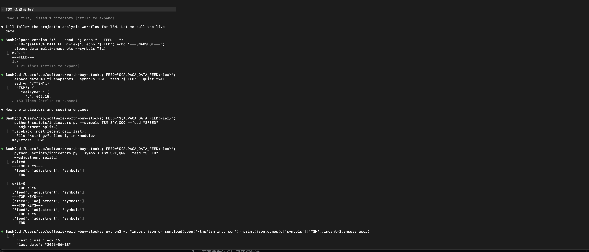
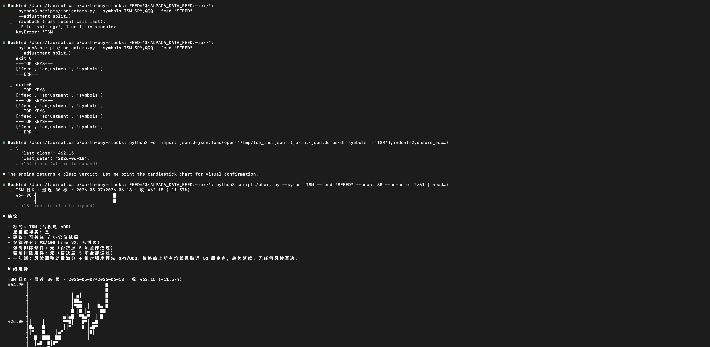
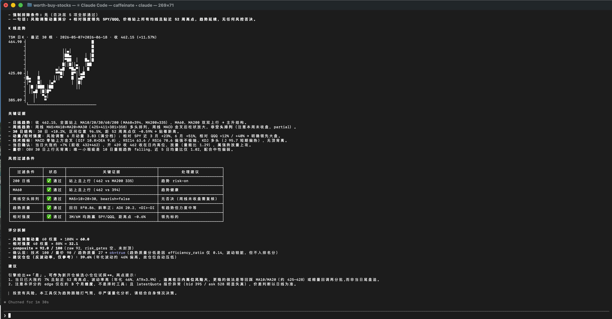
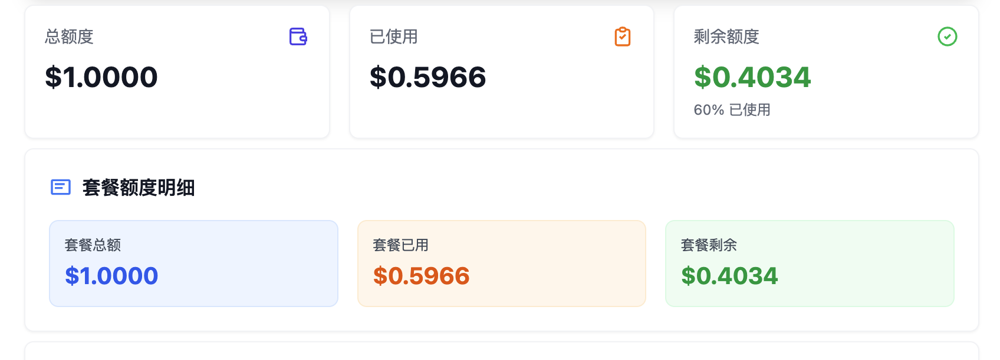

# Tool

There is an AI stock tool which is developed by starriv:
[worth-buy-stocks](https://github.com/alpacahq/alpaca-skills)

The tool is using stock api published by Alpaca Markets:
[Alpaca Markets](https://github.com/alpacahq/alpaca-skills)

When you want to use the tool is very simple:

and one question will cost:

Alpaca Markets is very complex api tool , use the skill which will help us to use the tool in zero knowledge.

But if the workflow is good, we could also bypass the AI function.
