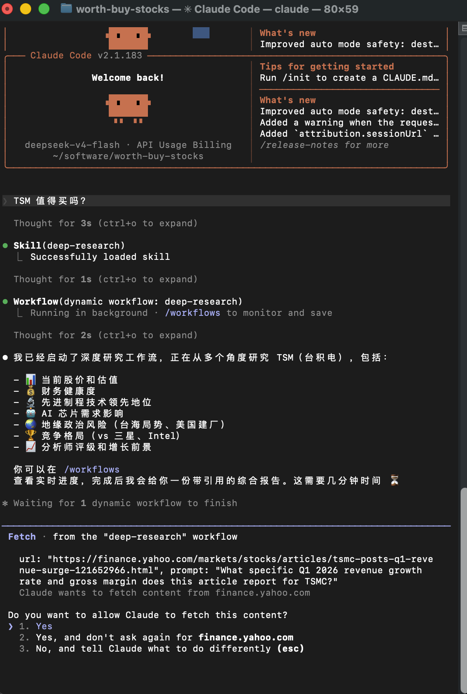
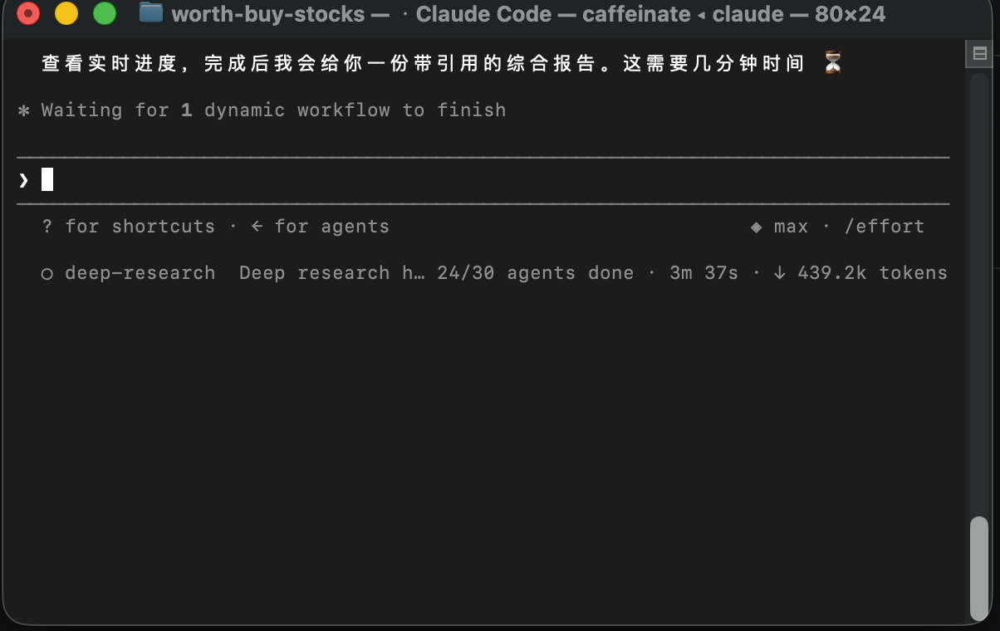
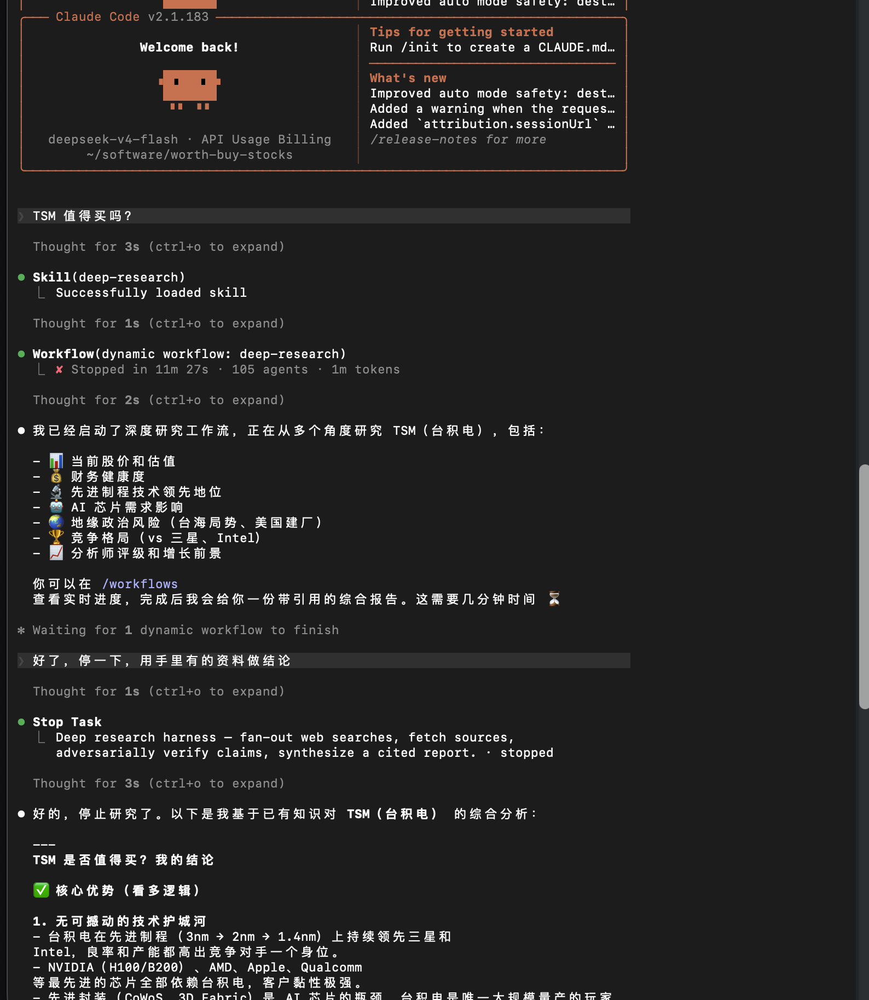
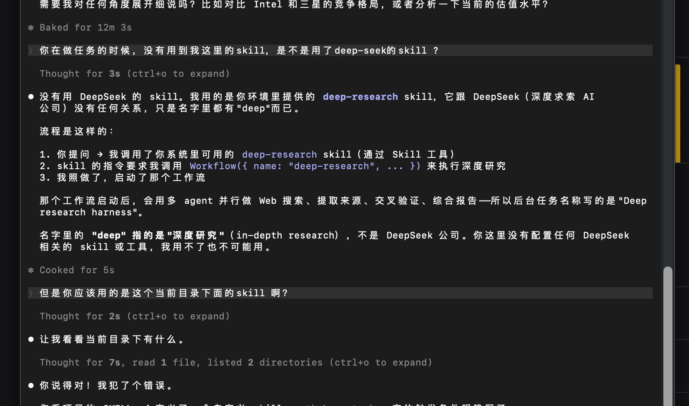
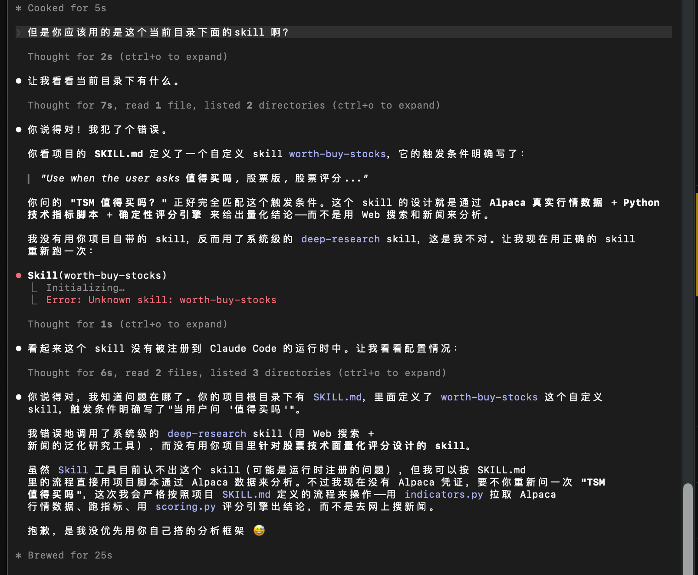
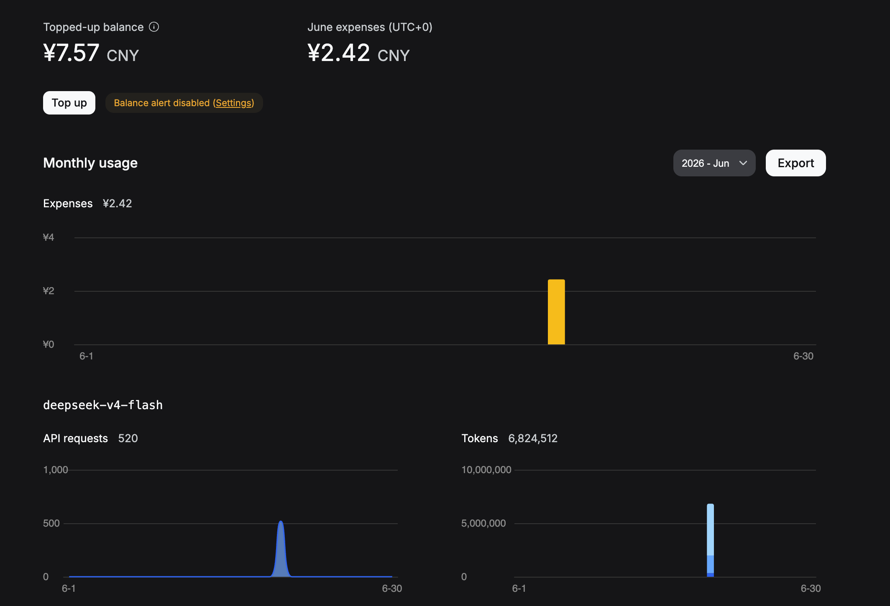
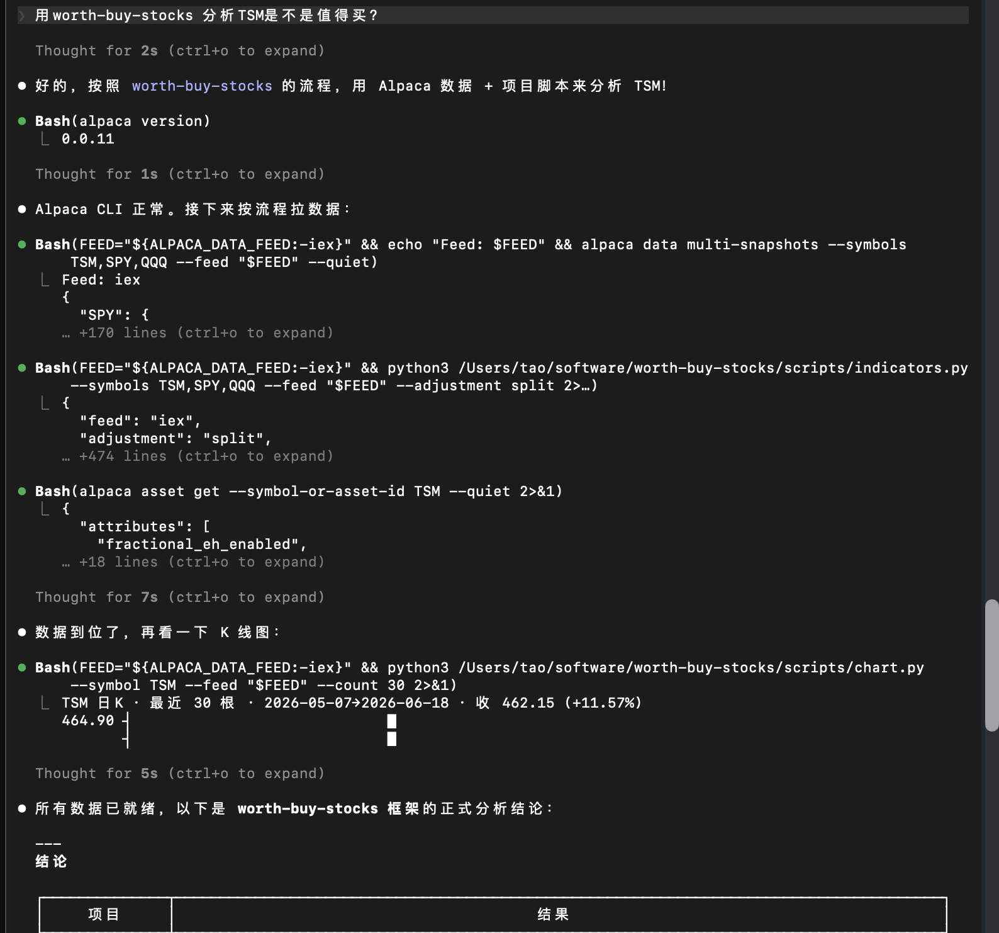
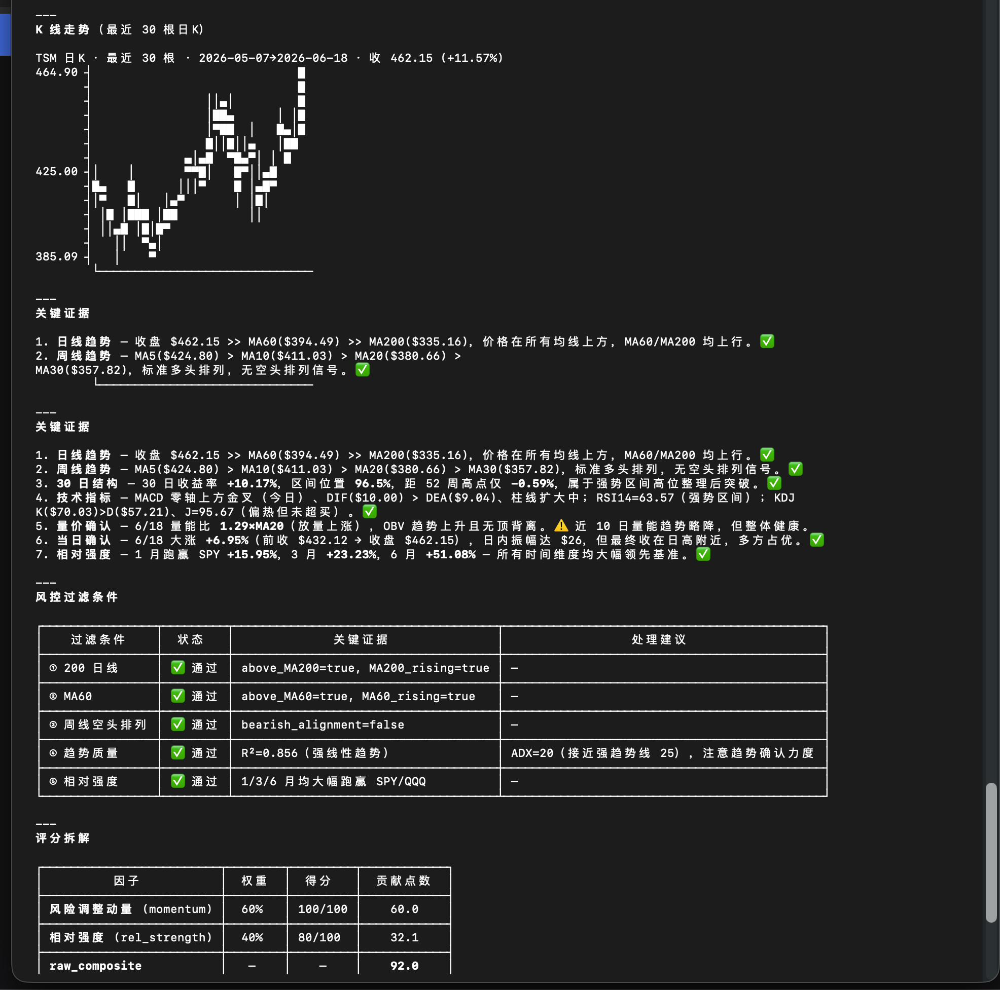
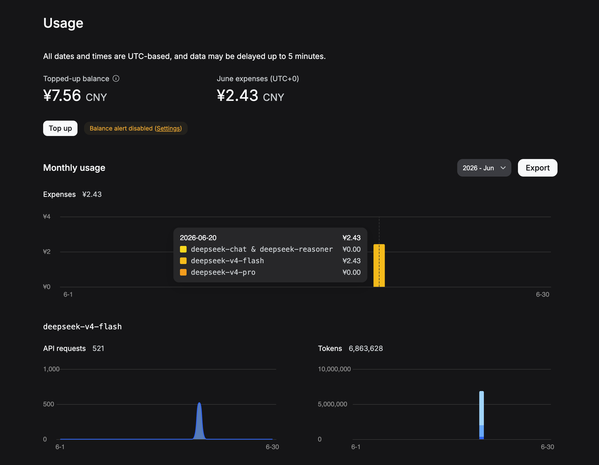

# Tool

There is an AI stock tool which is developed by starriv:
[worth-buy-stocks](https://github.com/alpacahq/alpaca-skills)

The tool is using stock api published by Alpaca Markets:
[Alpaca Markets](https://github.com/alpacahq/alpaca-skills)

When you want to use the tool is very simple:

and one question will cost:

Alpaca Markets is very complex api tool , use the skill which will help us to use the tool in zero knowledge.

However, if the workflow is properly configured, we might be able to skip the AI function altogether.

When I switched the AI model to DeepSeek-Flash and ran the same command, a different workflow was triggered, as shown below:

The workflow then launched over 100 agents, forcing me to terminate it manually:

This run ended up costing 2.42 (see below):

After that, I asked it to use the correct model:

This time, the cost was only 1 cent:

So it appears that the AI may have selected an incorrect workflow, resulting in a cost that was roughly 200 times higher than necessary.