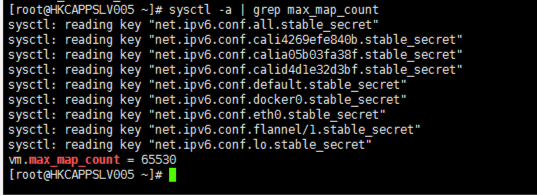
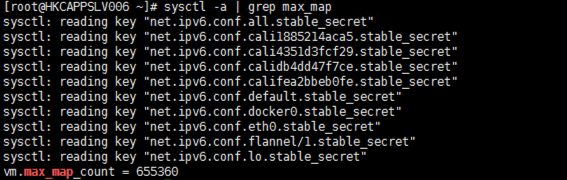

# JVM allocate memory failed in docker

## JVM allocate failed

In Azure, when set Docker container memory more than 8G, JVM will throw 
exception as blow:

Allocate memory failed:
: @@snip[Allocate failed](log/log.txt)

## VM setting

The crash happened in some docker container hosted in specified host.

root cause:

1 crashed host setting:

2 Not crashed host setting:

Answer from [link](https://forums.docker.com/t/odd-memory-problem-with-java-on-ubuntu-container/27617)
