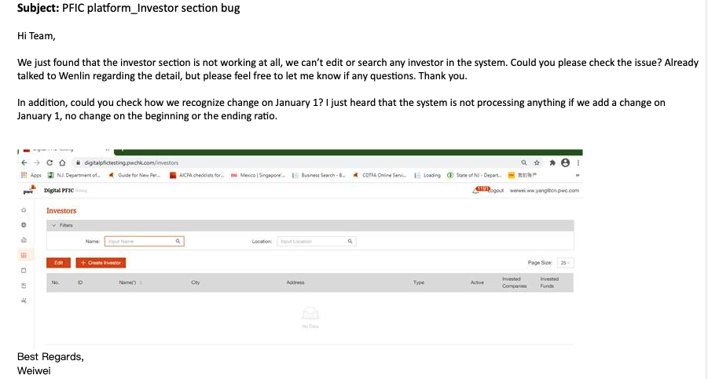
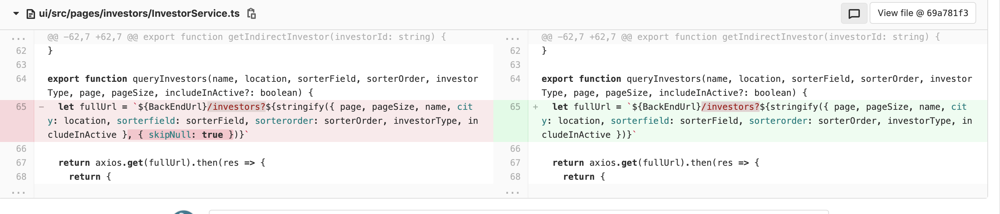
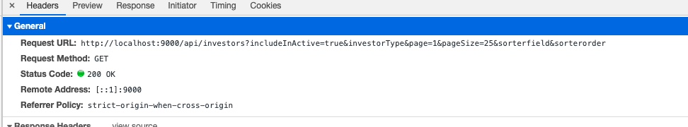
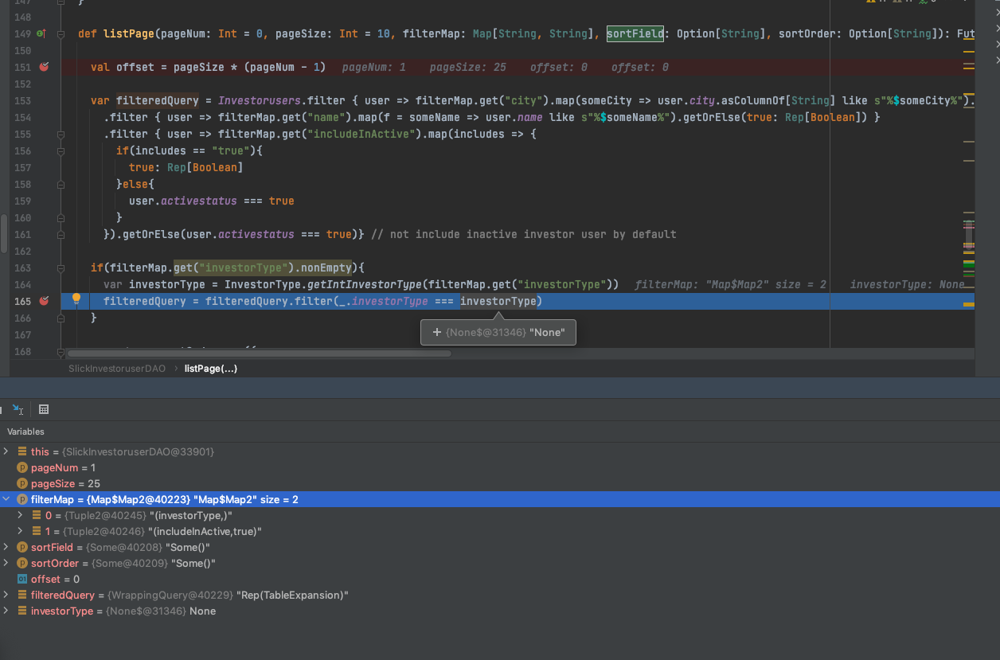
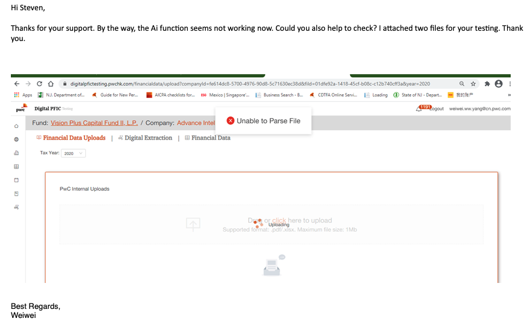
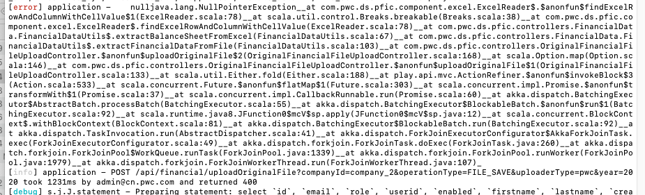

# Add features leads system fail

## Investor list function failed

User reports the list investor feature failed:

The following change cause the bug:

After the change the request url will be:

What's the code for the query:

Controller
: @@snip[Controller](code/listInvestor.scala)

InvestorUserDao
: @@snip[Investor user dao](code/InvestorUserDao.scala)

What's the value in passed in the search is:

Actually, there are some tricky value generated:

    sortField,sortOrder is Some() , while in DAO, these fields are handled correctly.

    While in filterMap, the "investorType" value is "", which is not handle correctly.

The bug is very obviously, the skipNull option in stringify function will remove null query parameters.
After removed this option, the query url contains some empty parameters, the DB query can't handle some cases.

The more question will be asked is how to avoid Some() or Some(null), Map("a"->"") in user's input.

## Upload function is blocked

User report the upload function is broken when apply a new feature:

While the log in backend is:

The bug is more obvious:

Upload controller:

: @@snip[Upload controller](code/uploadController.scala)

Code from a new feature:

: @@snip[Code for new feature](code/extractBalanceSheetFromExcel.scala)

The upload function is an existed feature in our system. After that new feature is added to process specified 
type of Excel document. 

Then Excel file not match the new feature will fail.

