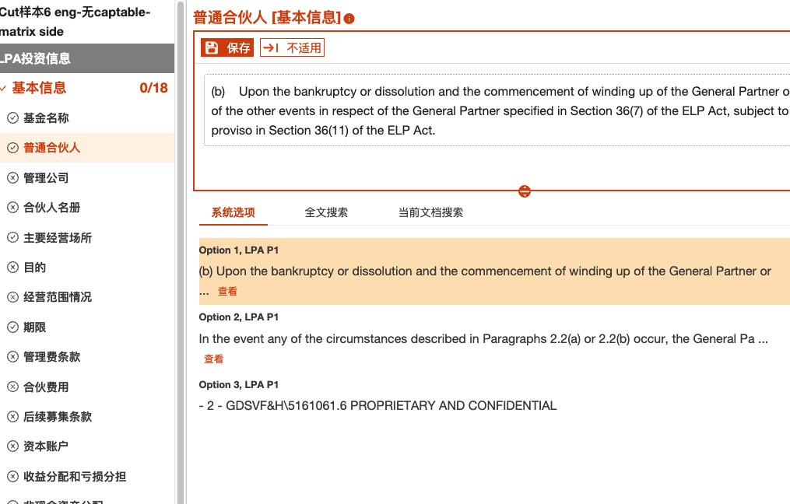

# Debug python processor

## Issue

When set up exctraction rule, but some paragraph can't be extract.



## set the degbug

Set the local dev not delete output file 
```
export SKIP_TMP_FILE_CLEAN=TRUE
```
and use python script to reproduce the error

```
python3 /Users/steventzhou/software/ds-cidr/processor/creditreview/main.py -pjn aidr -pn extraction_processor -i /tmp/ds-cidr/PROJ_6/processors/b044a71d-9d97-4f67-bace-838a1dc59962/output.json -o /tmp/ds-cidr/PROJ_6/processors/6d6e61c4-471d-4fb2-8bab-ded4acef072e/output.json -ec /tmp/ds-cidr/PROJ_6/d7517139-8898-3e93-b198-0363e24189ce -rules /tmp/ds-cidr/PROJ_6/1fe1df36-b64f-30e7-ab5b-ff85b031660a -v 2.0.0
```

find the python code
: @@snip[extractor](src/extractor.py)

set the debug info
: @@snip[extractor with debug](src/extractor.debug.py)

with the debug message
: @@snip[output message](src/output.txt)

With the info:

```
{'type': 'PARAGRAPH_MATCH', 'regex': 'Partnership', 'isSkipTitle': True}
```

We could easily find the missing part is marked as title and ignored.

```
{'word_ids': [555, 555, 555, -1, 556, 556, 556, 556, 557, 558, 558, 559, 560, 560, 560, 560, 560, 560, 560, 560, 560, 560, 560, 560, 561, 562, 563, 563, 563, 564, 565, 565, 565, 565, 566, 567, 567, 568, 569, 569, 569, 570, 571, 571, 571, 571, 571, 571, 571, 571, 571, 571, 571, 572, 573, 573, 573, 573, 573, 573, 573, 573, 573, 574, 575, 575, 575, 575, 576, 577, 577, 577, 578, 579, 579, 579, 579, 579, 579, 580, 581, 581, -1, 582, 582, 582, 583, 584, 584, 584, 584, 584, 584, 584, 584, 584, 584, 584, 585, 586, 586, 586, 587, 588, 588, 588, 588, 588, 589, 590, 590, 590, 590, 590, 590, 590, 590, 591, 592, 592, 592, 592, 592, 593, 594, 594, 594, 595, 596, 597, 597, 598, 599, 600, 600, 600, 600, 600, 601, 602, 602, 602, 602, 602, 603, 604, 604, 604, 605, 606, 606, 606, 606, 606, 606, 606, 607, 608, 608, 608, 608, 608, 608, 608, 608, 608, 608, 608, 608, 609, 610, 610, 610, 610, 611, 612, 613, 613, 614, 615, 615, 615, 615, 615, 615, 615, 616, 617, 617, -1, 618, 618, 618, 618, 618, 618, 618, 618, 618, 619, 620, 620, 620, 621, 622, 623, 624, 624, 624, 624, 624, 624, 625, 626, 626, 626, 626, 626, 626, 627, 628, 628, 628, 628, 628, 628, 628, 628, 628, 628, 629, 630, 630, 631, 632, 632, 632, 632, 632, 632, 632, 632, 633, 634, 634, 635, 636, 636, 636, 636, 636, 636, 636, 636, 636, 637, 638, 638, 638, 639, 640, 640, 641, 642, 642, 642, 642, 642, 642, 642, 642, 643, 644, 644, 645, 646, 646, 646, 646, 646, 646, 646, 646, 647, 648, 648, -1, 649, 649, 649, 649, 649, 649, 649, 649, 649, 650, 651, 651, 651, 652, 653, 654, 655, 656, 657, 657, 657, 658, 659, 660, 660, 660, 660, 660, 660, 660, 660, 660, 660, 660, 661, 662, 662, 662, 662, 663, 664, 665], 'text_content': '2.1\tTerm of Partnership.  The term of the Partnership commenced upon the filing of the Certificate and shall continue until ten (10) years after the Initial Contribution Date (as defined in Paragraph 3.1), unless sooner terminated as provided in Paragraph 2.2 or extended as provided in Paragraph 8.1(e) (the “Partnership Term”).', 'title_level': 5, 'titles': {'0': '', '1': 'ARTICLE II', '2': '', '3': '', '4': '', '5': '2.1\tTerm of Partnership.  The term of the Partnership commenced upon the filing of the Certificate and shall continue until ten (10) years after the Initial Contribution Date (as defined in Paragraph 3.1), unless sooner terminated as provided in Paragraph 2.2 or extended as provided in Paragraph 8.1(e) (the “Partnership Term”).'}, 'closest_title_list': ['2.1\tTerm of Partnership.  The term of the Partnership commenced upon the filing of the Certificate and shall continue until ten (10) years after the Initial Contribution Date (as defined in Paragraph 3.1), unless sooner terminated as provided in Paragraph 2.2 or extended as provided in Paragraph 8.1(e) (the “Partnership Term”).', 'ARTICLE II'], 'word_count': 329, 'paragraph_id': 6, 'page_id': 0, 'end_page_id': 0, 'sent_id_per_page': 6, 'sent_id': 6, 'is_crosspage': False, 'is_table_placeholder': False, 'table_id': None}
```


