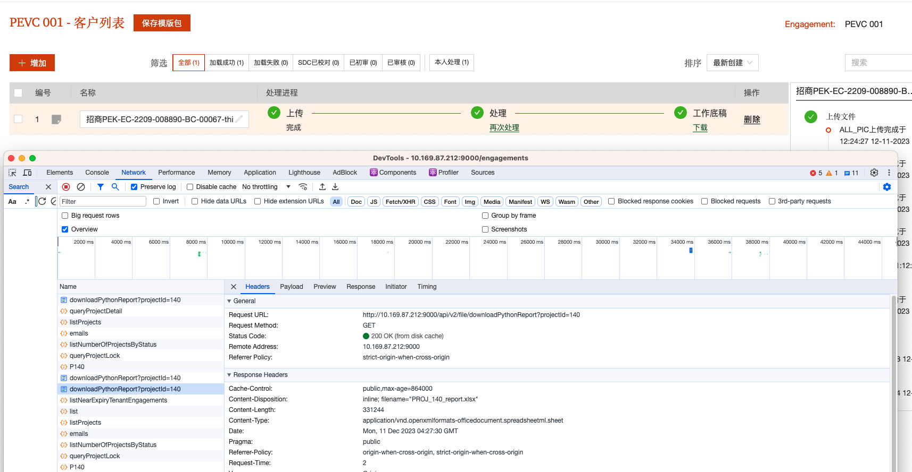
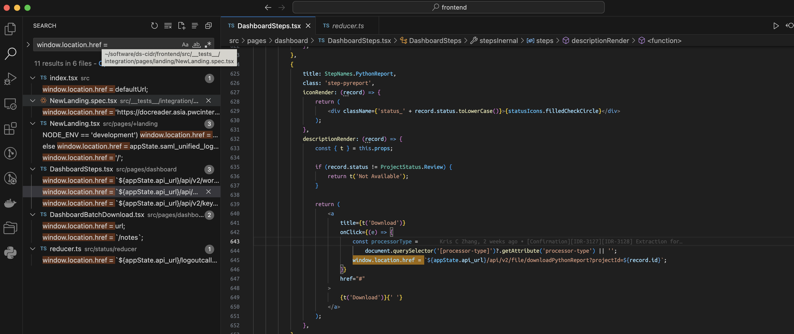

# Download from cache

## Issue

User download a file and can't get the latest version,

and when user click download, the result is from browser cache not from backend.

The frontend code:

The download action is not triggering ajax call, but open a web url which return a cached value by browser's default behavior.
