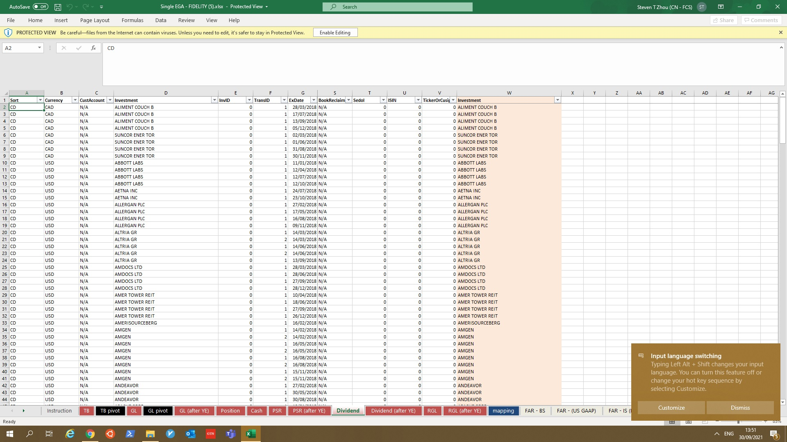
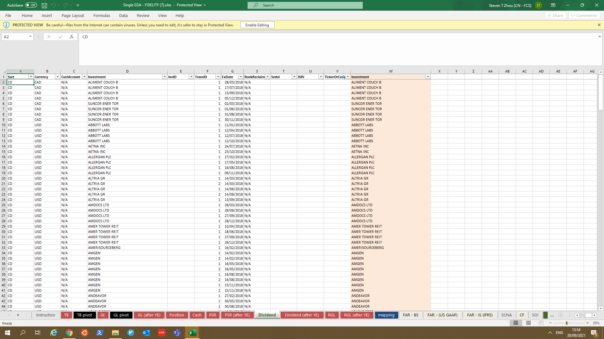
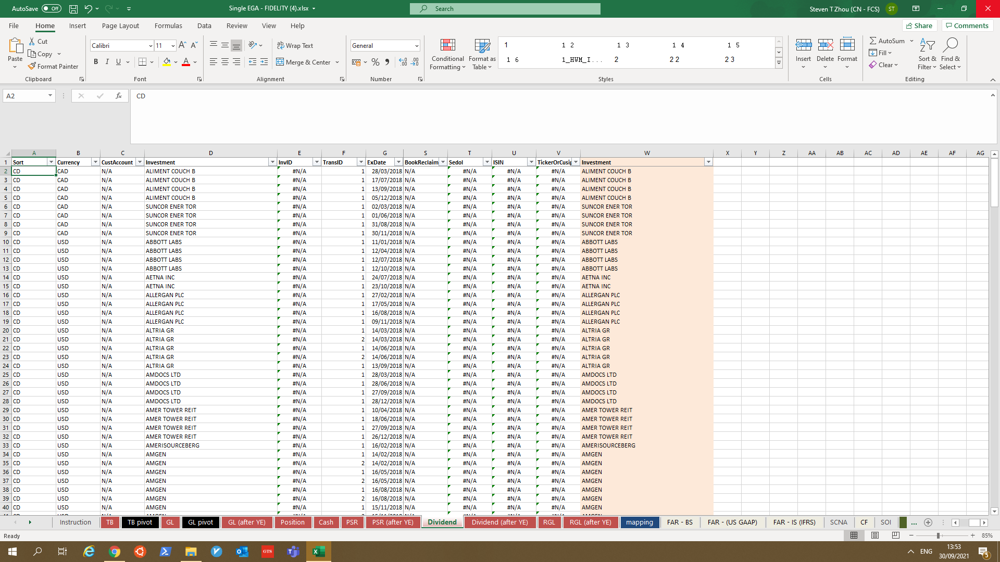
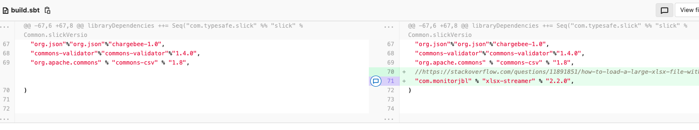
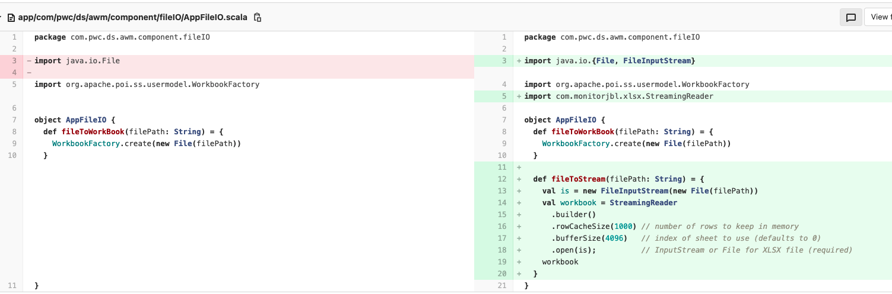

# Excel formula issue

## Issue

In AWM downloaded EGA Excel file will have display issue in Windows system but not in Mac.
The issue as below:

The Sedol and ISIN field is formula, but show as value 0. After "enable editing" the formula will not evaluate correctly.

What's the expected behavior:

The formula should be empty at beginning, after "enable editing", the value will evaluate correctly.

## Issue code

The issue of display is introduced by the code change:

For the sbt change to include the streaming lib and code change to add function using streaming method to read excel.
While the read function is not used.

So the lib which introduce the display issue in windows.

## Why?

The lib may have a function to evaluate value when write cell to excel, when the formula can't be evaluated correctly, then use 0 as default.

