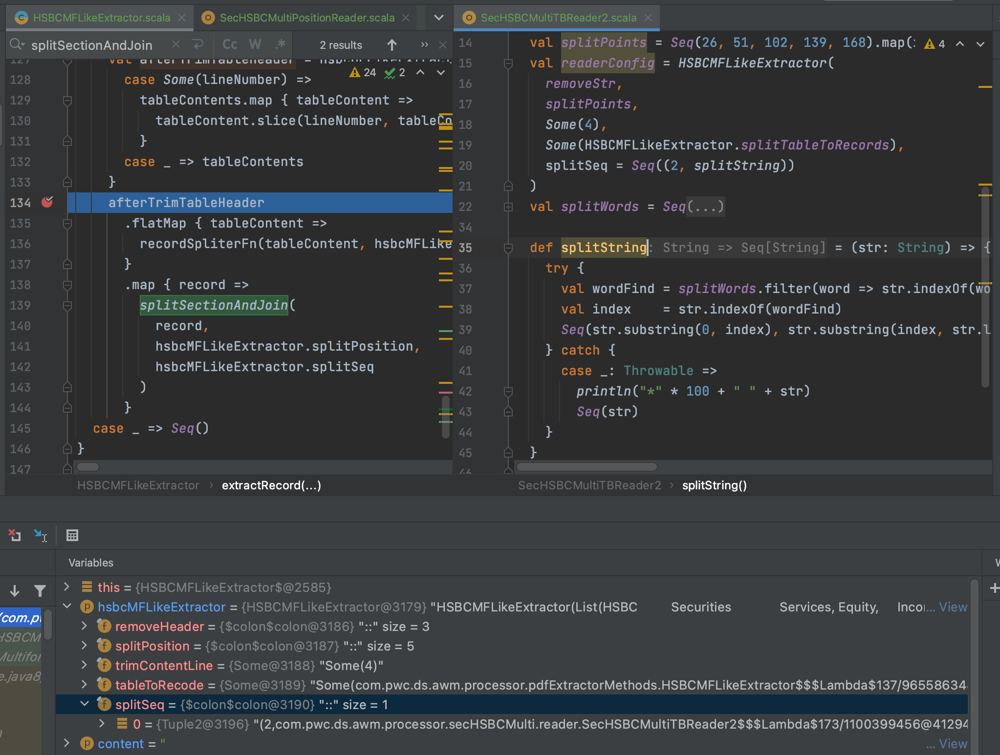
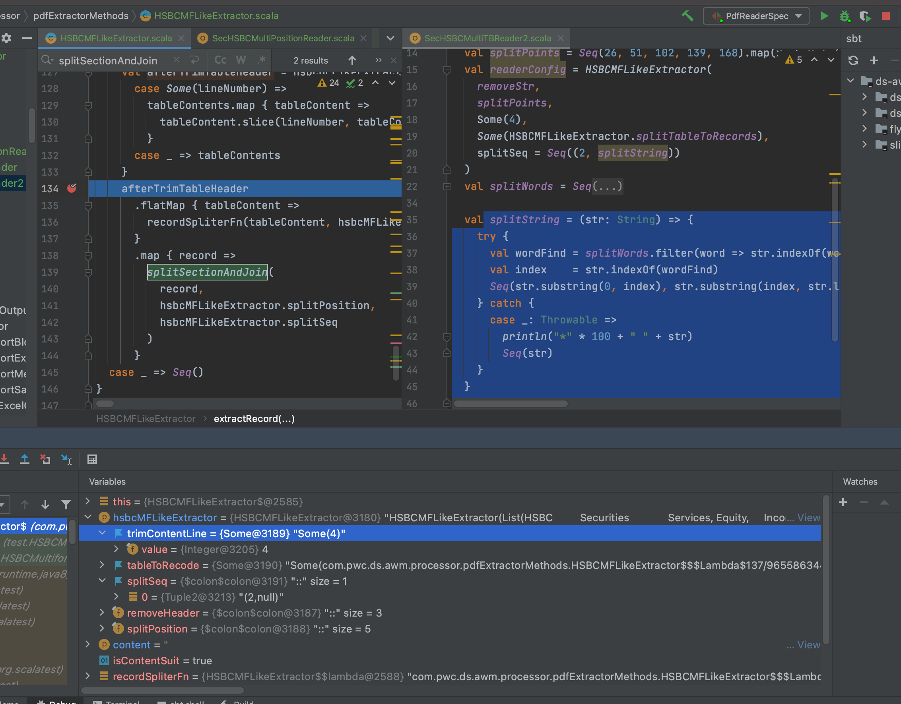

# Function and Val in code

## Issue

In scala  function and val are quiet equal as below:

def f1 = (a: Int) => { a *2}
val f1 = (a: Int) => { a *2}

In some case the two will have different feature:

When use function, every thing as expected:

When use val, the null pointer error show up:

The code as below:

ExtractorConfig
: @@snip[HSBCMFLikeExtractor](code/HSBCMFLikeExtractor.scala)

Reader Instance
: @@snip[SecHSBCMultiTBReader](code/SecHSBCMultiTBReader2.scala)

