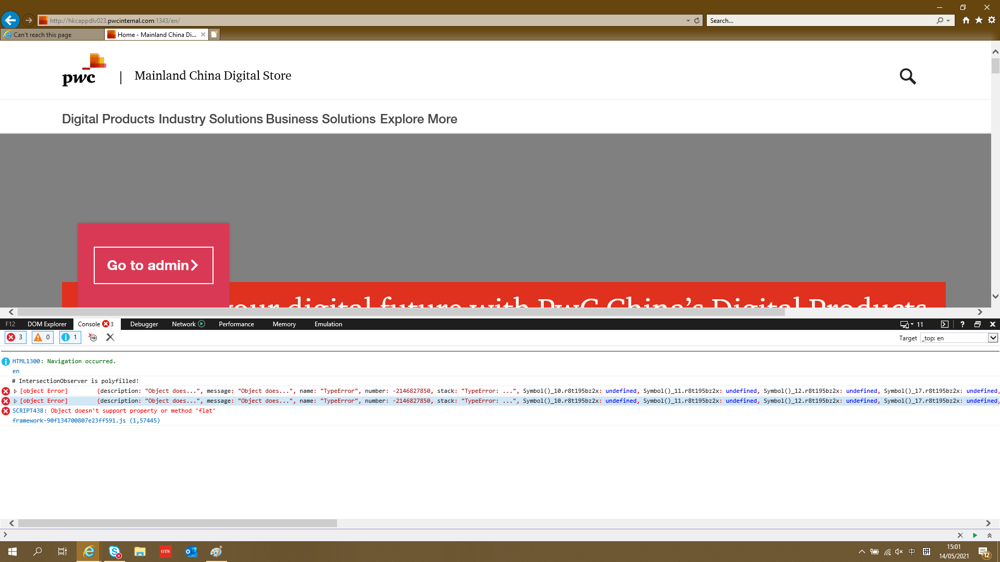

# Hosting issue for IE

## Issue for IE

The site can open in IE as 

and can't be loaded when reopen the same link:

This behavior can't be reproduced when the site is hosted in python server.

## Fix the issue 

IE don't support flat operation.