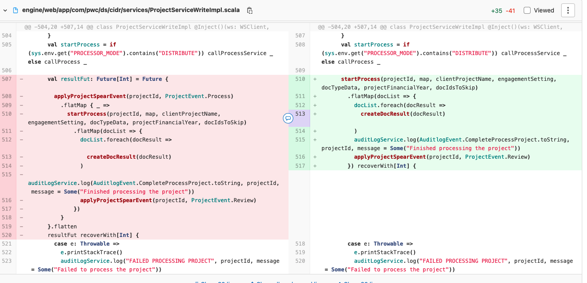

# Initial crash

## Issue 

IDR project start with Akka cluster initial crash with error "port 1600 is already in use".

The port 1600 is the akka node port.

Why the initialization will create multiple akka cluster?

Because the IDR will record unfinished projects and try to restart these project on startup.

The left solution will wrap the restart function in Future will create parallel restart project operation which will try to create multiple akka system at same time. Then the crash happens.

