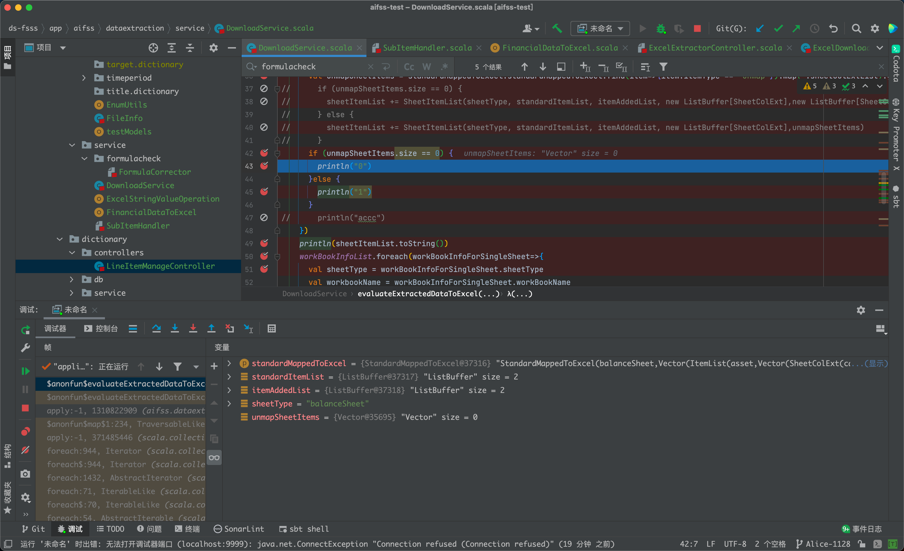
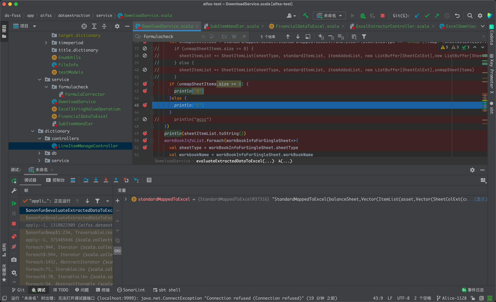
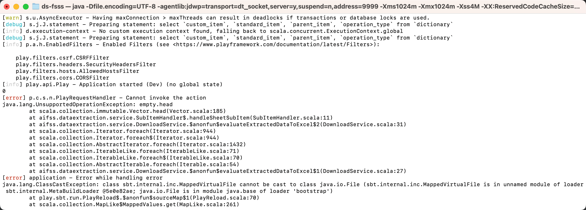
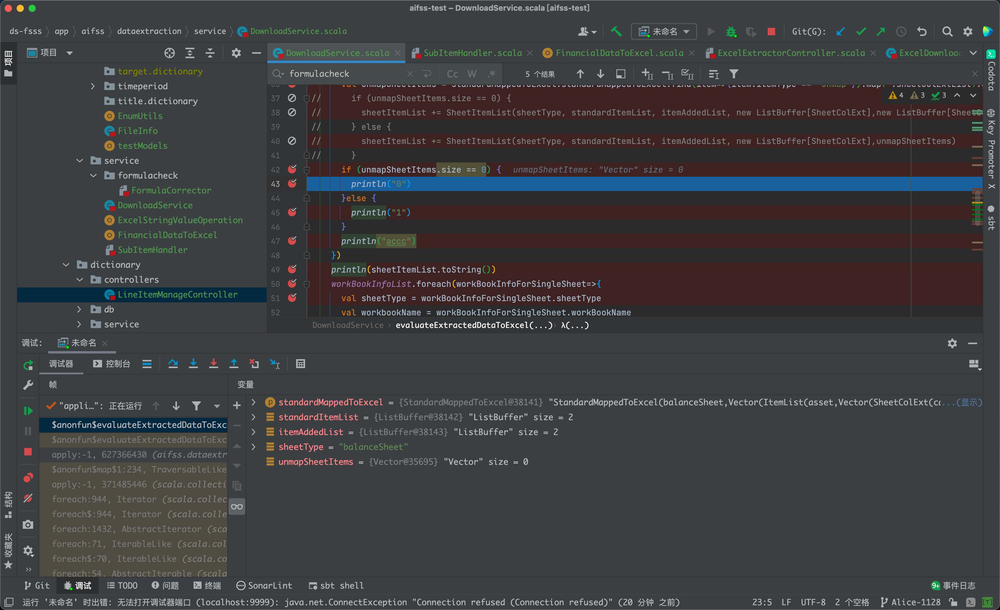
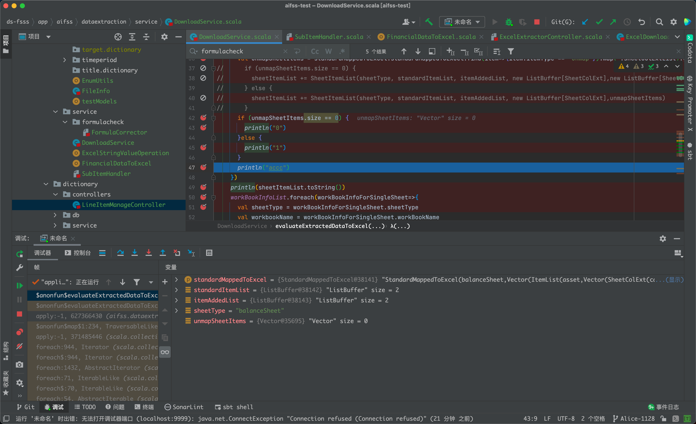
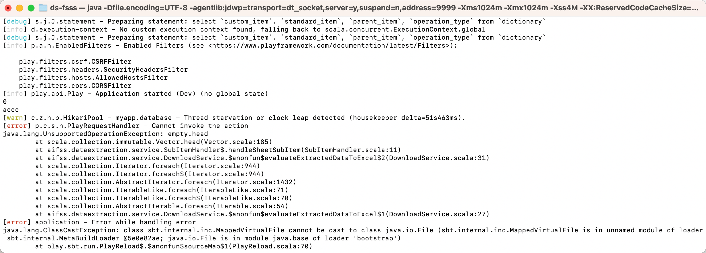
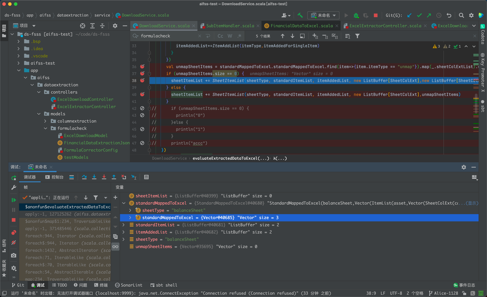
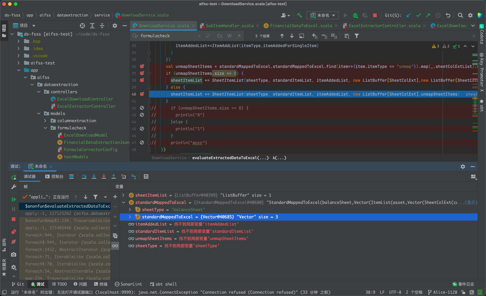
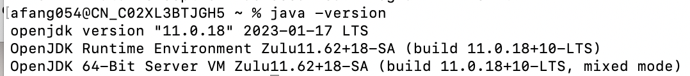
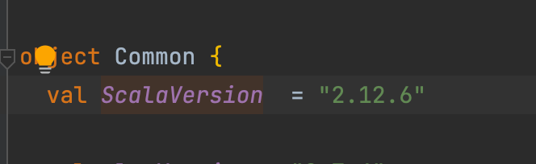

# Intellij bug for scala  

## Issues

In a if -- else branch, when condition is 0 

then go if branch

but will also go to else branch 

In else branch, every variable is lost.

and console log is :

If changed a bit:
Then go to if branch

And bypass else:

and console log is :

When go to real case:

If branch

go to else branch

The code to reproduce:

: @@snip[code to reproduce](./code/DownloadService.scala)

Intellij:2021.2

Java:OpenJDK 11

Scala:2.12.6

## What's happened

The if else block is in the foreach or map funtion, which intellij want to evaluate the return value, then bug happens.