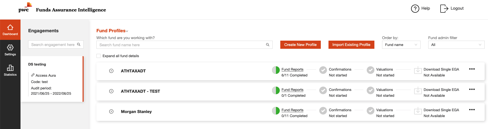

# Load issue for valuation

## Valuation load issue

The fund list is as below, when use select one engagement, all funds will be listed, but with more and more funds in same
engagement, the load time increase to unacceptable.

The original javascript code as below:

FetchData
: @@snip[UI element fetch](./code/fetchDataBefore.jsx)

GetValuationService
: @@snip[Get Valuation Service](./code/fetchValuationProgress.jsx)

Every time one fund's valuation fetched, the react state will be updated.

FetchData
: @@snip[UI element fetch](./code/fetchData.jsx)

GetValuation
: @@snip[Get Valuation](./code/getValuationUploadOrNot.jsx)
