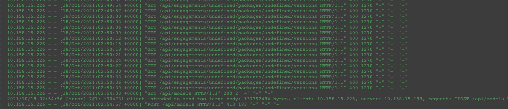
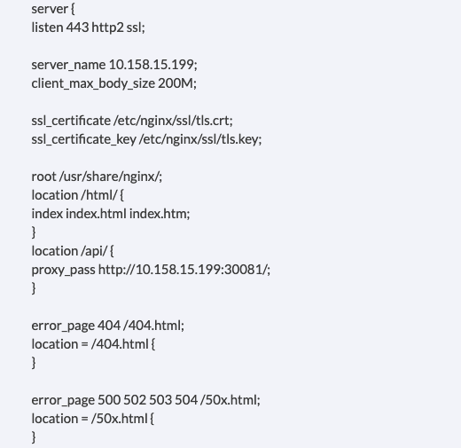
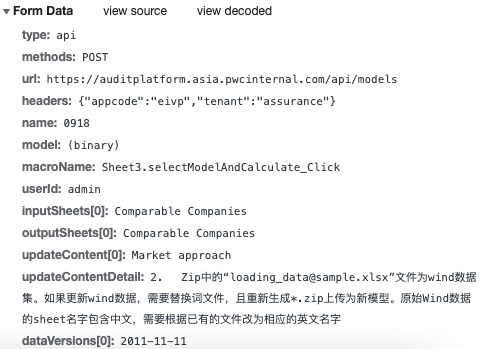
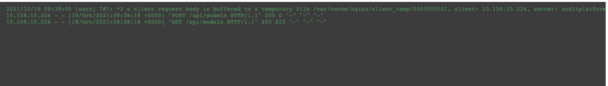

# nginx config for domain

## Upload failure

In novus project, the frontend could call get method to backend server,
but for post api call the quest always failed.

For the nginx setting as below:

From frontend, the POST quest is use the api request:

So the server name in nginx should use domain name.

After that, we could see the post body can be cached in nginx server:

