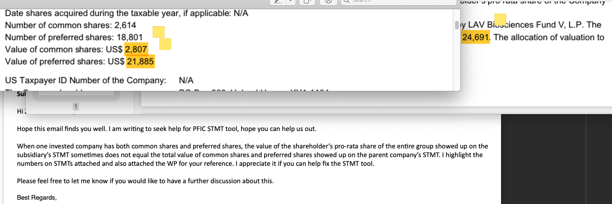

# Number add for round up

## Issue found

The parent company has two types share, and the child company need to display the total of two types share value.
For the round up issue, the number is not equal.

## code

Original code

: @@snip[Origin code](code/code1.scala)

Fix code

: @@snip[Fix code](code/code2.scala)