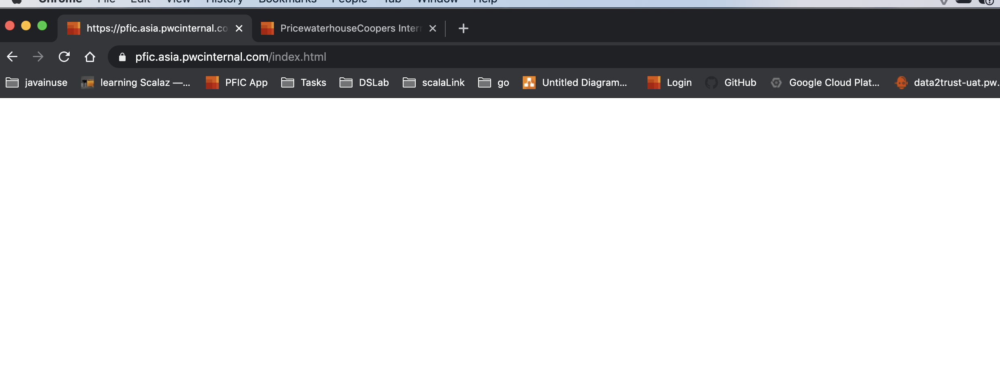
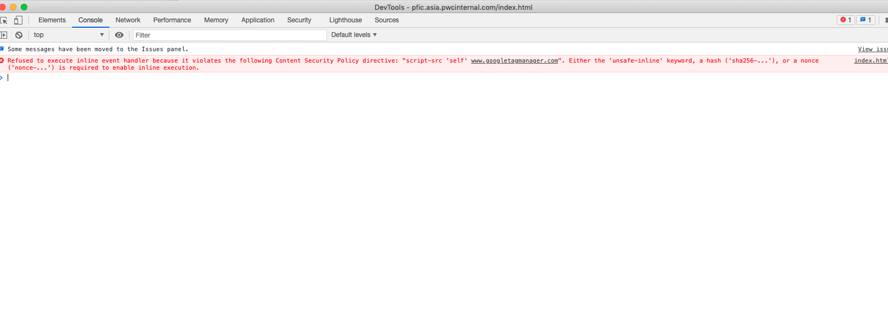
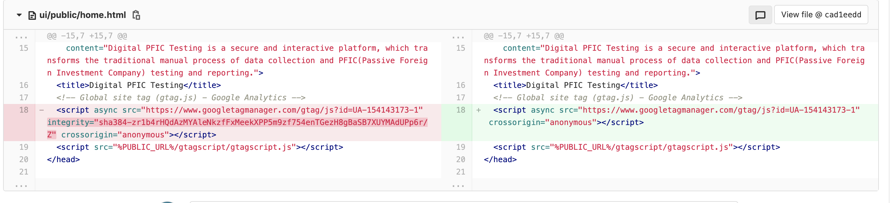

# Page can't retrieve 

## Page can't get when using IdAM

In PFIC system, in UAT environment, the page can't be retrieved:



But in another environment, the login function works well.

And if disable IdAM service, the login function also works.

The IdAM service works in local.

Then the chrome log shows:



## What's happened?

The UAT nginx server has configuration of a rule for security check:

```text
add_header Content-Security-Policy "default-src 'self' cdn.plyr.io; style-src 'self' 'unsafe-inline'; script-src 'self' www.googletagmanager.com; img-src 'self' data:" always;
```

But for "www.googletagmanager.com" the sha value will change from time to time.

So the integrity value is removed:



So the nginx will block the page, and chrome will not load the page correctly.


