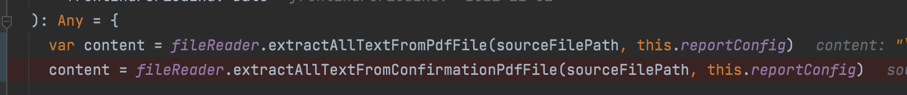
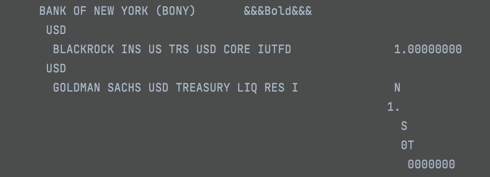
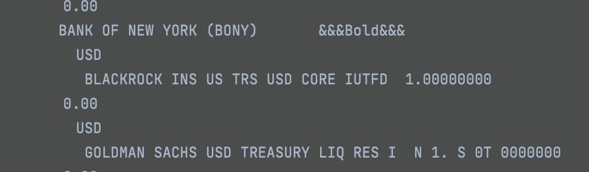

# Read PDF

## Issue

Read text content from pdf may encounter some wired issue:


the text content is expected to be:
```markdown
BANK OF NEW YORK (BONY)      
         USD
          BLACKROCK INS US TRS USD CORE IUTFD  1.00000000     
         USD
          GOLDMAN SACHS USD TREASURY LIQ RES   1.0000000 
```

But use different pdf reader setting will have difference result:


Reader1:

```markdown
  def extractAllTextFromPdfFile(sourceFilePath: String, reportConfig: ExtractorConfig): String = {
    try {
      var content = ""
      if (isPdfFileExtension(sourceFilePath)) {
        val file                            = FileSystemHelper.getFile(sourceFilePath)
        val document                        = PDDocument.load(file)
        val stripper: LayoutPdfTextStripper = new LayoutPdfTextStripper
        stripper.setReportConfig(reportConfig)
        stripper.setSortByPosition(true);
        content = stripper.getText(document);
        document.close()
      }
      content
    } catch {
      case e: IOException => throw new IOException("read source pdf file IO error")
      case e: Exception   => throw new Exception(JsError("read source pdf file IO error"))
    }
  }
```

result:



Reader2:

```markdown
  def extractAllTextFromConfirmationPdfFile(
      sourceFilePath: String,
      reportConfig: ExtractorConfig
  ): String = {
    try {
      var content = ""
      if (isPdfFileExtension(sourceFilePath)) {
        var file                                        = FileSystemHelper.getFile(sourceFilePath)
        val document                                    = PDDocument.load(file);
        var stripper: LayoutConfirmationPdfTextStripper = new LayoutConfirmationPdfTextStripper;
        stripper.setReportConfig(reportConfig)
        stripper.setSortByPosition(true);
        content = stripper.getText(document);
      }
      content
    } catch {
      case e: IOException => throw new IOException("read source pdf file IO error")
      case e: Exception   => throw new Exception(JsError("read source pdf file IO error"))
    }
  }
```

result:

