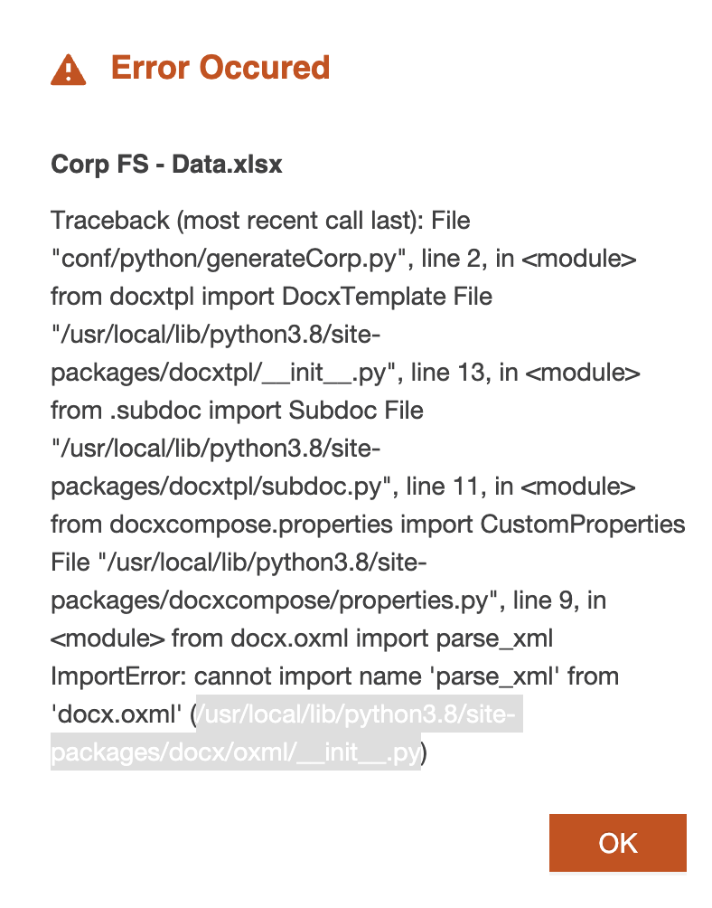
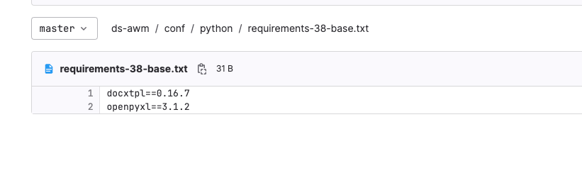
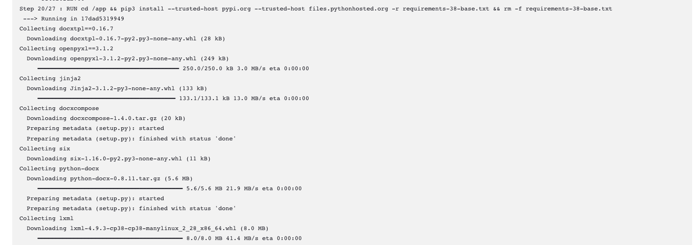
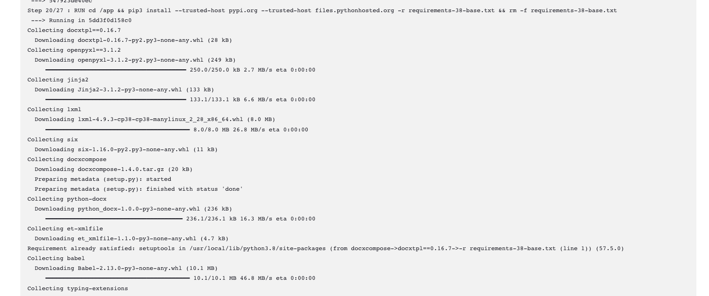

# Python build with different version of lib

## Issue

Issue from application for python processor task failed

The python dependency file as below:

There is no code change and from Jenkins log, the python-docs has different version.

Old version

New version

Fail on specified version

## How to fix

From the log, the python-docs is inderect-dependency of openpyxl, if the python-docs version is set in requirement file, the issue will not be happened.
But the root cause is the python lib install happened in each build, if the lib install finished in base image, there will have no different afterward.