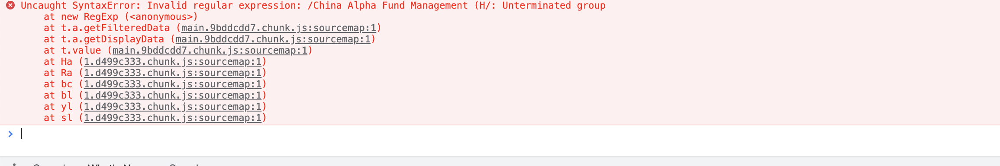
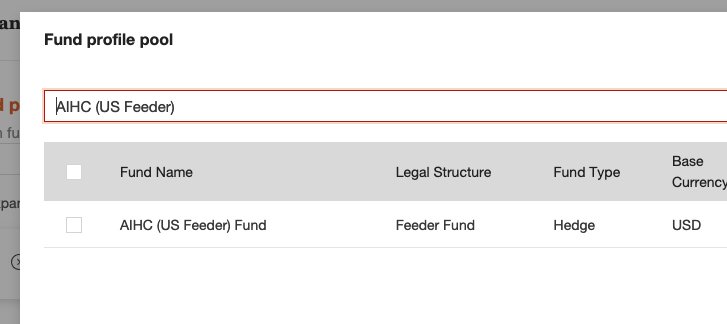

# Regex failed in frontend

## Issue

Search without bracket success :

Search failed with bracket:

When search with half bracket, the UI will crash:

The reason for the failed is using regex in frontend, when in  backend the search 
will success.

When search in backend, Slick can handle the special letter; while in frontend, 
the input should be verified. Don't trust user's input.

## Think more about the regex 

Why the bug happens? The regex use user's "random input", regex expression is very powerful tool in route or other 
server side use case but can't handle the simple user input. 

Which will introduce similarly philosophy thinking: "With great power comes great responsibility". 

The "great responsibility" is which client's random input can't afford. So the regex used in client side is not good choice.
Similar to the thread pool management, these powerful feature should be thoughtful and careful treated. 