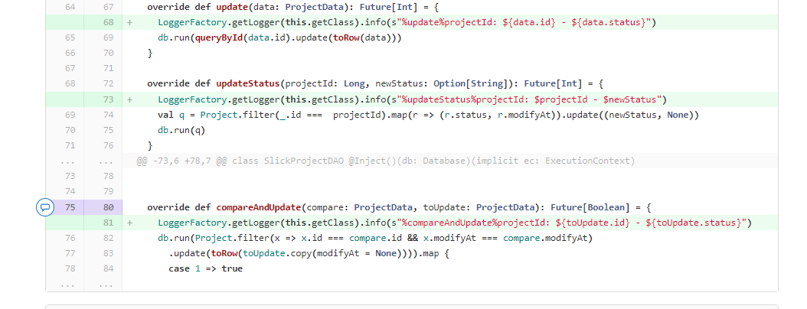
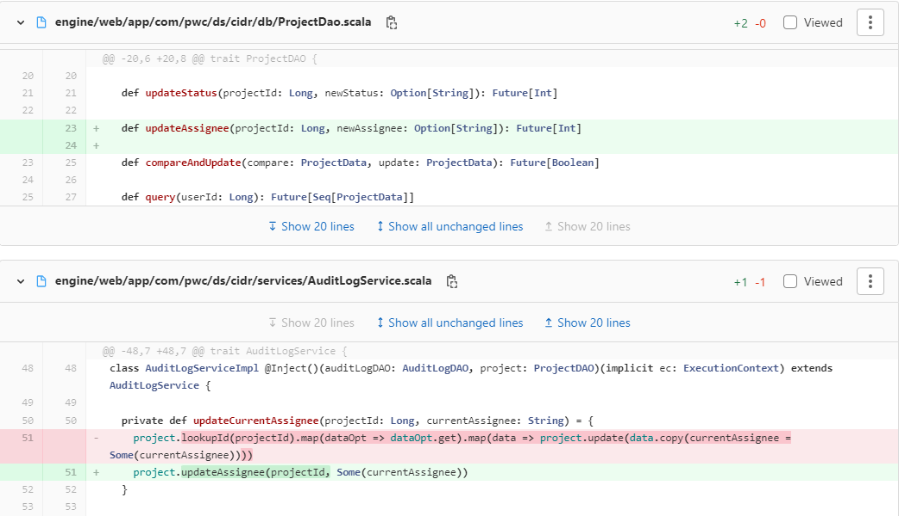

# project status update issue

## update issue

In CIDR, some project is failed but in front end the project status is processing

Set the log for the project status

and shows the log :
: @@snip[log for db update](./log/log.txt)

When the project is processing, there are some sub tasks running, if one of the subtask is failed,then the job should be 
marked as failed, and in front-end user's operation may also impact the project status updated, then update from frontend 
will use the dirty value of the previous status and write back the project status.

fix for the bug:
