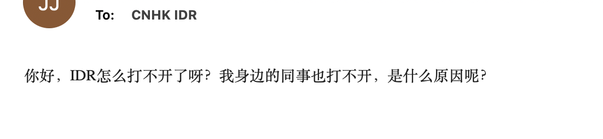
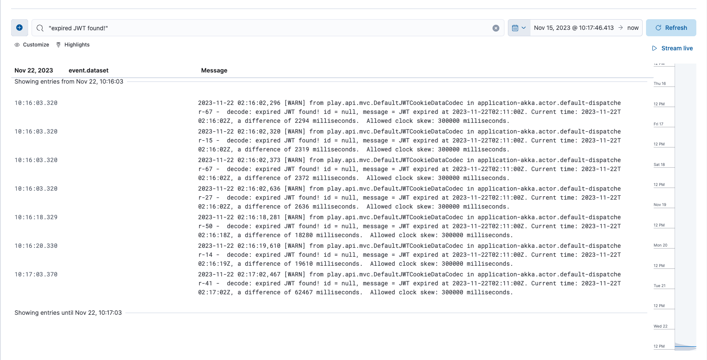
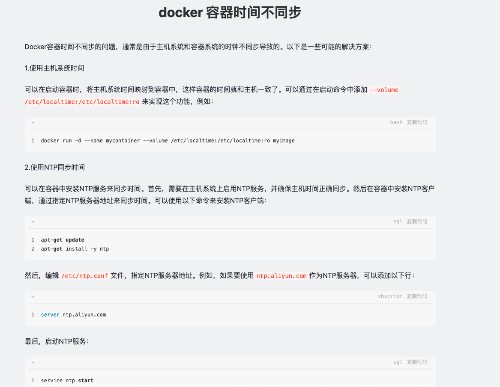

Time in docker is not syned 

## Issue

User reports the issue:

and restart the server, the issue is fixed

and the check the logs 

Fix [the timer in docer](https://juejin.cn/s/docker%20%E5%AE%B9%E5%99%A8%E6%97%B6%E9%97%B4%E4%B8%8D%E5%90%8C%E6%AD%A5)

