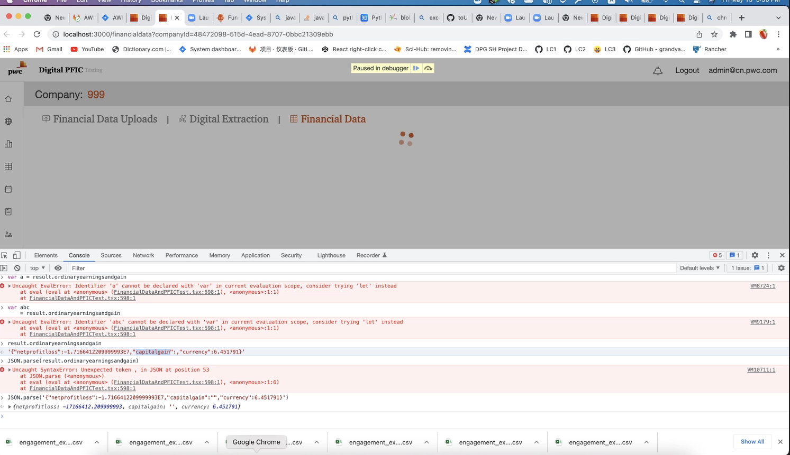

# UI crash

## Issue 1

When user is assigned to specified engagement, then user can't login to the system


The fund name is "Bosheng China Special Value – Fund 2021"

But "–" is different from "-"


The code for the issue is 

```javascript
    try{
        var userResponse = await axios.get(`/user`, {headers:userInfo})
        if(userResponse.data){
          let privilege = userResponse.data ? userResponse.data.userInfoFront.privilege : ""
          //window.sessionStorage.setItem("userInfo",btoa(JSON.stringify(userResponse.data)))
          store.dispatch(setPrivilege(privilege))
          var loginValue = this.email || "my account";
          this.props.login(loginValue);
          let state = this.props.location.state || {};
          window.location.href = state.from || '/';
        }
        else {
          this.setState({
            ishiddenrerror: false
          });
        }
      }
      catch (e) {
        this.setState({
          ishiddenrerror: false
        })
      }
```

The btoa will throw exception,while catch will not print anything about this exception.

## Issue 2 

User report some financial data can't be load in frontend.


The "capitalgain" gain field is not correct in the json string

The code for the update ordinary earning operation
: @@snip[Code for update ordinary earning](code/ordinaryearning.scala)

The code for Excel Reader
: @@snip[Code for Excel reader](code/ExcelReader.scala)


When excel has a field of " ", then the filed set in json will be missing.

The key point is always using class instead of man-made string format.