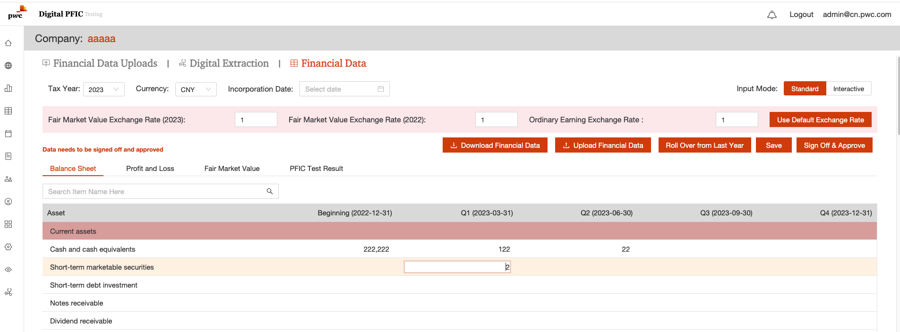
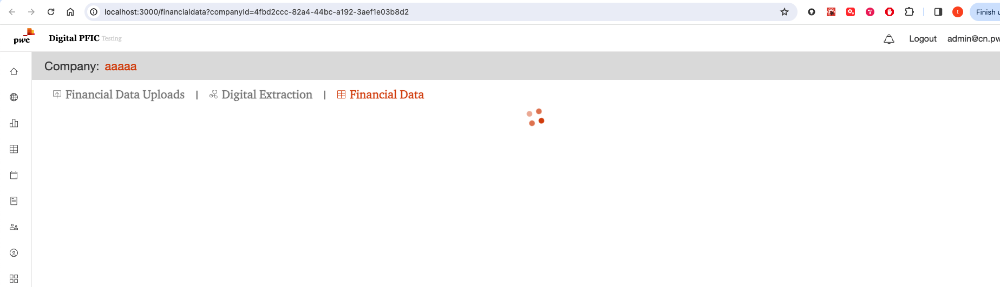
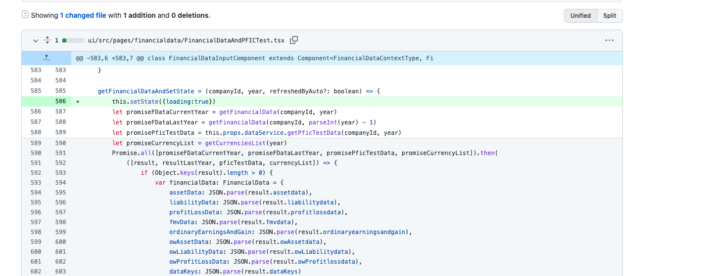

# UI refreshing issue

## Issue

User report UI is extramly slow:


When user edit financial data:


Then the UI will continuely loading:


The issue is caused by code:



The function code
: @@snip[The function code](code/getFinancialDataAndSetState.js)


the issue:

``` javascript
if (refreshedByAuto) {
    // if the function is triggered by auto save, only update pficTest data
    this.setState({
        pficTest: pficTest
    })
}
```

How to handle the status code updating in long function?

