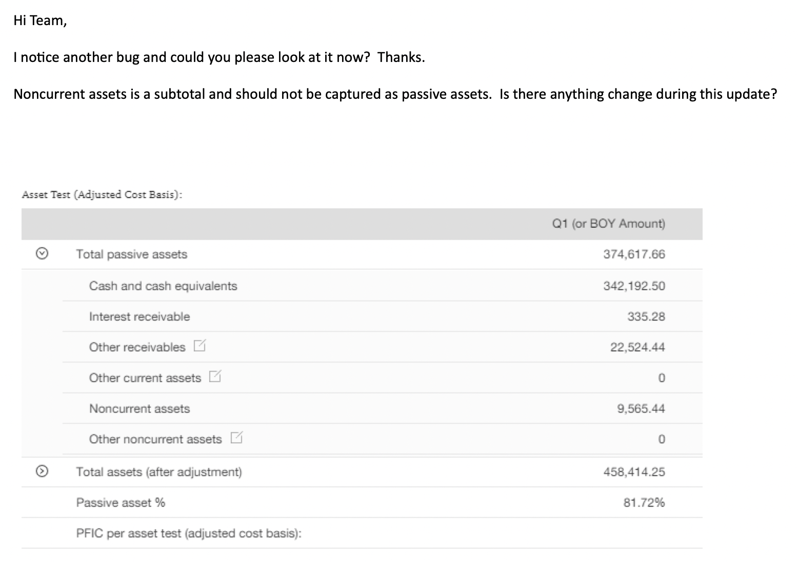
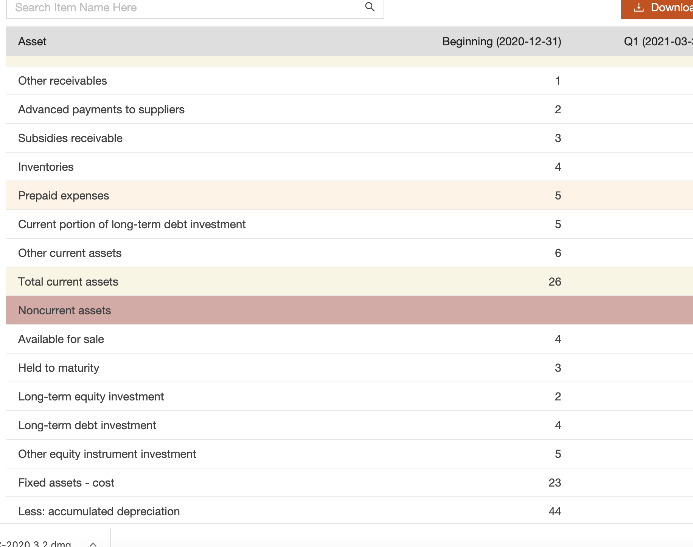
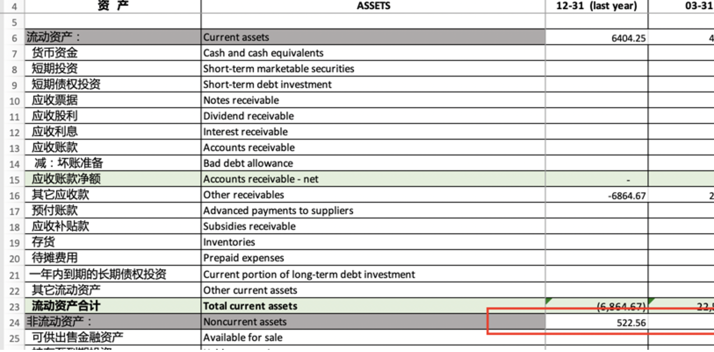

# Unexpected value show up

## Issue 

## What's the bug about?

From very beginning the "Noncurrent assets" is a col which user could input value. As client's request, the 
field is promoted to title of section which can't accept user's input.

Frontend code
: @@snip[Frontend code](code/FinancialDataCaculateTile_assetData.ts)

Backend code
: @@snip[Backend code](code/pfictest.package.scala)

Frontend code shows the "Noncurrent assets" is title which can't be modified, while the backend code still 
keep the filed as original design.
 The "Noncurrent assets" is the title of section, which is not available for user's input. 

So user could not input the value of "Noncurrent assets" in frontend page. The inconsistent can't be detected.

When new feature added that user can input via excel file upload:

Then the bug happens.

## What's cause for the bug.

From the implementation code. We could see there are two rule logic on both frontend and backend.

1. For frontend, user need to see instant value change.
2. The backend contains another rule for the subset of the data.

How to avoid such issue:

  Move the logic to backend. 

