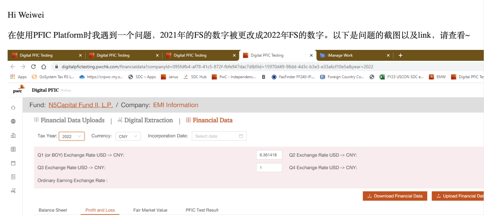
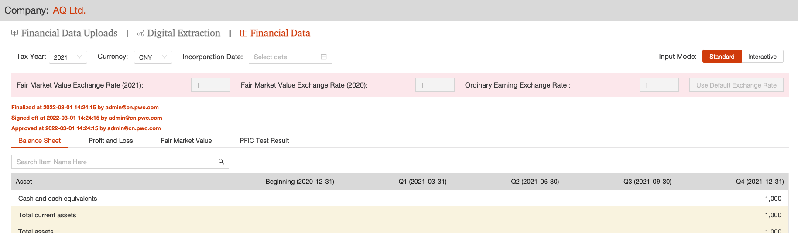
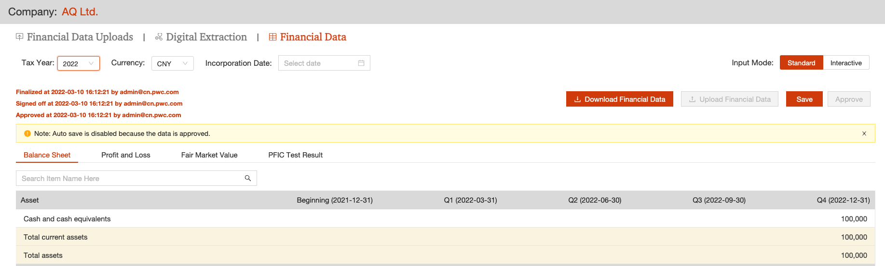
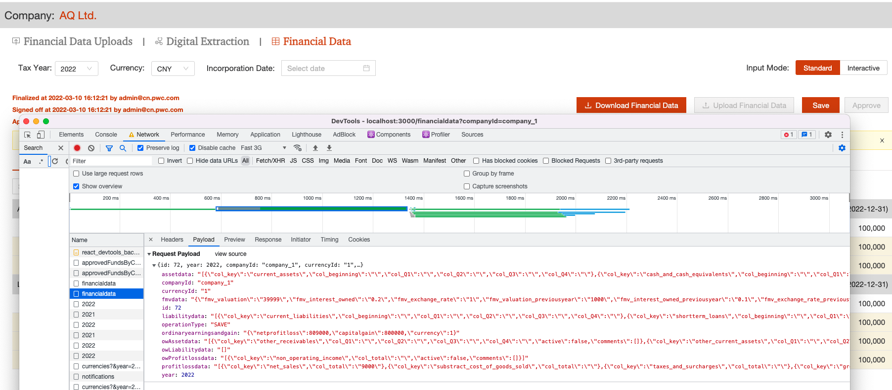
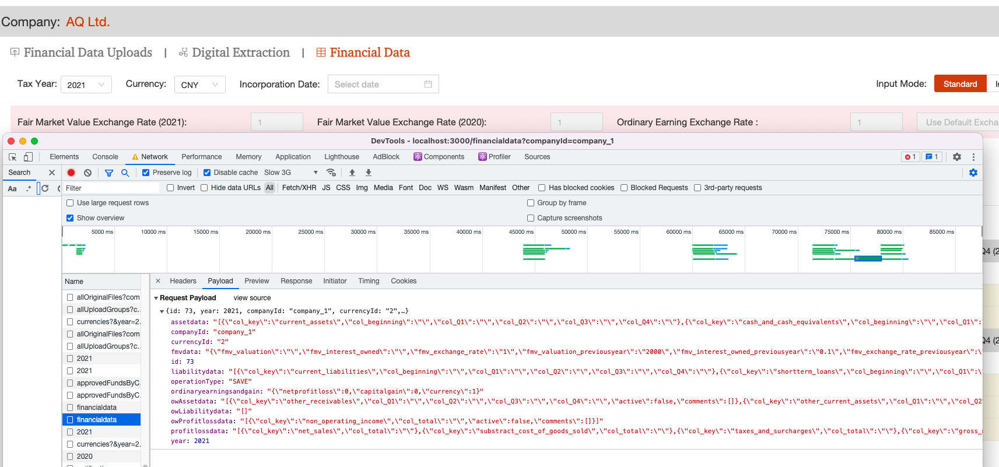

# Wrong finacial data updated

## Issue

The user said the finacial data is change for year 2021:

But in 2023, user can't modify year 2021's data:

User can only moidy year 2022's data:

## How to modify the data which can't be modified

The modify action ["Save" button trigger] will trigger post api request as below:

there could see the data for 2022 in updated.

And in year 2022, there is a button of "Save"  which is enabled, and set the network to "Slow 3G" and select "2021" year, before the UI refresh finish, click "Save" button.
Then the post body will have year "2021" and data of 2022 which is not refreshed 

## How to avoid this?

1. check in backend-- year 2021 should be blocked in api call 
2. don't trust froutend input -- front end status may be in corrupted format

