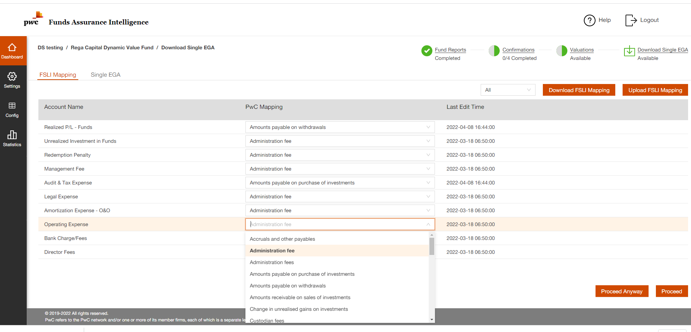
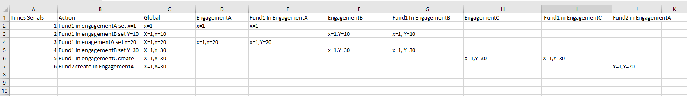

# Knowledge base establish with deep-copy

## Knowledge base

For example, in AWM there is a domain knowledge which is FSLI mapping:

Which is a account name from client to "PwC Mapping".

User need to do the account mapping for each fund.

How to create the domain knowledge by user selection.

There will have there scope:

1. global scope 
2. engagement base scope
3. fund scope

---
When user try to modify the knowledge for new fund, the system will try to find a knowledge in engagement
which the fund belongs to, if there is no knowledge base record, then will use the deep-copy of global knowledge base.

When user modified any mapping for the new fund, the modification will applied to the fund record and same 
as the engagement record also to the global record.

-----
Then the user's interact with fund will impacted both global and engagement scope, when user create another 
fund, the fund will use the engagement's knowledge base. Also the change will impact new engagement's fund creating.

The time serials will be like:

## Question

In this way, the global knowledge base could be easily modified by user, so the modification for global 
knowledge may or may not applied depends on the system design.