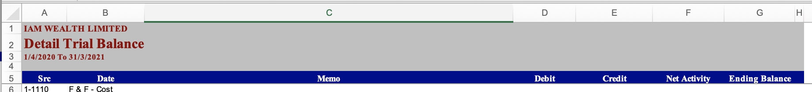
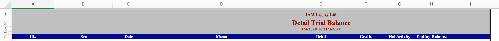
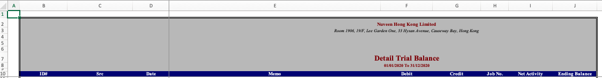

# Handle multi input

## Multi input format

The MYOB GL input files has multiple input format:

Chinese:


Missing ID column:


Normal:



Add extra job num:




## Handle inputs uses same design

Use the combination way to handle the different inputs:

```scala
    val tableRow1 = BasicExcelReaderHelper.processFileOnExcelReader(
      sourceFilePath,
      frontEndFundName,
      MyobGLReader.setting1
    )
    val tableRow2 = BasicExcelReaderHelper.processFileOnExcelReader(
      sourceFilePath,
      frontEndFundName,
      MyobGLReader.setting2
    )
    val tableRow3 = BasicExcelReaderHelper.processFileOnExcelReader(
      sourceFilePath,
      frontEndFundName,
      MyobGLReader.setting3
    )
    val tableRow4 = BasicExcelReaderHelper.processFileOnExcelReader(
      sourceFilePath,
      frontEndFundName,
      MyobGLReader.setting4
    )
    BasicGLProcessor.processFile(
      tableRow1 ++ tableRow2 ++ tableRow3 ++ tableRow4,
      frontEndPeriodStart,
      frontEndPeriodEnd,
      TranDate,
      storage
    )
```

