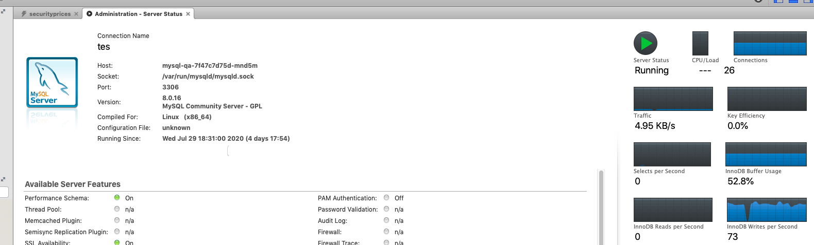

# DB bulk insert

## DB multiple insert issue

In AWM, there is a function for user to upload GSP data:

Then the backend will process these data, there are more than 20000 record in the excel:

But after backend processing finished, there are only 8451 records in the database:

when upload the same file after 8 times, the number goes to 21751:

Code for record in backend:

Controller
: @@snip[Controller](code/controller.scala)

Service
: @@snip[Service](code/service.scala)

DB
: @@snip[DB](code/db.scala)

From the service, it shows every item recording will cost 2 trips around with the database, and the 
database status will be :

 

Refine code with batch record:

Controller
: @@snip[Controller](code/r1controller.scala)

Service
: @@snip[Service](code/r1service.scala)

DB
: @@snip[DB](code/r1db.scala)

After the code change, all items are recorded:

## Performance issue
The record function has some performance issue, each record insert will also have 
2 trip around to database, here is using remote mysql server to compare performance:

The refine db insert code as below:

Not refined
: @@snip[Not refined](code/r1db.scala)

Refined
: @@snip[Refined query](code/r2db.scala)

After refined, with same configuration, the inserting performance as below:

## Md5 issue for compare

## Questions

1.Why only 8451 items record in the first scenarios:

   Because in first scenarios, all items for insert are running in separated DB request,
   There is some setting for db connection:

@@snip[db config](code/db.conf)
   
2.Why there is more than 20071 records in first scenarios when upload files multiple times:

   Because the inserting are in the different threads to query if same item existed in db, then the
   insert operations will insert same record at same time in different threads.
