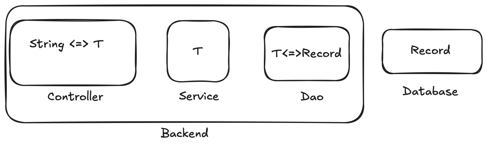
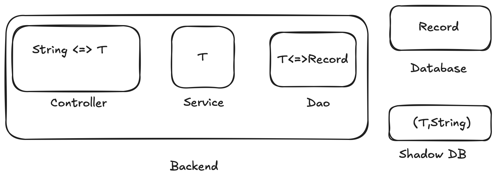
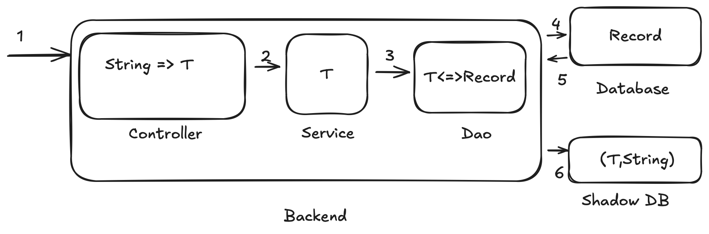
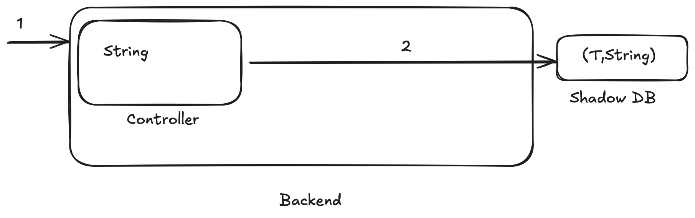

# Accelerating query performance with a Shadow DB

## Performance bottlenecks in backend data retrieval

Traditional backend design frequently follows this pattern:

Backend servers respond to API calls with data in JSON (string) format.
The Controller layer translates this string into a specific data type [T].
The Dao layer further transforms database records into the same data type [T].

Consequently, each record retrieved from the backend server undergoes two transformations.

While this approach is manageable for infrequent operations like Create, Update, and Delete (typically affecting single records), it can become a significant performance bottleneck for frequent Read operations.
Read operations often return multiple results per API call.
Moreover, complex queries that are difficult to optimize within the database schema may require processing a larger number of records on the backend server, further exacerbating the performance issue.

## Adding Shadow DB

Now shadow DB is added to system design as below

### Write operation

To synchronize the database with the shadow DB, each Create, Update, and Delete operation performed on the database will trigger an "update" event. This event is then used to synchronize the shadow DB with the changes made to the primary database.

### Read operation

The shadow DB stores data as (T, String) pairs. The 'T' component is used to execute the query logic, while the 'String' component represents the actual result of the query operation.

