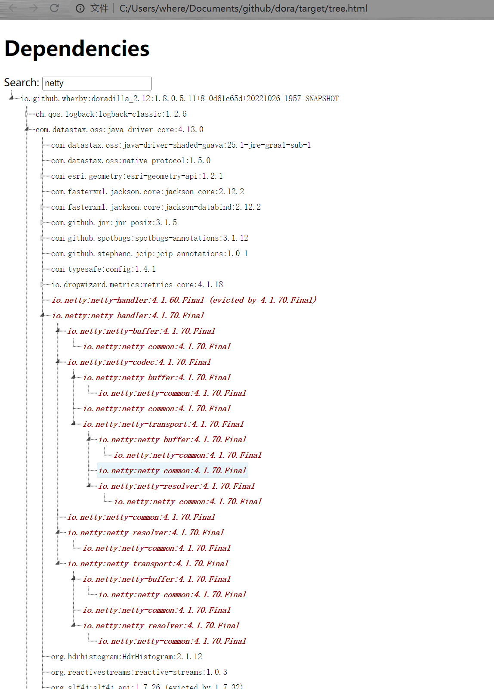
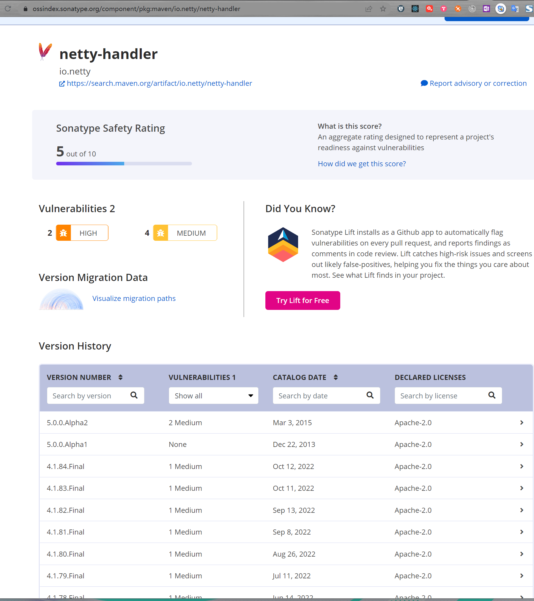
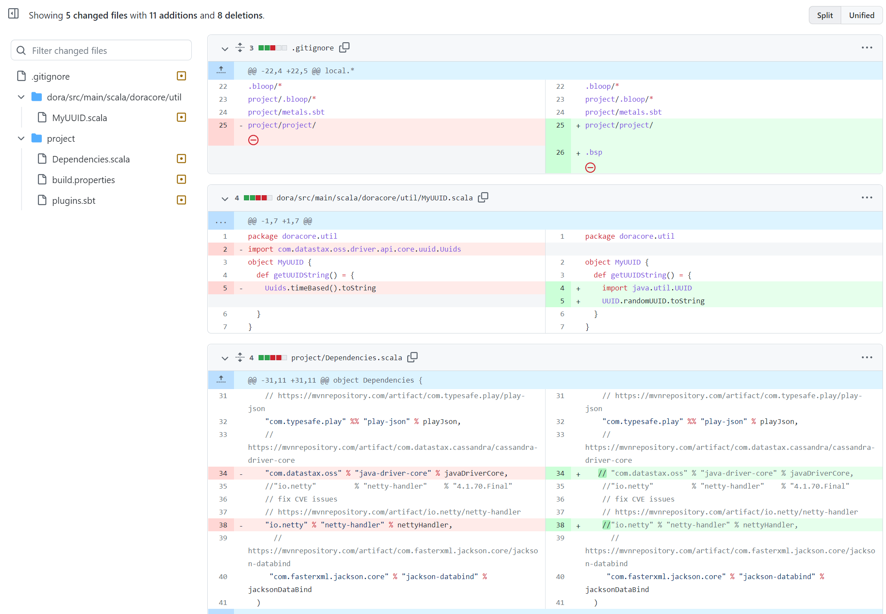

# Dependency

## Issue

In dora lib, there is one depency on java driver core of datastax:



While the lib depends on netty-handler, but this lib has CVE not fixed in current version and only available one is in about 9 years ago 



## Remove the dependency

The lib is used to create time uuid for actor which is used wildly in lib, but at
very beginning, this lib function is used in interface like:
```
package doracore.util
import com.datastax.oss.driver.api.core.uuid.Uuids
object MyUUID {
  def getUUIDString() = {
    Uuids.timeBased().toString
  }
}
```
so remove the lib will be easily:



https://github.com/wherby/dora/commit/fb78c1c7d6e5029e71f29889513567e8e3880655
