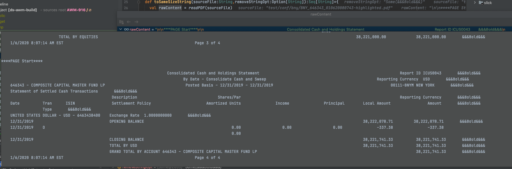
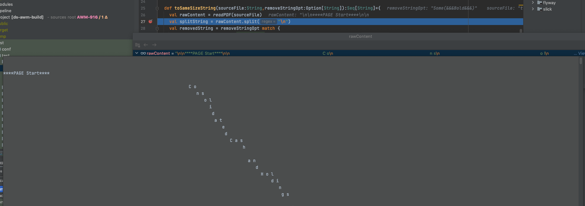
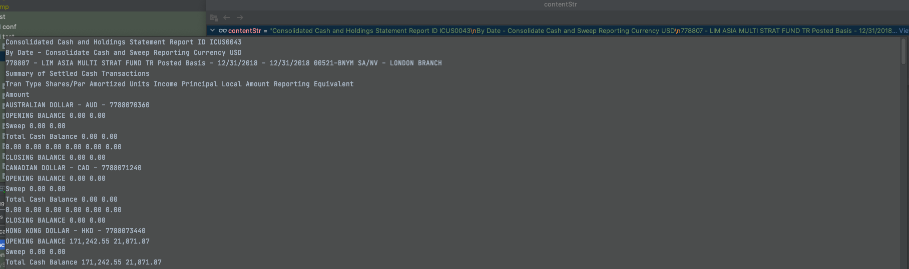

# How to structure a extractor process.

## Using OO design

Caller method

: @@snip[caller mether](./code/geneva/caller.scala)

Process design using OO

PositionAppraisalReportProcessor
: @@snip[PositionAppraisalReportProcessor](./code/geneva/PositionAppraisalReportProcessor.scala)

BaseExcelReportProcessor
: @@snip[BaseExcelReportProcessor](./code/geneva/BaseExcelReportProcessor.scala)

BaseReportProcessor
: @@snip[BaseReportProcessor](./code/geneva/BaseReportProcessor.scala)

AbstractProcessor
: @@snip[AbstractProcessor](./code/geneva/AbstractProcessor.scala)

Configuration file

PositionAppraisalReportConfig
: @@snip[PositionAppraisalReportConfig](./code/geneva/PositionAppraisalReportConfig.scala)

ExtractorConfig
: @@snip[ExtractorConfig](./code/geneva/ExtractorConfig.scala)

## Another way of design

Caller method
: @@snip[Caller method](./code/morgan/caller.scala)

MorganPSRProcessor
: @@snip[MorganPSRProcessor](./code/morgan/MorganPSRProcessor.scala)

MorganExcelPSRReader
: @@snip[MorganExcelPSRReader](./code/morgan/MorganExcelPSRReader.scala)

## How to compare the two ways

The two ways achieves same result.

The OO way use a big configuration to control all behaviors. The functions in
configuration are:

    1. convert excel to standard input 
    2. located the target field in input
    3. extract target input into result
    4. format the result value 

The another way combines the configuration of different functions.

## PDF different type

From beginning, we use pdf reader to read pdf contents to text lines:

Read PDF for type1
: @@snip[Read PDF](./code/readPdf.scala)

The pdf reader will return text content in formatted way:

While there is another type of pdf which will return unformatted result:

Then the reader need be change,
: @@snip[Read raw PDF](./code/readRaw.scala)

The result will be:

This way return result in line format, but lost formatted information(the space information is lost)

So the configuration way has more complex configuration when deal with the different reader.
While the combination way will have more flexibility to handle different type of input in  different way.
