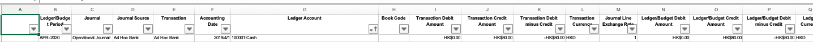
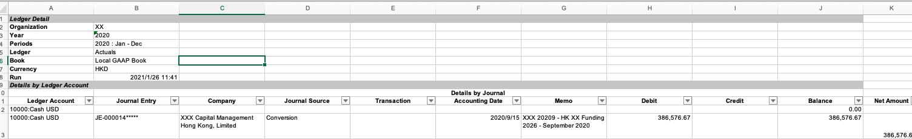

# How to structure a extractor process.

## Using OO design

Caller method

: @@snip[caller mether](./code/geneva/caller.scala)


Process design using OO

PositionAppraisalReportProcessor
: @@snip[PositionAppraisalReportProcessor](./code/geneva/PositionAppraisalReportProcessor.scala)

BaseExcelReportProcessor
: @@snip[BaseExcelReportProcessor](./code/geneva/BaseExcelReportProcessor.scala)

BaseReportProcessor
: @@snip[BaseReportProcessor](./code/geneva/BaseReportProcessor.scala)

AbstractProcessor
: @@snip[AbstractProcessor](./code/geneva/AbstractProcessor.scala)

Configuration file

PositionAppraisalReportConfig
: @@snip[PositionAppraisalReportConfig](./code/geneva/PositionAppraisalReportConfig.scala)

ExtractorConfig
: @@snip[ExtractorConfig](./code/geneva/ExtractorConfig.scala)

## Another way of design

Caller method
: @@snip[Caller method](./code/morgan/caller.scala)


MorganPSRProcessor
: @@snip[MorganPSRProcessor](./code/morgan/MorganPSRProcessor.scala)

MorganExcelPSRReader
: @@snip[MorganExcelPSRReader](./code/morgan/MorganExcelPSRReader.scala)


## How to compare the two ways

The two ways achieves same result.

The OO way use a big configuration to control all behaviors. The functions in
configuration are:

    1. convert excel to standard input 
    2. located the target field in input
    3. extract target input into result
    4. format the result value 


The another way combines the configuration of different functions.

## PDF different type

From beginning, we use pdf reader to read pdf contents to text lines:

Read PDF for type1
: @@snip[Read PDF](./code/readPdf.scala)

The pdf reader will return text content in formatted way:


While there is another type of pdf which will return unformatted result:


Then the reader need be change,
: @@snip[Read raw PDF](./code/readRaw.scala)

The result will be:


This way return result in line format, but lost formatted information(the space information is lost)

So the configuration way has more complex configuration when deal with the different reader.
While the combination way will have more flexibility to handle different type of input in  different way.


## Remove duplicated code using function programming

Using first way could reduce the duplicated code, but all different processor will increase the configuration
file's complexity to unmanageable. When using the second way will split each configuration to each processor, meanwhile 
introduce duplicated code in each processor and extractor.

So we create a structure to for the generic workflow:

```scala
    case class BasicExcelReader(
        header: String,
        filter: Seq[(Seq[ExcelField], String) => Boolean],
        mapper: Seq[ExcelField] => Map[String, String],
        readerOpt: Option[String => Seq[Seq[ExcelField]]]
    )
```

Code as below:

WorkdayProcessor
: @@snip[WorkdayProcessor](./code/workday/WorkdayProcessor.scala)

TBProcessor
: @@snip[WorkdayTBProcessor](./code/workday/WorkdayTBProcessor.scala)

TBReader
: @@snip[WorkdayTBReader](./code/workday/WorkdayTBRader.scala)

GLProcessor
: @@snip[WorkdayProcessor](./code/workday/WorkdayGLProcessor.scala)

GLReader
: @@snip[WorkdayGLReader](./code/workday/WorkdayGLReader.scala)

GLReader2
: @@snip[WorkdayGLReader2](./code/workday/WorkdayGLRead2.scala)

BasicExcelReaderHelper
: @@snip[BasicExcelReaderHelper](./code/workday/BasicExcelReaderHelper.scala)

BasicProcessFile
: @@snip[BasicProcessFile](./code/workday/BasicProcessFile.scala)

For all Excel file, go throw filter=>mapper process as above.

For GL type 1 fil as blow:



the code will work perfectly to extract all information using one Excel row:

```scala
  def createRow(row: Seq[ExcelField]) = {
    (createGLRowMap() ++ Map(
      BeginingBalanceDescriptiton -> getValueOfExcelField(row, 6),
      TranDate                    -> convertDateStringToYMDString(getValueOfExcelField(row, 5)),
      TranDescription             -> getValueOfExcelField(row, 19),
      Currency                    -> getValueOfExcelField(row, 11),
      LocalAmount                 -> getValueOfExcelField(row, 10),
      BookAmount                  -> getValueOfExcelField(row, 15)
    )).toMap
  }
```

But for GL type2 input:



There is need another input for currency and EndingBalanceAmount need additional information, but we don't
want to change interface, then curry is used:

```scala
 def getGroupedValue(inputFile: String): Map[String, Seq[Seq[ExcelField]]] = {
    val seqListValue = BasicExcelReaderHelper.defaultExcelReaderForExcel(headerStr)(inputFile)
    seqListValue.groupBy(list => list(0).field)
  }

  def getAmount(groupedRecord: Map[String, Seq[Seq[ExcelField]]], account: String): String = {
    val lastRow = groupedRecord.filter(tempGroup => tempGroup._1 == account).head._2.last
    getValueOfExcelField(lastRow, 9)
  }

  def createRow(currency: String, groupedRecord: Map[String, Seq[Seq[ExcelField]]]) =
    (row: Seq[ExcelField]) => {
      (createGLRowMap() ++ Map(
        BeginingBalanceDescriptiton -> getValueOfExcelField(row, 0),
        TranDate                    -> convertDateStringToYMDString(getValueOfExcelField(row, 5)),
        TranID                      -> getValueOfExcelField(row, 1),
        TranDescription             -> getValueOfExcelField(row, 6),
        Currency                    -> currency,
        LocalAmount                 -> getValueOfExcelFieldWithDefault(row, 10, Some("")),
        BookAmount                  -> getValueOfExcelFieldWithDefault(row, 10, Some("")),
        Balance                     -> getValueOfExcelField(row, 9),
        EndingBalanceAmount         -> getAmount(groupedRecord, getValueOfExcelField(row, 0))
      )).toMap
    }
```

## Bug in processor design

There is bug in processor design for getStorage function
```scala 
object WorkdayProcessor {
  val extractorMap = Map[Seq[String], (AbstractProcessor, ExtractorConfig)](
    Seq("TB") -> (new WorkdayTBProcessor, ReportPurchaseAndSalesConfig.extractorConfig),
    Seq("GL") -> (new WorkdayGLProcessor, ReportPurchaseAndSalesConfig.extractorConfig)
  )

  val processFiles = BasicProcessFile.processFiles(extractorMap) _

  //What's will be when create an instance in val
  val getStorage = BasicProcessFile.getStorageBase(new FundManagerSingleEGAStorage) _
}
```

need change to 


```scala 
object WorkdayProcessor {
  val extractorMap = Map[Seq[String], (AbstractProcessor, ExtractorConfig)](
    Seq("TB") -> (new WorkdayTBProcessor, ReportPurchaseAndSalesConfig.extractorConfig),
    Seq("GL") -> (new WorkdayGLProcessor, ReportPurchaseAndSalesConfig.extractorConfig)
  )

  val processFiles = BasicProcessFile.processFiles(extractorMap) _

  def getStorage = BasicProcessFile.getStorageBase(new FundManagerSingleEGAStorage) _
}
```

If the getStorage is val, then the "new FundManagerSingleEGAStorage" will only create once.


