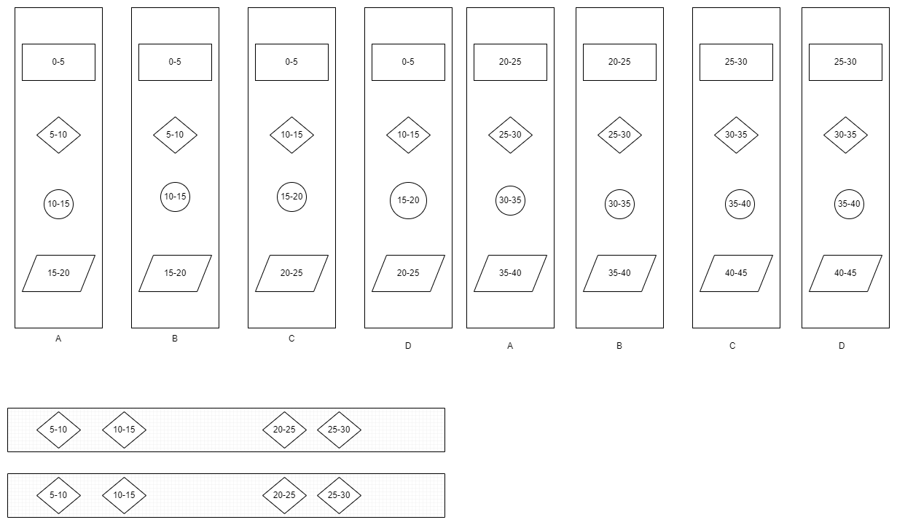
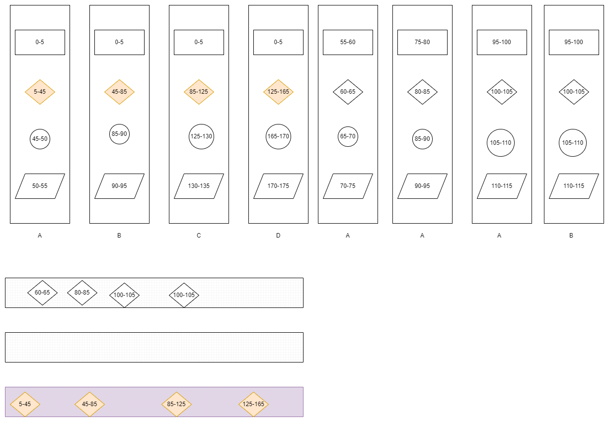
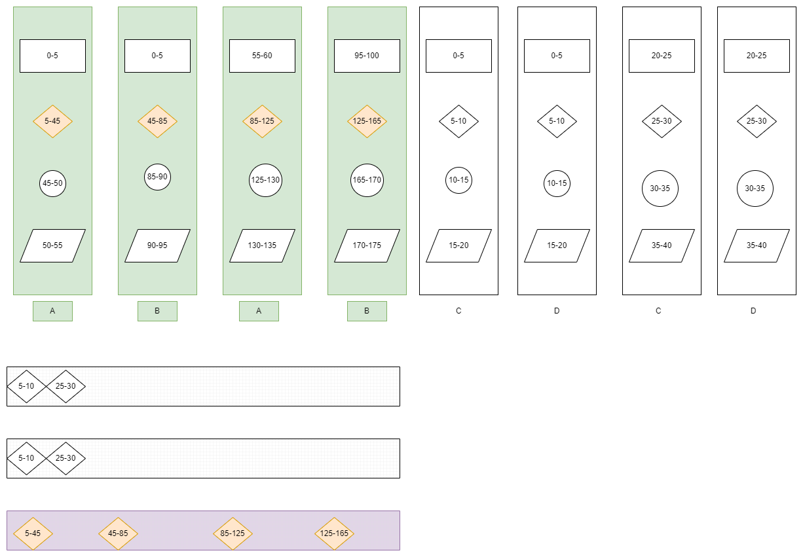
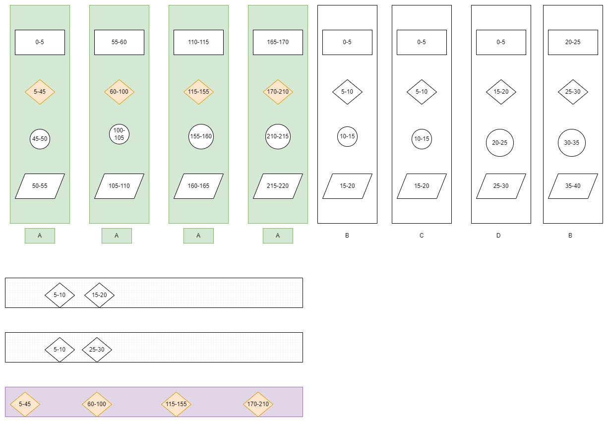

# Fast and slow jobs

## Basic fast jobs flow

Fist think a workflow contains 4 jobs, each job cost 5 minutes to finish

The parallel job number is 4

The second job can only run 2 at same time 

## With Slow job

And at same condition, the first 4 workflow's second job is slow job,
slow job needs 40 minutes and can only run 1 at same time.

## Split workflow

If we split slow and fast workflow with 2 fast channel and 2 slow channel

With 3 fast channel and 1 slow channel

