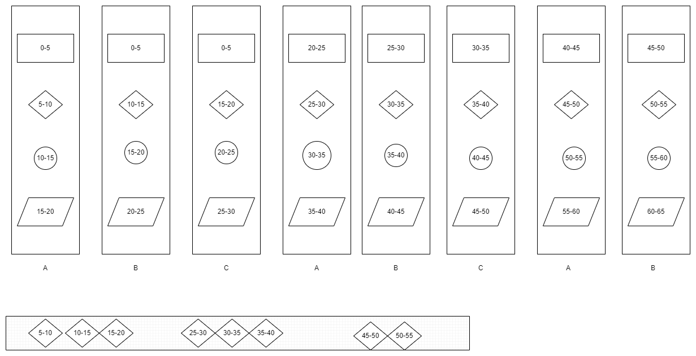
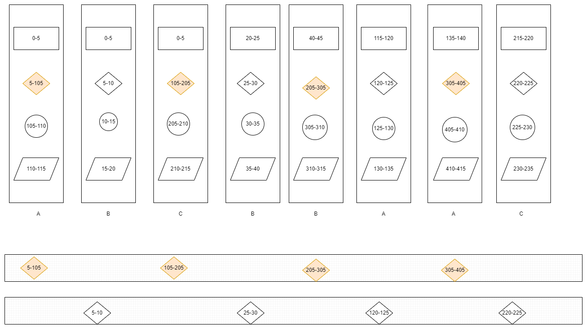
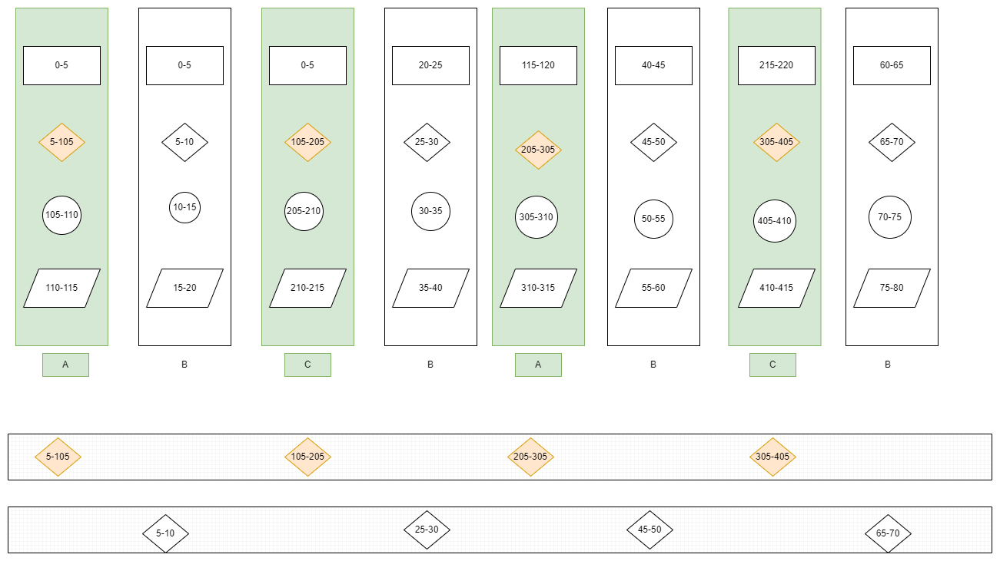
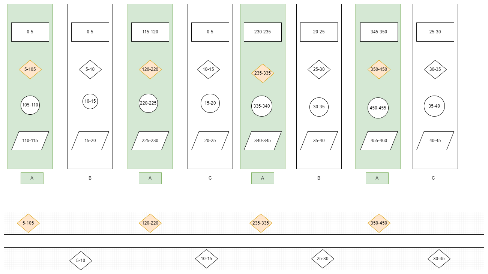

# Fast and slow job(2)

## Fast job work flow

Let's have 8 job work flows

    1. each work flow contains 4 job needs to executed in sequence
    2. each job is fast job which takes 5 minutes to finish
    3. the second job is resource limited job and 
       there is only one resource be available, 
       which means there will only one second job could be executed
    4. the parallel number is 3, 
       there will be A,B,C worker finish the job

## Add slow job

If some work flow the second job is slow job, and which needs 100 minutes and needs another resource

## Seperate the fast job and slow job

Let's ask different workers work with different type of workflow: 

### 1 fast and 2 slow worker

## 2 fast and 1 slow worker

