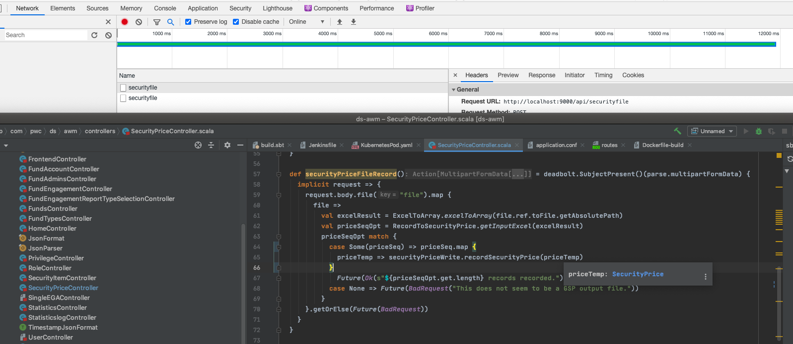
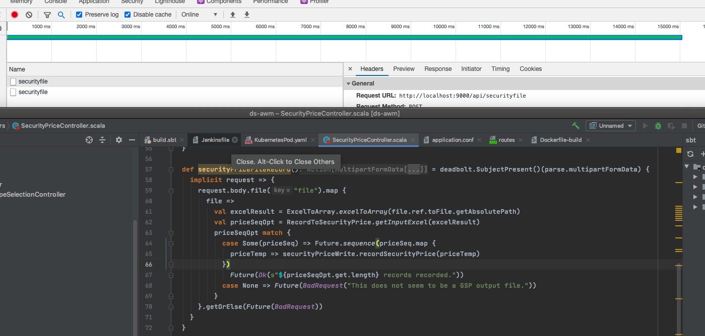
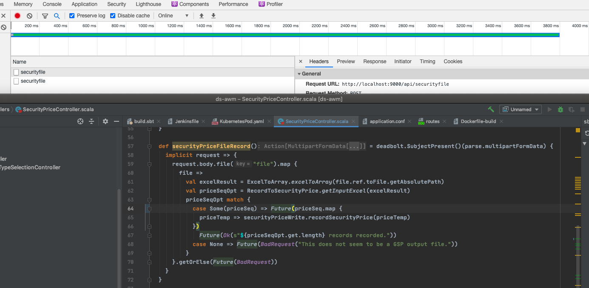

# Future value

## Future with sequence

There are two tasks for file upload record job:
1. extract excel fields to records
2. record to database

When there is no asynchronous context in the job about 12 seconds:

When use Future.sequence in the job costs about 15 seconds:

When only use Future in the job only less than 4 seconds(for file upload and extract):
