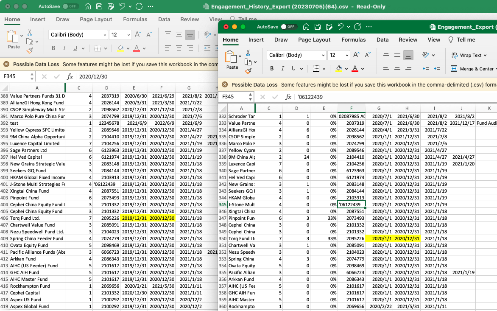
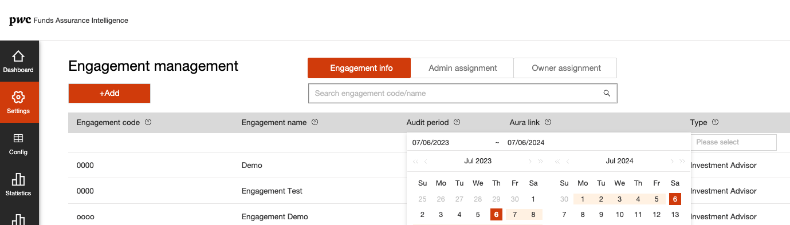

# Date time different issue

## Issue



The issue is happend when generate date from timestamp in backend for different time zone.
```scala 
val sdf2 = new SimpleDateFormat("yyyy/MM/dd")
val periodstart = engagement.flatMap(_.periodstart).map(ts => sdf2.format(new Date(ts.getTime())))
```

## SQL define

SQL define
: @@snip[SQL define](./src/engagement.sql)

UI of date input



## How to avoid this issue