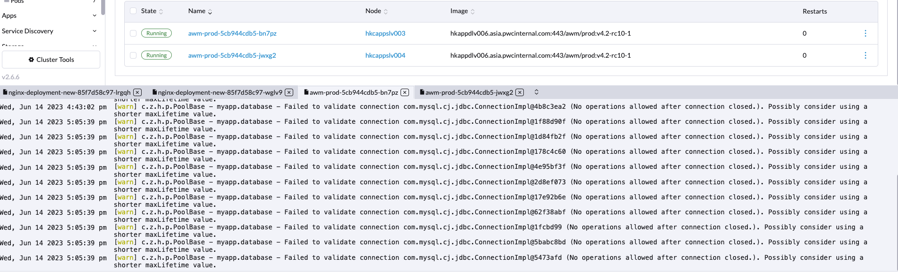
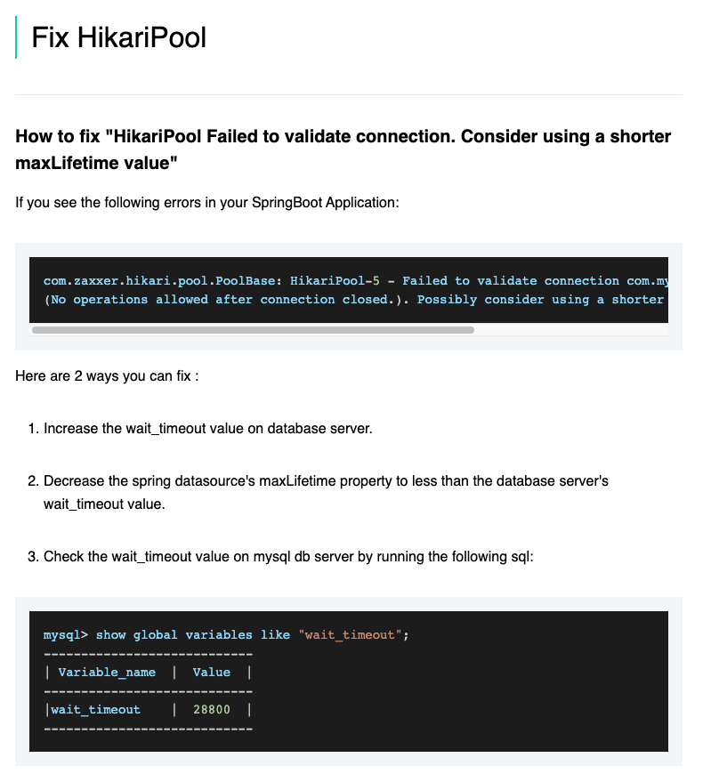
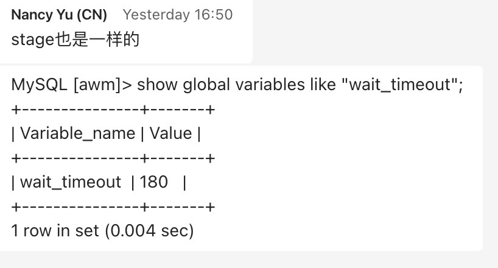
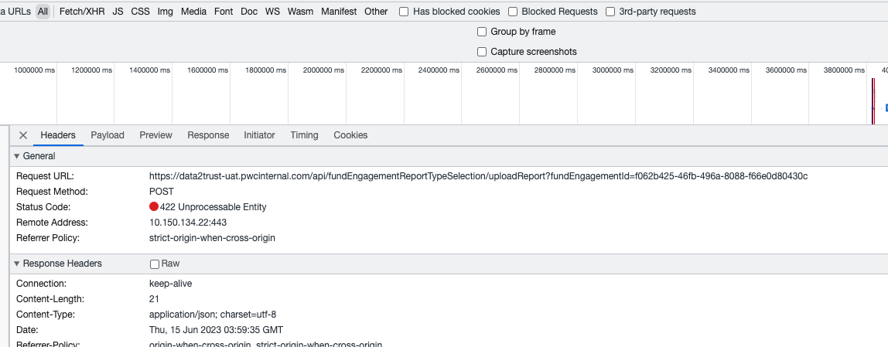
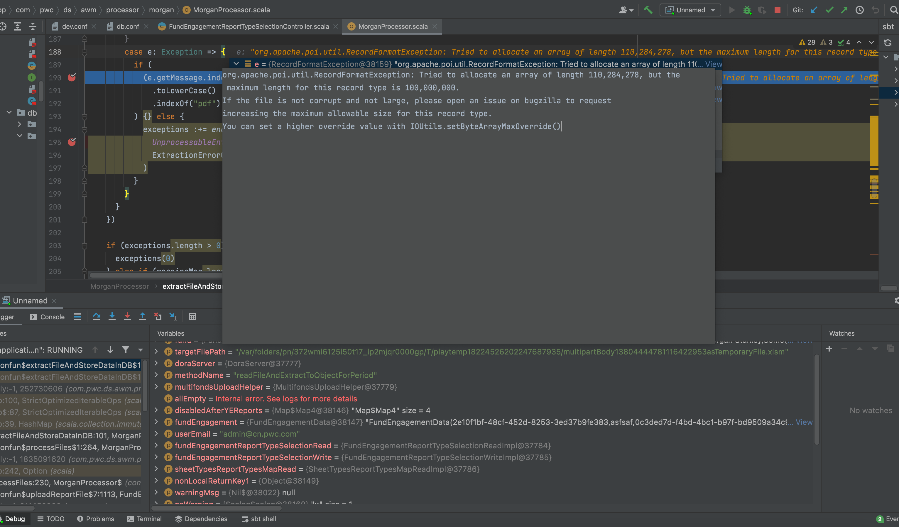
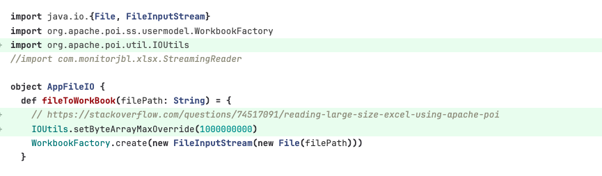

# Mysql Issue for Hikari: Failed to validate connection because connection is closed

## Issue 
When upload more than 10M excel in fundsAI, the upload will be failed


When check the application log, the below warning of mysql connect "Failed to validate connection com.mysql.cj.jdbc.ConnectionImpl@44d4d5eb (No operations allowed after connection closed.). " will be found.



And check the warning message, will find some link as https://techgry.com/concepts/02-maxLifetime 



It shows the server setting of maxlife time is not match the client side.

Check with the production environment mysql setting:



is 180 (seconds).

And if we change the value to "18000" , the db connection warning is dispeared, but the upload is not working as same.

## Real issue

The upload failed is a post call with 422 error code, which is handledby application


And debug the error find POI read issue:


And follow the instuctions to fix poi read error:


https://stackoverflow.com/questions/74517091/reading-large-size-excel-using-apache-poi

## Why Mysql connnection has issue

From the processor the work flow as below:
```
 upload file -> file read -> file process -> store to database 
```

The error happend in "file read " step, but mysql connection issue was thrown. It doesn't make sense if we think as step by step process. 

What maybe 