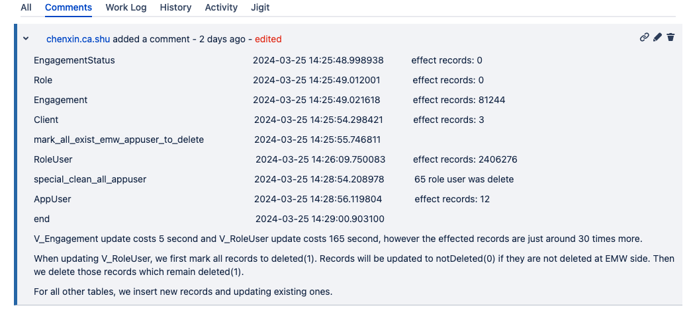

# Mem and DB

## Update user record in database

When sync EMW user, there will have 2,000,000 database updete operation. How the 2,000,000 operation generated, when start update, mark all user record in database as deleted, and insertOrupdate all user in EMW records in database, if the record in database, the update operation will reset delete flag. 

The comparing job is set to database, if there are 1,000,000 records, there will have doubled operation in each sync job, while 99.9% records remains same.

## Record jobs in memory

When user trigger a job, IDR will record the job in database and directly send the job to memory, and don't remove the job record in memory. When server restart, the job which is not finished will be loaded in memory, this operation which will be the limitation for scale out when have two hosts, the two hosts will loads same jobs. 