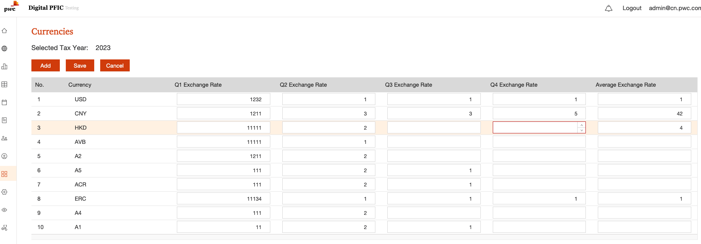

# MySql batch update issue

## User's update is not recorded.
User report they changed currency setting but find the changes doesn't be applied.
Currency setting UI as below:



User could add a new currency and update a currency rate. Change will be recorded in currencies and currency name table.

When we check log, find user did a update on 3/13/2024.

When we check the mysql table,  only currency name table has user's update record is updated and currencies table doesn't have user's update.

```

MySQL [pfic]> SELECT * FROM pfic.currencies;
+--------------------------------------+--------------------------------------+--------------+--------------+------+----------------------------------------------------------------------+--------------+--------------+--------------+
| id                                   | currency_id                          | q4_rate      | average_rate | year | description                                                          | q1_rate      | q2_rate      | q3_rate      |
+--------------------------------------+--------------------------------------+--------------+--------------+------+----------------------------------------------------------------------+--------------+--------------+--------------+
| 033D34B8-78D2-4AA0-BA35-27CECB347EBE | 1                                    |     1.000000 |     1.000000 | 2023 | updated by weiwei.ww.yang@cn.pwc.com at Thu Feb 09 06:13:52 UTC 2023 |     1.000000 |     1.000000 |     1.000000 |
| 0db6fbc0-7cb6-11eb-8269-8356e4c3b165 | da661bfe-0ba8-406c-8c90-815fb2a1c4a1 |     1.274196 |     1.341120 | 2020 | This currency is added by penny.w.wei@cn.pwc.com                     |     1.417125 |     1.364241 |     1.336428 |
| 1F091F8E-9BCF-4D47-8077-5CE41CBFF673 | da661bfe-0ba8-406c-8c90-815fb2a1c4a1 |     1.354535 |     1.301664 | 2022 | updated by penny.w.wei@cn.pwc.com at Mon Feb 28 01:04:48 UTC 2022    |     1.250600 |     1.289224 |     1.373988 |
| 207DDE20-796B-4582-BE1D-BF8D2251B676 | 3                                    |     7.808760 |     7.830600 | 2022 | updated by penny.w.wei@cn.pwc.com at Mon Feb 28 01:02:07 UTC 2022    |     7.830562 |     7.846677 |     7.849858 |
| 283FE5C0-9B79-4F29-BFCC-19B829CBB5E1 | 4be482d6-4fc2-41e1-8e24-2f1b6d690160 |     1.377050 |     1.332276 | 2021 | updated by penny.w.wei@cn.pwc.com at Mon Feb 28 01:04:48 UTC 2022    |     1.314488 |     1.332124 |     1.386670 |
| 3373A1AA-C2E0-48AA-98F1-4C36FD67230C | 2                                    |     6.968000 |     6.908800 | 2019 | NULL                                                                 |     6.711900 |     6.866800 |     7.138300 |
| 3517E241-E8BA-45D6-9B06-2C5DEDD09E27 | a9d22a28-17e2-4da0-98d1-805c2ee38ab1 |    82.747525 |    78.538552 | 2022 | updated by penny.w.wei@cn.pwc.com at Mon Feb 28 01:04:48 UTC 2022    |    75.587429 |    78.828050 |    81.503067 |
| 38039DEE-F418-49B1-89C1-1B473BC8778C | 4be482d6-4fc2-41e1-8e24-2f1b6d690160 |     1.468020 |         NULL | 2023 | updated by weiwei.ww.yang@cn.pwc.com at Thu Feb 09 06:43:10 UTC 2023 |         NULL |         NULL |         NULL |
| 3904633A-EB2B-410C-A0A1-EADC77A5615C | 2                                    |     6.876400 |     6.614600 | 2018 | NULL                                                                 |     6.280700 |     6.619800 |     6.868300 |
| 3DBD4EF7-002B-4AAB-B3BC-6A7D22C434DA | da661bfe-0ba8-406c-8c90-815fb2a1c4a1 |     1.269874 |     1.253744 | 2021 | updated by penny.w.wei@cn.pwc.com at Thu Mar 11 02:41:26 UTC 2021    |     1.259194 |     1.239598 |     1.271062 |
| 42347DA9-0354-496A-8B74-7EF4F80FA63C | 2                                    |     6.898300 |     6.730574 | 2022 | updated by penny.w.wei@cn.pwc.com at Mon Feb 28 01:02:07 UTC 2022    |     6.343092 |     6.697722 |     7.112828 |
| 4254                                 | 1                                    |     1.000000 |     1.000000 | 2019 | NULL                                                                 |     1.000000 |     1.000000 |     1.000000 |
| 45BF00CD-C43A-4EA5-9E2A-6F5FD94618B5 | 1                                    |     1.000000 |     1.000000 | 2020 | NULL                                                                 |     1.000000 |     1.000000 |     1.000000 |
| 479dc120-80bc-11eb-9ec1-39b260562b51 | da4623bf-477c-4b9d-8bf3-2e7adce695b7 |     0.732596 |     0.779832 | 2020 | NULL                                                                 |     0.808101 |     0.811219 |     0.776899 |
| 4C59C1EE-2E8A-4C98-95A1-413F0632F95E | 3                                    |     7.808530 |         NULL | 2023 | updated by weiwei.ww.yang@cn.pwc.com at Thu Feb 09 06:34:55 UTC 2023 |         NULL |         NULL |         NULL |
| 4DADBE95-87A0-4561-AACA-7FE11C20CF16 | a9d22a28-17e2-4da0-98d1-805c2ee38ab1 |    83.185800 |         NULL | 2023 | updated by weiwei.ww.yang@cn.pwc.com at Thu Feb 09 06:34:55 UTC 2023 |         NULL |         NULL |         NULL |
| 607EA0C6-26F6-4E05-BBA8-D5201D4A6BAC | 2                                    |     6.361418 |     6.451791 | 2021 | NULL                                                                 |     6.556486 |     6.457854 |     6.457995 |
| 60B93CEB-CA1B-46CA-9194-273970D227A0 | 3                                    |     7.797426 |     7.772671 | 2021 | NULL                                                                 |     7.774402 |     7.765206 |     7.786682 |
| 62B0F410-02F1-4979-BA2A-0756327243D2 | 2                                    |     7.079800 |         NULL | 2023 | updated by weiwei.ww.yang@cn.pwc.com at Thu Feb 09 06:13:52 UTC 2023 |         NULL |         NULL |         NULL |
| 6A26144B-8685-4A99-BA39-B2C05032976B | da4623bf-477c-4b9d-8bf3-2e7adce695b7 |     0.785462 |         NULL | 2023 | updated by weiwei.ww.yang@cn.pwc.com at Thu Feb 09 06:13:52 UTC 2023 |         NULL |         NULL |         NULL |
| 6E63098F-AFA2-4414-AF87-AF0033BB04BD | 1540b2c3-75ae-483a-a925-8c1af19f9b14 |  1294.460000 |         NULL | 2023 | updated by weiwei.ww.yang@cn.pwc.com at Thu Feb 09 06:34:55 UTC 2023 |         NULL |         NULL |         NULL |
| 798C3A3A-4684-44F5-98EA-D857D0D1ABAC | ba3b903c-cc7b-429d-9a64-2d9c753dc982 |   141.035000 |         NULL | 2023 | updated by weiwei.ww.yang@cn.pwc.com at Thu Feb 09 06:34:55 UTC 2023 |         NULL |         NULL |         NULL |
| 7B4A2876-5D75-48F4-AA18-A1F39DDA79D5 | 5f60da64-a053-4a65-8248-4caf05009929 |     0.934274 |     0.951134 | 2022 | updated by penny.w.wei@cn.pwc.com at Mon Feb 28 01:04:48 UTC 2022    |     0.899698 |     0.956909 |     1.020572 |
| 7b53ce10-d882-11eb-b6eb-51d4970dace9 | 4be482d6-4fc2-41e1-8e24-2f1b6d690160 |     1.297312 |     1.453330 | 2020 | NULL                                                                 |     1.628366 |     1.454142 |     1.400468 |
| 815D8666-F5BC-4E0F-8FBB-41530876945B | 5f60da64-a053-4a65-8248-4caf05009929 |     0.881594 |     0.845477 | 2021 | updated by penny.w.wei@cn.pwc.com at Thu Mar 11 02:42:26 UTC 2021    |     0.852680 |     0.841852 |     0.862846 |
| 85D8162D-AD61-47EE-A20C-DCBAE26E2EEB | 3                                    |     7.787600 |     7.835100 | 2019 | NULL                                                                 |     7.850000 |     7.812900 |     7.839900 |
| 85FEF722-161B-4065-80B7-A98D2FAF89A4 | ba3b903c-cc7b-429d-9a64-2d9c753dc982 |   131.101000 |   131.420982 | 2022 | updated by penny.w.wei@cn.pwc.com at Mon Feb 28 01:04:48 UTC 2022    |   121.829574 |   136.108751 |   144.613376 |
| 87F23629-1FF0-4549-B5EB-6186FFFCDFFE | c8afe0ca-b0fc-43e4-afe6-bae65fdcf7b8 | 15560.755000 | 14848.624981 | 2022 | updated by weiwei.ww.yang@cn.pwc.com at Thu Feb 09 06:43:10 UTC 2023 | 14352.489384 | 14915.656412 | 15257.678286 |
| 8D0CF578-CE76-49C3-9570-990B4BF3A4CF | da4623bf-477c-4b9d-8bf3-2e7adce695b7 |     0.826638 |     0.811493 | 2022 | updated by penny.w.wei@cn.pwc.com at Mon Feb 28 01:04:48 UTC 2022    |     0.761407 |     0.823256 |     0.898086 |
| 9A013112-9DD6-4762-807C-F99B7A2A508C | da661bfe-0ba8-406c-8c90-815fb2a1c4a1 |     1.325170 |         NULL | 2023 | updated by weiwei.ww.yang@cn.pwc.com at Thu Feb 09 06:43:10 UTC 2023 |         NULL |         NULL |         NULL |
| 9a921da0-54ab-11eb-ae14-7d806ff58e7a | 5f60da64-a053-4a65-8248-4caf05009929 |     0.815352 |     0.877299 | 2020 | This currency is added by penny.w.wei@cn.pwc.com                     |     0.909048 |     0.875319 |     0.852905 |
| 9f2cea60-80bc-11eb-9ec1-39b260562b51 | ba3b903c-cc7b-429d-9a64-2d9c753dc982 |   103.166820 |   106.757683 | 2020 | NULL                                                                 |   108.112670 |   107.786434 |   105.579828 |
| A64A66B4-07B8-4759-B6BE-62A01594BD4B | ba3b903c-cc7b-429d-9a64-2d9c753dc982 |   115.093029 |   109.817398 | 2021 | This currency is added by penny.w.wei@cn.pwc.com                     |   110.699958 |   110.743952 |   111.708661 |
| A91B3C44-38C8-4D30-A4F5-897F83E39512 | 1                                    |     1.000000 |     1.000000 | 2018 | NULL                                                                 |     1.000000 |     1.000000 |     1.000000 |
| b61182e0-80bc-11eb-9ec1-39b260562b51 | 1540b2c3-75ae-483a-a925-8c1af19f9b14 |  1087.037776 |  1179.713160 | 2020 | NULL                                                                 |  1220.107854 |  1200.204758 |  1167.585628 |
| B6864BCF-8B23-48B1-AC86-102FE7CCA624 | a9d22a28-17e2-4da0-98d1-805c2ee38ab1 |    74.366634 |    73.915199 | 2021 | This currency is added by penny.w.wei@cn.pwc.com                     |    73.297281 |    74.284374 |    74.210652 |
| B96F5F81-F40B-49F4-BFF5-369EE1DFB26F | 2                                    |     6.532645 |     6.901958 | 2020 | NULL                                                                 |     7.089556 |     7.069729 |     6.803297 |
| B999226E-369A-4AB7-9B83-F609BA859DC9 | 1540b2c3-75ae-483a-a925-8c1af19f9b14 |  1189.662014 |  1144.924442 | 2021 | This currency is added by penny.w.wei@cn.pwc.com                     |  1129.531652 |  1129.622538 |  1184.752844 |
| BD4086E2-71BB-47DB-8523-6EA4E59E0D3D | 3                                    |     7.752704 |     7.756134 | 2020 | NULL                                                                 |     7.752868 |     7.750375 |     7.750064 |
| c9537930-80bc-11eb-9ec1-39b260562b51 | a9d22a28-17e2-4da0-98d1-805c2ee38ab1 |    73.022441 |    73.976030 | 2020 | NULL                                                                 |    74.810921 |    75.288745 |    73.632718 |
| CA0FFE81-2241-42AB-8271-27A9BECE0DE8 | da4623bf-477c-4b9d-8bf3-2e7adce695b7 |     0.740082 |     0.727128 | 2021 | This currency is added by penny.w.wei@cn.pwc.com                     |     0.726399 |     0.722766 |     0.742978 |
| df39aec0-f859-11ec-8614-3d66a03153cf | c8afe0ca-b0fc-43e4-afe6-bae65fdcf7b8 | 14241.948720 | 14309.988302 | 2021 | NULL                                                                 | 14568.554890 | 14542.391381 | 14317.447779 |
| E2908A51-5B02-4EDB-A468-04818A65D2B5 | 1540b2c3-75ae-483a-a925-8c1af19f9b14 |  1261.915000 |  1291.829282 | 2022 | updated by weiwei.ww.yang@cn.pwc.com at Thu Feb 09 06:13:52 UTC 2023 |  1212.993563 |  1295.589204 |  1435.442487 |
| E3451651-D0CA-4E0E-9231-609FBB325AC6 | 1                                    |     1.000000 |     1.000000 | 2021 | NULL                                                                 |     1.000000 |     1.000000 |     1.000000 |
| EAD97D41-1DBB-4FF5-8547-689D86793A01 | 4be482d6-4fc2-41e1-8e24-2f1b6d690160 |     1.466684 |     1.442088 | 2022 | updated by weiwei.ww.yang@cn.pwc.com at Thu Feb 09 06:34:55 UTC 2023 |     1.335003 |     1.450957 |     1.547793 |
| EBDB14D6-1B08-41AC-8613-8FEBE102CA87 | 1                                    |     1.000000 |     1.000000 | 2022 | updated by penny.w.wei@cn.pwc.com at Mon Feb 28 01:02:07 UTC 2022    |     1.000000 |     1.000000 |     1.000000 |
| F1D399B9-985B-4032-AC73-C3CCCE1AC13D | 5f60da64-a053-4a65-8248-4caf05009929 |     0.906023 |         NULL | 2023 | updated by weiwei.ww.yang@cn.pwc.com at Thu Feb 09 06:34:55 UTC 2023 |         NULL |         NULL |         NULL |
| F7FEE7F4-1977-4F47-98BA-1C08D82BD645 | c8afe0ca-b0fc-43e4-afe6-bae65fdcf7b8 | 15389.000000 |         NULL | 2023 | updated by weiwei.ww.yang@cn.pwc.com at Thu Feb 09 08:04:37 UTC 2023 |         NULL |         NULL |         NULL |
| F9CECB79-3B9F-4DD7-8028-91CD5F6A83ED | 3                                    |     7.831700 |     7.837500 | 2018 | NULL                                                                 |     7.849100 |     7.846300 |     7.828700 |
+--------------------------------------+--------------------------------------+--------------+--------------+------+----------------------------------------------------------------------+--------------+--------------+--------------+
49 rows in set (0.003 sec)
 
MySQL [pfic]> SELECT * FROM pfic.currency_name;
+--------------------------------------+----------+--------------------------------------------------------------------+
| id                                   | currency | description                                                        |
+--------------------------------------+----------+--------------------------------------------------------------------+
| 1                                    | USD      | updated by robert.c.tao@cn.pwc.com at Wed Mar 13 06:41:12 UTC 2024 |
| 1540b2c3-75ae-483a-a925-8c1af19f9b14 | KRW      | updated by robert.c.tao@cn.pwc.com at Wed Mar 13 06:41:12 UTC 2024 |
| 2                                    | CNY      | updated by robert.c.tao@cn.pwc.com at Wed Mar 13 06:41:12 UTC 2024 |
| 3                                    | HKD      | updated by robert.c.tao@cn.pwc.com at Wed Mar 13 06:41:12 UTC 2024 |
| 4be482d6-4fc2-41e1-8e24-2f1b6d690160 | AUD      | updated by robert.c.tao@cn.pwc.com at Wed Mar 13 06:41:12 UTC 2024 |
| 5f60da64-a053-4a65-8248-4caf05009929 | EUR      | updated by robert.c.tao@cn.pwc.com at Wed Mar 13 06:41:12 UTC 2024 |
| a9d22a28-17e2-4da0-98d1-805c2ee38ab1 | INR      | updated by robert.c.tao@cn.pwc.com at Wed Mar 13 06:41:12 UTC 2024 |
| ba3b903c-cc7b-429d-9a64-2d9c753dc982 | JPY      | updated by robert.c.tao@cn.pwc.com at Wed Mar 13 06:41:12 UTC 2024 |
| c8afe0ca-b0fc-43e4-afe6-bae65fdcf7b8 | IDR      | updated by robert.c.tao@cn.pwc.com at Wed Mar 13 06:41:12 UTC 2024 |
| da4623bf-477c-4b9d-8bf3-2e7adce695b7 | GBP      | updated by robert.c.tao@cn.pwc.com at Wed Mar 13 06:41:12 UTC 2024 |
| da661bfe-0ba8-406c-8c90-815fb2a1c4a1 | CAD      | updated by robert.c.tao@cn.pwc.com at Wed Mar 13 06:41:12 UTC 2024 |
+--------------------------------------+----------+--------------------------------------------------------------------+
11 rows in set (0.003 sec)

```

The date is 5/20/2024, are the changes missing for currencies table?

When user did a single row change for the currencies. There is a "new record" appears :"updated by robert.c.tao@cn.pwc.com at Wed Mar 13 06:41:12 UTC 2024 " , the data is updated as user's change today 5/20/2024, but the modify record is 3/13/2024.

```

MySQL [pfic]> SELECT * FROM pfic.currencies;
+--------------------------------------+--------------------------------------+--------------+--------------+------+----------------------------------------------------------------------+--------------+--------------+--------------+
| id                                   | currency_id                          | q4_rate      | average_rate | year | description                                                          | q1_rate      | q2_rate      | q3_rate      |
+--------------------------------------+--------------------------------------+--------------+--------------+------+----------------------------------------------------------------------+--------------+--------------+--------------+
| 033D34B8-78D2-4AA0-BA35-27CECB347EBE | 1                                    |     1.000000 |     1.000000 | 2023 | updated by weiwei.ww.yang@cn.pwc.com at Thu Feb 09 06:13:52 UTC 2023 |     1.000000 |     1.000000 |     1.000000 |
| 0db6fbc0-7cb6-11eb-8269-8356e4c3b165 | da661bfe-0ba8-406c-8c90-815fb2a1c4a1 |     1.274196 |     1.341120 | 2020 | This currency is added by penny.w.wei@cn.pwc.com                     |     1.417125 |     1.364241 |     1.336428 |
| 1F091F8E-9BCF-4D47-8077-5CE41CBFF673 | da661bfe-0ba8-406c-8c90-815fb2a1c4a1 |     1.354535 |     1.301664 | 2022 | updated by penny.w.wei@cn.pwc.com at Mon Feb 28 01:04:48 UTC 2022    |     1.250600 |     1.289224 |     1.373988 |
| 207DDE20-796B-4582-BE1D-BF8D2251B676 | 3                                    |     7.808760 |     7.830600 | 2022 | updated by penny.w.wei@cn.pwc.com at Mon Feb 28 01:02:07 UTC 2022    |     7.830562 |     7.846677 |     7.849858 |
| 283FE5C0-9B79-4F29-BFCC-19B829CBB5E1 | 4be482d6-4fc2-41e1-8e24-2f1b6d690160 |     1.377050 |     1.332276 | 2021 | updated by penny.w.wei@cn.pwc.com at Mon Feb 28 01:04:48 UTC 2022    |     1.314488 |     1.332124 |     1.386670 |
| 3373A1AA-C2E0-48AA-98F1-4C36FD67230C | 2                                    |     6.968000 |     6.908800 | 2019 | NULL                                                                 |     6.711900 |     6.866800 |     7.138300 |
| 3517E241-E8BA-45D6-9B06-2C5DEDD09E27 | a9d22a28-17e2-4da0-98d1-805c2ee38ab1 |    82.747525 |    78.538552 | 2022 | updated by penny.w.wei@cn.pwc.com at Mon Feb 28 01:04:48 UTC 2022    |    75.587429 |    78.828050 |    81.503067 |
| 38039DEE-F418-49B1-89C1-1B473BC8778C | 4be482d6-4fc2-41e1-8e24-2f1b6d690160 |     1.468020 |         NULL | 2023 | updated by weiwei.ww.yang@cn.pwc.com at Thu Feb 09 06:43:10 UTC 2023 |         NULL |         NULL |         NULL |
| 3904633A-EB2B-410C-A0A1-EADC77A5615C | 2                                    |     6.876400 |     6.614600 | 2018 | NULL                                                                 |     6.280700 |     6.619800 |     6.868300 |
| 3DBD4EF7-002B-4AAB-B3BC-6A7D22C434DA | da661bfe-0ba8-406c-8c90-815fb2a1c4a1 |     1.269874 |     1.253744 | 2021 | updated by penny.w.wei@cn.pwc.com at Thu Mar 11 02:41:26 UTC 2021    |     1.259194 |     1.239598 |     1.271062 |
| 42347DA9-0354-496A-8B74-7EF4F80FA63C | 2                                    |     6.898300 |     6.730574 | 2022 | updated by penny.w.wei@cn.pwc.com at Mon Feb 28 01:02:07 UTC 2022    |     6.343092 |     6.697722 |     7.112828 |
| 4254                                 | 1                                    |     1.000000 |     1.000000 | 2019 | NULL                                                                 |     1.000000 |     1.000000 |     1.000000 |
| 45BF00CD-C43A-4EA5-9E2A-6F5FD94618B5 | 1                                    |     1.000000 |     1.000000 | 2020 | NULL                                                                 |     1.000000 |     1.000000 |     1.000000 |
| 479dc120-80bc-11eb-9ec1-39b260562b51 | da4623bf-477c-4b9d-8bf3-2e7adce695b7 |     0.732596 |     0.779832 | 2020 | NULL                                                                 |     0.808101 |     0.811219 |     0.776899 |
| 4C59C1EE-2E8A-4C98-95A1-413F0632F95E | 3                                    |     7.808530 |         NULL | 2023 | updated by weiwei.ww.yang@cn.pwc.com at Thu Feb 09 06:34:55 UTC 2023 |         NULL |         NULL |         NULL |
| 4DADBE95-87A0-4561-AACA-7FE11C20CF16 | a9d22a28-17e2-4da0-98d1-805c2ee38ab1 |    83.185800 |         NULL | 2023 | updated by weiwei.ww.yang@cn.pwc.com at Thu Feb 09 06:34:55 UTC 2023 |         NULL |         NULL |         NULL |
| 607EA0C6-26F6-4E05-BBA8-D5201D4A6BAC | 2                                    |     6.361418 |     6.451791 | 2021 | NULL                                                                 |     6.556486 |     6.457854 |     6.457995 |
| 60B93CEB-CA1B-46CA-9194-273970D227A0 | 3                                    |     7.797426 |     7.772671 | 2021 | NULL                                                                 |     7.774402 |     7.765206 |     7.786682 |
| 62B0F410-02F1-4979-BA2A-0756327243D2 | 2                                    |     7.079800 |         NULL | 2023 | updated by robert.c.tao@cn.pwc.com at Wed Mar 13 06:41:12 UTC 2024   |     6.868040 |         NULL |         NULL |
| 6A26144B-8685-4A99-BA39-B2C05032976B | da4623bf-477c-4b9d-8bf3-2e7adce695b7 |     0.785462 |         NULL | 2023 | updated by weiwei.ww.yang@cn.pwc.com at Thu Feb 09 06:13:52 UTC 2023 |         NULL |         NULL |         NULL |
| 6E63098F-AFA2-4414-AF87-AF0033BB04BD | 1540b2c3-75ae-483a-a925-8c1af19f9b14 |  1294.460000 |         NULL | 2023 | updated by weiwei.ww.yang@cn.pwc.com at Thu Feb 09 06:34:55 UTC 2023 |         NULL |         NULL |         NULL |
| 798C3A3A-4684-44F5-98EA-D857D0D1ABAC | ba3b903c-cc7b-429d-9a64-2d9c753dc982 |   141.035000 |         NULL | 2023 | updated by weiwei.ww.yang@cn.pwc.com at Thu Feb 09 06:34:55 UTC 2023 |         NULL |         NULL |         NULL |
| 7B4A2876-5D75-48F4-AA18-A1F39DDA79D5 | 5f60da64-a053-4a65-8248-4caf05009929 |     0.934274 |     0.951134 | 2022 | updated by penny.w.wei@cn.pwc.com at Mon Feb 28 01:04:48 UTC 2022    |     0.899698 |     0.956909 |     1.020572 |
| 7b53ce10-d882-11eb-b6eb-51d4970dace9 | 4be482d6-4fc2-41e1-8e24-2f1b6d690160 |     1.297312 |     1.453330 | 2020 | NULL                                                                 |     1.628366 |     1.454142 |     1.400468 |
| 815D8666-F5BC-4E0F-8FBB-41530876945B | 5f60da64-a053-4a65-8248-4caf05009929 |     0.881594 |     0.845477 | 2021 | updated by penny.w.wei@cn.pwc.com at Thu Mar 11 02:42:26 UTC 2021    |     0.852680 |     0.841852 |     0.862846 |
| 85D8162D-AD61-47EE-A20C-DCBAE26E2EEB | 3                                    |     7.787600 |     7.835100 | 2019 | NULL                                                                 |     7.850000 |     7.812900 |     7.839900 |
| 85FEF722-161B-4065-80B7-A98D2FAF89A4 | ba3b903c-cc7b-429d-9a64-2d9c753dc982 |   131.101000 |   131.420982 | 2022 | updated by penny.w.wei@cn.pwc.com at Mon Feb 28 01:04:48 UTC 2022    |   121.829574 |   136.108751 |   144.613376 |
| 87F23629-1FF0-4549-B5EB-6186FFFCDFFE | c8afe0ca-b0fc-43e4-afe6-bae65fdcf7b8 | 15560.755000 | 14848.624981 | 2022 | updated by weiwei.ww.yang@cn.pwc.com at Thu Feb 09 06:43:10 UTC 2023 | 14352.489384 | 14915.656412 | 15257.678286 |
| 8D0CF578-CE76-49C3-9570-990B4BF3A4CF | da4623bf-477c-4b9d-8bf3-2e7adce695b7 |     0.826638 |     0.811493 | 2022 | updated by penny.w.wei@cn.pwc.com at Mon Feb 28 01:04:48 UTC 2022    |     0.761407 |     0.823256 |     0.898086 |
| 9A013112-9DD6-4762-807C-F99B7A2A508C | da661bfe-0ba8-406c-8c90-815fb2a1c4a1 |     1.325170 |         NULL | 2023 | updated by weiwei.ww.yang@cn.pwc.com at Thu Feb 09 06:43:10 UTC 2023 |         NULL |         NULL |         NULL |
| 9a921da0-54ab-11eb-ae14-7d806ff58e7a | 5f60da64-a053-4a65-8248-4caf05009929 |     0.815352 |     0.877299 | 2020 | This currency is added by penny.w.wei@cn.pwc.com                     |     0.909048 |     0.875319 |     0.852905 |
| 9f2cea60-80bc-11eb-9ec1-39b260562b51 | ba3b903c-cc7b-429d-9a64-2d9c753dc982 |   103.166820 |   106.757683 | 2020 | NULL                                                                 |   108.112670 |   107.786434 |   105.579828 |
| A64A66B4-07B8-4759-B6BE-62A01594BD4B | ba3b903c-cc7b-429d-9a64-2d9c753dc982 |   115.093029 |   109.817398 | 2021 | This currency is added by penny.w.wei@cn.pwc.com                     |   110.699958 |   110.743952 |   111.708661 |
| A91B3C44-38C8-4D30-A4F5-897F83E39512 | 1                                    |     1.000000 |     1.000000 | 2018 | NULL                                                                 |     1.000000 |     1.000000 |     1.000000 |
| b61182e0-80bc-11eb-9ec1-39b260562b51 | 1540b2c3-75ae-483a-a925-8c1af19f9b14 |  1087.037776 |  1179.713160 | 2020 | NULL                                                                 |  1220.107854 |  1200.204758 |  1167.585628 |
| B6864BCF-8B23-48B1-AC86-102FE7CCA624 | a9d22a28-17e2-4da0-98d1-805c2ee38ab1 |    74.366634 |    73.915199 | 2021 | This currency is added by penny.w.wei@cn.pwc.com                     |    73.297281 |    74.284374 |    74.210652 |
| B96F5F81-F40B-49F4-BFF5-369EE1DFB26F | 2                                    |     6.532645 |     6.901958 | 2020 | NULL                                                                 |     7.089556 |     7.069729 |     6.803297 |
| B999226E-369A-4AB7-9B83-F609BA859DC9 | 1540b2c3-75ae-483a-a925-8c1af19f9b14 |  1189.662014 |  1144.924442 | 2021 | This currency is added by penny.w.wei@cn.pwc.com                     |  1129.531652 |  1129.622538 |  1184.752844 |
| BD4086E2-71BB-47DB-8523-6EA4E59E0D3D | 3                                    |     7.752704 |     7.756134 | 2020 | NULL                                                                 |     7.752868 |     7.750375 |     7.750064 |
| c9537930-80bc-11eb-9ec1-39b260562b51 | a9d22a28-17e2-4da0-98d1-805c2ee38ab1 |    73.022441 |    73.976030 | 2020 | NULL                                                                 |    74.810921 |    75.288745 |    73.632718 |
| CA0FFE81-2241-42AB-8271-27A9BECE0DE8 | da4623bf-477c-4b9d-8bf3-2e7adce695b7 |     0.740082 |     0.727128 | 2021 | This currency is added by penny.w.wei@cn.pwc.com                     |     0.726399 |     0.722766 |     0.742978 |
| df39aec0-f859-11ec-8614-3d66a03153cf | c8afe0ca-b0fc-43e4-afe6-bae65fdcf7b8 | 14241.948720 | 14309.988302 | 2021 | NULL                                                                 | 14568.554890 | 14542.391381 | 14317.447779 |
| E2908A51-5B02-4EDB-A468-04818A65D2B5 | 1540b2c3-75ae-483a-a925-8c1af19f9b14 |  1261.915000 |  1291.829282 | 2022 | updated by weiwei.ww.yang@cn.pwc.com at Thu Feb 09 06:13:52 UTC 2023 |  1212.993563 |  1295.589204 |  1435.442487 |
| E3451651-D0CA-4E0E-9231-609FBB325AC6 | 1                                    |     1.000000 |     1.000000 | 2021 | NULL                                                                 |     1.000000 |     1.000000 |     1.000000 |
| EAD97D41-1DBB-4FF5-8547-689D86793A01 | 4be482d6-4fc2-41e1-8e24-2f1b6d690160 |     1.466684 |     1.442088 | 2022 | updated by weiwei.ww.yang@cn.pwc.com at Thu Feb 09 06:34:55 UTC 2023 |     1.335003 |     1.450957 |     1.547793 |
| EBDB14D6-1B08-41AC-8613-8FEBE102CA87 | 1                                    |     1.000000 |     1.000000 | 2022 | updated by penny.w.wei@cn.pwc.com at Mon Feb 28 01:02:07 UTC 2022    |     1.000000 |     1.000000 |     1.000000 |
| F1D399B9-985B-4032-AC73-C3CCCE1AC13D | 5f60da64-a053-4a65-8248-4caf05009929 |     0.906023 |         NULL | 2023 | updated by weiwei.ww.yang@cn.pwc.com at Thu Feb 09 06:34:55 UTC 2023 |         NULL |         NULL |         NULL |
| F7FEE7F4-1977-4F47-98BA-1C08D82BD645 | c8afe0ca-b0fc-43e4-afe6-bae65fdcf7b8 | 15389.000000 |         NULL | 2023 | updated by weiwei.ww.yang@cn.pwc.com at Thu Feb 09 08:04:37 UTC 2023 |         NULL |         NULL |         NULL |
| F9CECB79-3B9F-4DD7-8028-91CD5F6A83ED | 3                                    |     7.831700 |     7.837500 | 2018 | NULL                                                                 |     7.849100 |     7.846300 |     7.828700 |
+--------------------------------------+--------------------------------------+--------------+--------------+------+----------------------------------------------------------------------+--------------+--------------+--------------+
49 rows in set (0.003 sec)

```

When user update all records again, 
The currencies table value updated, but change log is 3/13/2024, and one of previous log is 5/20/2024.

```

MySQL [pfic]> SELECT * FROM pfic.currencies;
+--------------------------------------+--------------------------------------+--------------+--------------+------+----------------------------------------------------------------------+--------------+--------------+--------------+
| id                                   | currency_id                          | q4_rate      | average_rate | year | description                                                          | q1_rate      | q2_rate      | q3_rate      |
+--------------------------------------+--------------------------------------+--------------+--------------+------+----------------------------------------------------------------------+--------------+--------------+--------------+
| 033D34B8-78D2-4AA0-BA35-27CECB347EBE | 1                                    |     1.000000 |     1.000000 | 2023 | updated by weiwei.ww.yang@cn.pwc.com at Thu Feb 09 06:13:52 UTC 2023 |     1.000000 |     1.000000 |     1.000000 |
| 0db6fbc0-7cb6-11eb-8269-8356e4c3b165 | da661bfe-0ba8-406c-8c90-815fb2a1c4a1 |     1.274196 |     1.341120 | 2020 | This currency is added by penny.w.wei@cn.pwc.com                     |     1.417125 |     1.364241 |     1.336428 |
| 1F091F8E-9BCF-4D47-8077-5CE41CBFF673 | da661bfe-0ba8-406c-8c90-815fb2a1c4a1 |     1.354535 |     1.301664 | 2022 | updated by penny.w.wei@cn.pwc.com at Mon Feb 28 01:04:48 UTC 2022    |     1.250600 |     1.289224 |     1.373988 |
| 207DDE20-796B-4582-BE1D-BF8D2251B676 | 3                                    |     7.808760 |     7.830600 | 2022 | updated by penny.w.wei@cn.pwc.com at Mon Feb 28 01:02:07 UTC 2022    |     7.830562 |     7.846677 |     7.849858 |
| 283FE5C0-9B79-4F29-BFCC-19B829CBB5E1 | 4be482d6-4fc2-41e1-8e24-2f1b6d690160 |     1.377050 |     1.332276 | 2021 | updated by penny.w.wei@cn.pwc.com at Mon Feb 28 01:04:48 UTC 2022    |     1.314488 |     1.332124 |     1.386670 |
| 3373A1AA-C2E0-48AA-98F1-4C36FD67230C | 2                                    |     6.968000 |     6.908800 | 2019 | NULL                                                                 |     6.711900 |     6.866800 |     7.138300 |
| 3517E241-E8BA-45D6-9B06-2C5DEDD09E27 | a9d22a28-17e2-4da0-98d1-805c2ee38ab1 |    82.747525 |    78.538552 | 2022 | updated by penny.w.wei@cn.pwc.com at Mon Feb 28 01:04:48 UTC 2022    |    75.587429 |    78.828050 |    81.503067 |
| 38039DEE-F418-49B1-89C1-1B473BC8778C | 4be482d6-4fc2-41e1-8e24-2f1b6d690160 |     1.468020 |         NULL | 2023 | updated by weiwei.ww.yang@cn.pwc.com at Thu Feb 09 06:43:10 UTC 2023 |         NULL |         NULL |         NULL |
| 3904633A-EB2B-410C-A0A1-EADC77A5615C | 2                                    |     6.876400 |     6.614600 | 2018 | NULL                                                                 |     6.280700 |     6.619800 |     6.868300 |
| 3DBD4EF7-002B-4AAB-B3BC-6A7D22C434DA | da661bfe-0ba8-406c-8c90-815fb2a1c4a1 |     1.269874 |     1.253744 | 2021 | updated by penny.w.wei@cn.pwc.com at Thu Mar 11 02:41:26 UTC 2021    |     1.259194 |     1.239598 |     1.271062 |
| 42347DA9-0354-496A-8B74-7EF4F80FA63C | 2                                    |     6.898300 |     6.730574 | 2022 | updated by penny.w.wei@cn.pwc.com at Mon Feb 28 01:02:07 UTC 2022    |     6.343092 |     6.697722 |     7.112828 |
| 4254                                 | 1                                    |     1.000000 |     1.000000 | 2019 | NULL                                                                 |     1.000000 |     1.000000 |     1.000000 |
| 45BF00CD-C43A-4EA5-9E2A-6F5FD94618B5 | 1                                    |     1.000000 |     1.000000 | 2020 | NULL                                                                 |     1.000000 |     1.000000 |     1.000000 |
| 479dc120-80bc-11eb-9ec1-39b260562b51 | da4623bf-477c-4b9d-8bf3-2e7adce695b7 |     0.732596 |     0.779832 | 2020 | NULL                                                                 |     0.808101 |     0.811219 |     0.776899 |
| 4C59C1EE-2E8A-4C98-95A1-413F0632F95E | 3                                    |     7.808530 |     7.828750 | 2023 | updated by robert.c.tao@cn.pwc.com at Wed Mar 13 06:41:12 UTC 2024   |     7.849830 |     7.836140 |     7.831450 |
| 4DADBE95-87A0-4561-AACA-7FE11C20CF16 | a9d22a28-17e2-4da0-98d1-805c2ee38ab1 |    83.185800 |    82.576900 | 2023 | updated by robert.c.tao@cn.pwc.com at Wed Mar 13 06:41:12 UTC 2024   |    82.164200 |    82.067700 |    83.180200 |
| 607EA0C6-26F6-4E05-BBA8-D5201D4A6BAC | 2                                    |     6.361418 |     6.451791 | 2021 | NULL                                                                 |     6.556486 |     6.457854 |     6.457995 |
| 60B93CEB-CA1B-46CA-9194-273970D227A0 | 3                                    |     7.797426 |     7.772671 | 2021 | NULL                                                                 |     7.774402 |     7.765206 |     7.786682 |
| 62B0F410-02F1-4979-BA2A-0756327243D2 | 2                                    |     7.079800 |     7.074790 | 2023 | updated by robert.c.tao@cn.pwc.com at Mon May 20 08:34:05 UTC 2024   |     6.868040 |     7.255550 |     7.295200 |
| 6A26144B-8685-4A99-BA39-B2C05032976B | da4623bf-477c-4b9d-8bf3-2e7adce695b7 |     0.785462 |     0.804367 | 2023 | updated by robert.c.tao@cn.pwc.com at Wed Mar 13 06:41:12 UTC 2024   |     0.808534 |     0.789724 |     0.819394 |
| 6E63098F-AFA2-4414-AF87-AF0033BB04BD | 1540b2c3-75ae-483a-a925-8c1af19f9b14 |  1294.460000 |  1306.460000 | 2023 | updated by robert.c.tao@cn.pwc.com at Wed Mar 13 06:41:12 UTC 2024   |  1302.320000 |  1318.860000 |  1352.920000 |
| 798C3A3A-4684-44F5-98EA-D857D0D1ABAC | ba3b903c-cc7b-429d-9a64-2d9c753dc982 |   141.035000 |   140.526000 | 2023 | updated by robert.c.tao@cn.pwc.com at Wed Mar 13 06:41:12 UTC 2024   |   132.998000 |   144.562000 |   149.368000 |
| 7B4A2876-5D75-48F4-AA18-A1F39DDA79D5 | 5f60da64-a053-4a65-8248-4caf05009929 |     0.934274 |     0.951134 | 2022 | updated by penny.w.wei@cn.pwc.com at Mon Feb 28 01:04:48 UTC 2022    |     0.899698 |     0.956909 |     1.020572 |
| 7b53ce10-d882-11eb-b6eb-51d4970dace9 | 4be482d6-4fc2-41e1-8e24-2f1b6d690160 |     1.297312 |     1.453330 | 2020 | NULL                                                                 |     1.628366 |     1.454142 |     1.400468 |
| 815D8666-F5BC-4E0F-8FBB-41530876945B | 5f60da64-a053-4a65-8248-4caf05009929 |     0.881594 |     0.845477 | 2021 | updated by penny.w.wei@cn.pwc.com at Thu Mar 11 02:42:26 UTC 2021    |     0.852680 |     0.841852 |     0.862846 |
| 85D8162D-AD61-47EE-A20C-DCBAE26E2EEB | 3                                    |     7.787600 |     7.835100 | 2019 | NULL                                                                 |     7.850000 |     7.812900 |     7.839900 |
| 85FEF722-161B-4065-80B7-A98D2FAF89A4 | ba3b903c-cc7b-429d-9a64-2d9c753dc982 |   131.101000 |   131.420982 | 2022 | updated by penny.w.wei@cn.pwc.com at Mon Feb 28 01:04:48 UTC 2022    |   121.829574 |   136.108751 |   144.613376 |
| 87F23629-1FF0-4549-B5EB-6186FFFCDFFE | c8afe0ca-b0fc-43e4-afe6-bae65fdcf7b8 | 15560.755000 | 14848.624981 | 2022 | updated by weiwei.ww.yang@cn.pwc.com at Thu Feb 09 06:43:10 UTC 2023 | 14352.489384 | 14915.656412 | 15257.678286 |
| 8D0CF578-CE76-49C3-9570-990B4BF3A4CF | da4623bf-477c-4b9d-8bf3-2e7adce695b7 |     0.826638 |     0.811493 | 2022 | updated by penny.w.wei@cn.pwc.com at Mon Feb 28 01:04:48 UTC 2022    |     0.761407 |     0.823256 |     0.898086 |
| 9A013112-9DD6-4762-807C-F99B7A2A508C | da661bfe-0ba8-406c-8c90-815fb2a1c4a1 |     1.325170 |     1.349510 | 2023 | updated by robert.c.tao@cn.pwc.com at Wed Mar 13 06:41:12 UTC 2024   |     1.353070 |     1.324920 |     1.358020 |
| 9a921da0-54ab-11eb-ae14-7d806ff58e7a | 5f60da64-a053-4a65-8248-4caf05009929 |     0.815352 |     0.877299 | 2020 | This currency is added by penny.w.wei@cn.pwc.com                     |     0.909048 |     0.875319 |     0.852905 |
| 9f2cea60-80bc-11eb-9ec1-39b260562b51 | ba3b903c-cc7b-429d-9a64-2d9c753dc982 |   103.166820 |   106.757683 | 2020 | NULL                                                                 |   108.112670 |   107.786434 |   105.579828 |
| A64A66B4-07B8-4759-B6BE-62A01594BD4B | ba3b903c-cc7b-429d-9a64-2d9c753dc982 |   115.093029 |   109.817398 | 2021 | This currency is added by penny.w.wei@cn.pwc.com                     |   110.699958 |   110.743952 |   111.708661 |
| A91B3C44-38C8-4D30-A4F5-897F83E39512 | 1                                    |     1.000000 |     1.000000 | 2018 | NULL                                                                 |     1.000000 |     1.000000 |     1.000000 |
| b61182e0-80bc-11eb-9ec1-39b260562b51 | 1540b2c3-75ae-483a-a925-8c1af19f9b14 |  1087.037776 |  1179.713160 | 2020 | NULL                                                                 |  1220.107854 |  1200.204758 |  1167.585628 |
| B6864BCF-8B23-48B1-AC86-102FE7CCA624 | a9d22a28-17e2-4da0-98d1-805c2ee38ab1 |    74.366634 |    73.915199 | 2021 | This currency is added by penny.w.wei@cn.pwc.com                     |    73.297281 |    74.284374 |    74.210652 |
| B96F5F81-F40B-49F4-BFF5-369EE1DFB26F | 2                                    |     6.532645 |     6.901958 | 2020 | NULL                                                                 |     7.089556 |     7.069729 |     6.803297 |
| B999226E-369A-4AB7-9B83-F609BA859DC9 | 1540b2c3-75ae-483a-a925-8c1af19f9b14 |  1189.662014 |  1144.924442 | 2021 | This currency is added by penny.w.wei@cn.pwc.com                     |  1129.531652 |  1129.622538 |  1184.752844 |
| BD4086E2-71BB-47DB-8523-6EA4E59E0D3D | 3                                    |     7.752704 |     7.756134 | 2020 | NULL                                                                 |     7.752868 |     7.750375 |     7.750064 |
| c9537930-80bc-11eb-9ec1-39b260562b51 | a9d22a28-17e2-4da0-98d1-805c2ee38ab1 |    73.022441 |    73.976030 | 2020 | NULL                                                                 |    74.810921 |    75.288745 |    73.632718 |
| CA0FFE81-2241-42AB-8271-27A9BECE0DE8 | da4623bf-477c-4b9d-8bf3-2e7adce695b7 |     0.740082 |     0.727128 | 2021 | This currency is added by penny.w.wei@cn.pwc.com                     |     0.726399 |     0.722766 |     0.742978 |
| df39aec0-f859-11ec-8614-3d66a03153cf | c8afe0ca-b0fc-43e4-afe6-bae65fdcf7b8 | 14241.948720 | 14309.988302 | 2021 | NULL                                                                 | 14568.554890 | 14542.391381 | 14317.447779 |
| E2908A51-5B02-4EDB-A468-04818A65D2B5 | 1540b2c3-75ae-483a-a925-8c1af19f9b14 |  1261.915000 |  1291.829282 | 2022 | updated by weiwei.ww.yang@cn.pwc.com at Thu Feb 09 06:13:52 UTC 2023 |  1212.993563 |  1295.589204 |  1435.442487 |
| E3451651-D0CA-4E0E-9231-609FBB325AC6 | 1                                    |     1.000000 |     1.000000 | 2021 | NULL                                                                 |     1.000000 |     1.000000 |     1.000000 |
| EAD97D41-1DBB-4FF5-8547-689D86793A01 | 4be482d6-4fc2-41e1-8e24-2f1b6d690160 |     1.466684 |     1.442088 | 2022 | updated by weiwei.ww.yang@cn.pwc.com at Thu Feb 09 06:34:55 UTC 2023 |     1.335003 |     1.450957 |     1.547793 |
| EBDB14D6-1B08-41AC-8613-8FEBE102CA87 | 1                                    |     1.000000 |     1.000000 | 2022 | updated by penny.w.wei@cn.pwc.com at Mon Feb 28 01:02:07 UTC 2022    |     1.000000 |     1.000000 |     1.000000 |
| F1D399B9-985B-4032-AC73-C3CCCE1AC13D | 5f60da64-a053-4a65-8248-4caf05009929 |     0.906023 |     0.924802 | 2023 | updated by robert.c.tao@cn.pwc.com at Wed Mar 13 06:41:12 UTC 2024   |     0.919298 |     0.918668 |     0.945680 |
| F7FEE7F4-1977-4F47-98BA-1C08D82BD645 | c8afe0ca-b0fc-43e4-afe6-bae65fdcf7b8 | 15389.000000 |         NULL | 2023 | updated by weiwei.ww.yang@cn.pwc.com at Thu Feb 09 08:04:37 UTC 2023 |         NULL |         NULL |         NULL |
| F9CECB79-3B9F-4DD7-8028-91CD5F6A83ED | 3                                    |     7.831700 |     7.837500 | 2018 | NULL                                                                 |     7.849100 |     7.846300 |     7.828700 |
+--------------------------------------+--------------------------------------+--------------+--------------+------+----------------------------------------------------------------------+--------------+--------------+--------------+
49 rows in set (0.003 sec)
 
MySQL [pfic]> SELECT * FROM pfic.currency_name;
+--------------------------------------+----------+--------------------------------------------------------------------+
| id                                   | currency | description                                                        |
+--------------------------------------+----------+--------------------------------------------------------------------+
| 1                                    | USD      | updated by robert.c.tao@cn.pwc.com at Wed Mar 13 06:41:12 UTC 2024 |
| 1540b2c3-75ae-483a-a925-8c1af19f9b14 | KRW      | updated by robert.c.tao@cn.pwc.com at Mon May 20 08:48:51 UTC 2024 |
| 2                                    | CNY      | updated by robert.c.tao@cn.pwc.com at Mon May 20 08:46:54 UTC 2024 |
| 3                                    | HKD      | updated by robert.c.tao@cn.pwc.com at Mon May 20 08:49:34 UTC 2024 |
| 4be482d6-4fc2-41e1-8e24-2f1b6d690160 | AUD      | updated by robert.c.tao@cn.pwc.com at Mon May 20 08:50:14 UTC 2024 |
| 5f60da64-a053-4a65-8248-4caf05009929 | EUR      | updated by robert.c.tao@cn.pwc.com at Mon May 20 08:48:06 UTC 2024 |
| a9d22a28-17e2-4da0-98d1-805c2ee38ab1 | INR      | updated by robert.c.tao@cn.pwc.com at Mon May 20 08:49:15 UTC 2024 |
| ba3b903c-cc7b-429d-9a64-2d9c753dc982 | JPY      | updated by robert.c.tao@cn.pwc.com at Mon May 20 08:48:32 UTC 2024 |
| c8afe0ca-b0fc-43e4-afe6-bae65fdcf7b8 | IDR      | updated by robert.c.tao@cn.pwc.com at Mon May 20 08:50:33 UTC 2024 |
| da4623bf-477c-4b9d-8bf3-2e7adce695b7 | GBP      | updated by robert.c.tao@cn.pwc.com at Mon May 20 08:47:40 UTC 2024 |
| da661bfe-0ba8-406c-8c90-815fb2a1c4a1 | CAD      | updated by robert.c.tao@cn.pwc.com at Mon May 20 08:49:53 UTC 2024 |
+--------------------------------------+----------+--------------------------------------------------------------------+


```

## What's happened?

The batchupdate for mysql has bugs, the update of 3/13/2024 is not appied to mysql table (Not writed to disk). And another write will flush the change to disk.


The scala code of update as below:

```scala 

def insertOrUpdate() = deadbolt.Pattern(value = "b_admin", patternType = PatternType.REGEX)(trim(parse.json)) { implicit request => {
    val added = Json.parse(request.body.toString()).as[Seq[Currency]]
    val email = request.session.get("email").get
    val currencyNameFrontSeq = Json.parse(request.body.toString()).as[Seq[CurrencyNameFront]]
    val res =Future.sequence( currencyNameFrontSeq.map{
      cnF =>CurrencyNameClass(cnF.currencyNameId,cnF.currencyName,Some(s"updated by $email at ${Calendar.getInstance().getTime()}"))
    }.map{
      cn=> currencyNameWrite.addOrUpdateCurrencyName(cn)
    })
    Await.result(res , 1 second)
    currencyServiceWrite.insertOrUpdate(added).transform {
      case Success(_) => Success(Ok("success"))
      case Failure(exception) => exception match {
        case mysqlException: SQLIntegrityConstraintViolationException => {
          SafeLogger.logString(Logger,
            "Create investor failed with MySQLIntegrityConstraintViolationException", mysqlException)
          Success(BadRequest)
        }
        case _ => {
          SafeLogger.logString(Logger, "Create investor failed with InternalServerError", exception)
          Success(InternalServerError(exception.toString))
        }
      }
    }
  }
  }

```

``` scala

  override def insertOrUpdate(currencys: Seq[Currency]): Future[Unit] = {
    var inserts = for (currency <- currencys) yield {
      val currencyRow = currencyToCurrencyRow(currency)
      Currencies.insertOrUpdate(currencyRow)
    }
    db.run(DBIO.seq(inserts: _*))
  }

```