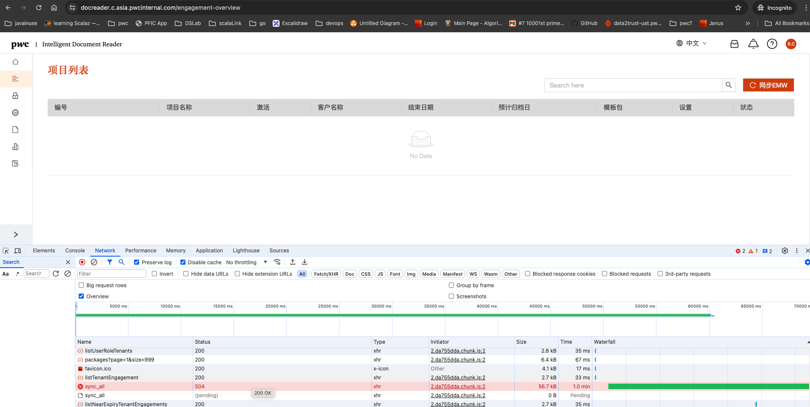
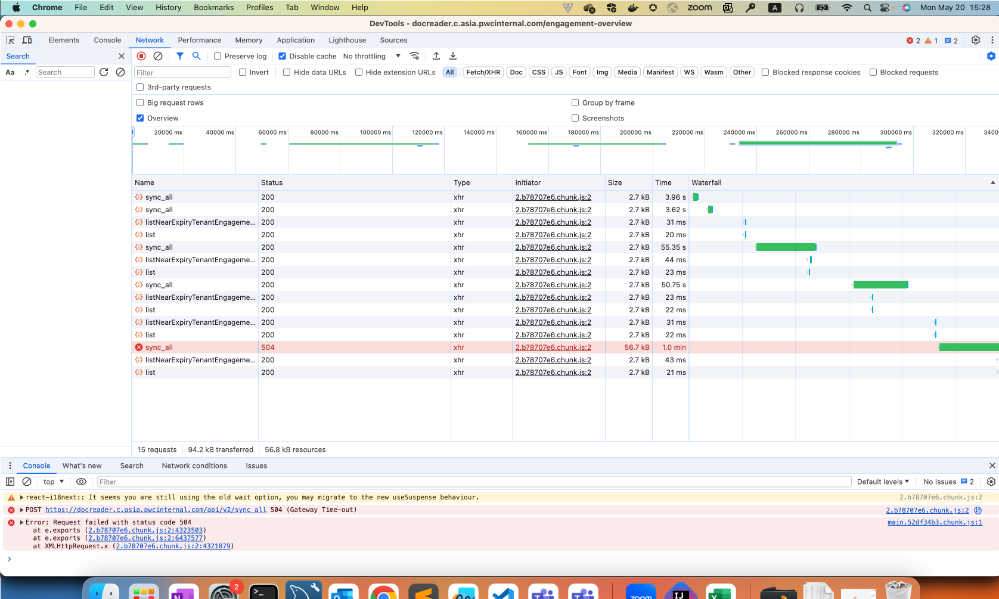
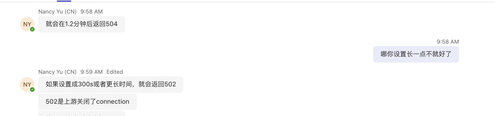
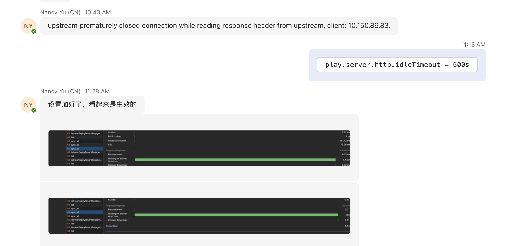
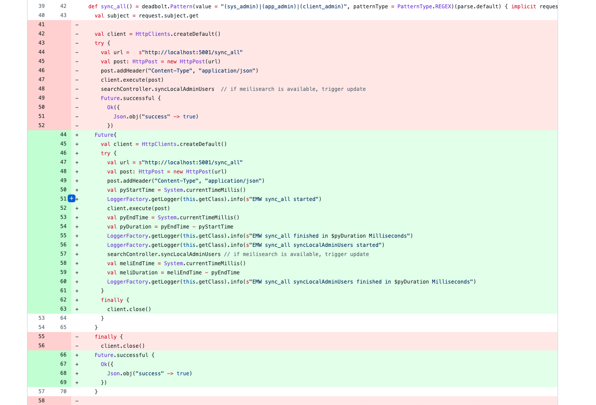

# Play timeout issue

## Issues

When IDR HK and Comon is changed to new Ubuntu server, the refresh operation will timeout.



While the refresh operation is triggered in old server, the refresh operation will have lower chance of timeout 



This is because in old enviorment, the operation will cost 40-65 seconds and in new environment, the operation will cost 65-110 seconds.

The default timeout of nginx is 60s, so the operation will get 504 in new environment.


When update the nginx timeout setting, there will have another timeout of 70s "upstream prematurely closed connection while reading response header from upstream, client: 10.150.****.**". But check application log, the api result code is 200. 



When call application directly, the will have another error "the connection is reset by peer". 

The 70s timeout is set by playframework, while in api level, the operation will cost 65-110s, and finish success, and in lower layer of connection, play server will reset connection in 70s.

When change config, the issue is resolved.



## Code for timeout

The origin code as below:

The code is sync call, while there is no need to sync call of sync service.

```scala
  def sync_all() = deadbolt.Pattern(value = "(sys_admin)|(app_admin)|(client_admin)", patternType = PatternType.REGEX)(parse.default) { implicit request =>
    val subject = request.subject.get

    val client = HttpClients.createDefault()
    try {
      val url =   s"http://localhost:5001/sync_all"
      val post: HttpPost = new HttpPost(url)
      post.addHeader("Content-Type", "application/json")
      client.execute(post)
      searchController.syncLocalAdminUsers  // if meilisearch is available, trigger update
      Future.successful {
        Ok({
          Json.obj("success" -> true)
        })
      }
    }
    finally {
      client.close()
    }

  }
  ```


  The operation "client.execute(post)" is a async call, why the this code is sync. Because " client.close()" will be waiting operation finished.
  

  We just use async call will fix the timeout issue

  


  
  