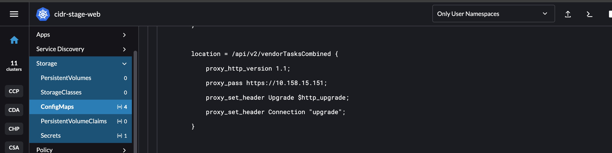
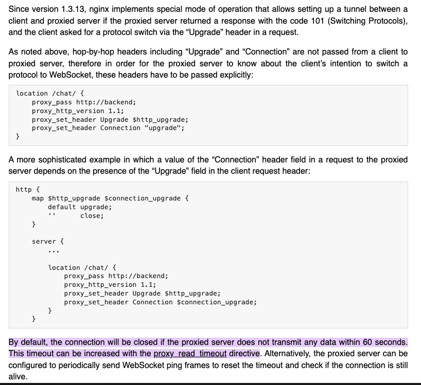

# Socket timeout 502

## Issue

When a API response is more than 60s, there will have timeout exception 
```
2024-07-04T10:31:54.074708453+08:00 2024/07/04 02:31:54 [warn] 21#21: *5652 a client request body is buffered to a temporary file /var/cache/nginx/client_temp/0000000225, client: 10.169.58.189, server: cidr-stg.asia.pwcinternal.com, request: "POST /api/v2/vendorTasksCombined HTTP/1.1", host: "cidr-stg.asia.pwcinternal.com" 2024-07-04T10:32:54.274787919+08:00 2024/07/04 02:32:54 [error] 21#21: *5652 upstream prematurely closed connection while reading response header from upstream, client: 10.169.58.189, server: cidr-stg.asia.pwcinternal.com, request: "POST /api/v2/vendorTasksCombined HTTP/1.1", upstream: "
https://10.158.15.151:443/api/v2/vendorTasksCombined
", host: "cidr-stg.asia.pwcinternal.com" 2024-07-04T10:32:54.275613423+08:00 10.169.58.189 - - [04/Jul/2024:02:32:54 +0000] "POST /api/v2/vendorTasksCombined HTTP/1.1" 502 56518 "-" "python-requests/2.32.2" "-"
``` 

If call application server directly, the response time is more than 60s, the response is success. Only if call Nginx endpoint, the exception will appear.

After add timeout for Nginx, the issue still existed.

from the link 

https://github.com/unbit/uwsgi/issues/2264

```
The option you are searching for is http-timeout that sets the timeout of the http router/proxy (you can see it as the equivalent of nginx upstream timeout). At the end you have 3 timeouts in place: nginx (upstream timeout) -> uwsgi-http-router (http-timeout, 60 seconds) -> uwsgi workers (socket-timeout, 4 seconds, but generally you do not need to touch it unless you do not have a proxy on front).

Relevant option in the code:

https://github.com/unbit/uwsgi/blob/master/plugins/http/http.c#L35

Please make a pull request for this page if you want to add a section for timeouts: https://uwsgi-docs.readthedocs.io/en/latest/HTTP.html

But please, do not add the http-router if you already have nginx on front, it will hurt performance and will add headaches :)

```

Which seems Nginx is doing "uwsgi-http-router (http-timeout, 60 seconds)" for the request. 
And also from link https://uwsgi-docs.readthedocs.io/en/latest/Nginx.html 

Why only the api has the issue?

Api Code
: @@snip[API Code](./code/upload.scala)


## Fix

Add below setting will fix the timeout issue:



form [Nginx link](https://nginx.org/en/docs/http/websocket.html#:~:text=By%20default%2C%20the%20connection%20will%20be%20closed%20if,timeout%20can%20be%20increased%20with%20the%20proxy_read_timeout%20directive)



Change the api to websocket protocol will resolve the issue.


