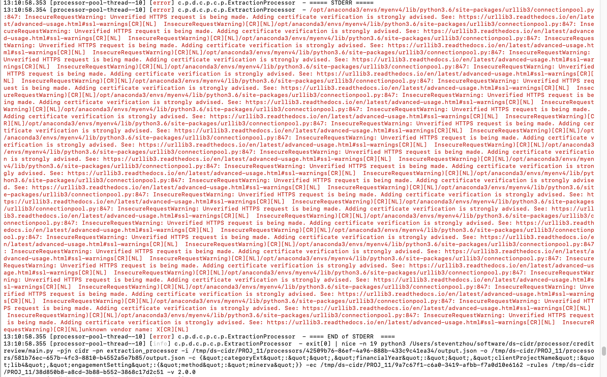
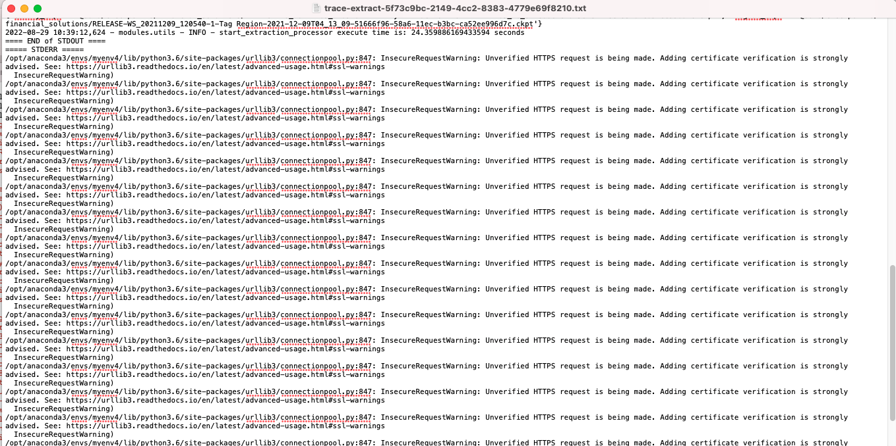
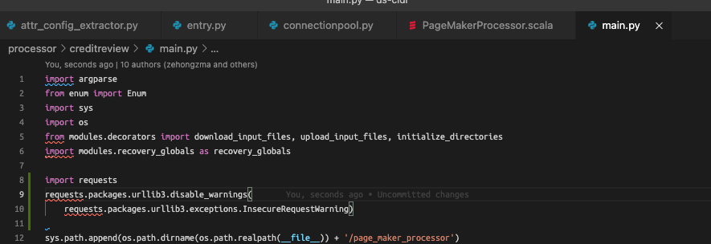
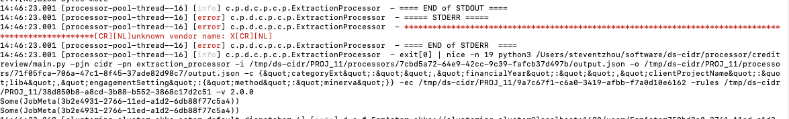

# Suppress insecurerequestwarning

## Issue 

The warning message shows in some processor

The warning message is recorded by file output:

we could add test code to check which processor generate the error code:

: @@snip[add TestCode](code/addTestCode.py)

## fix the code

According to https://stackoverflow.com/questions/27981545/suppress-insecurerequestwarning-unverified-https-request-is-being-made-in-pytho

code fix:

