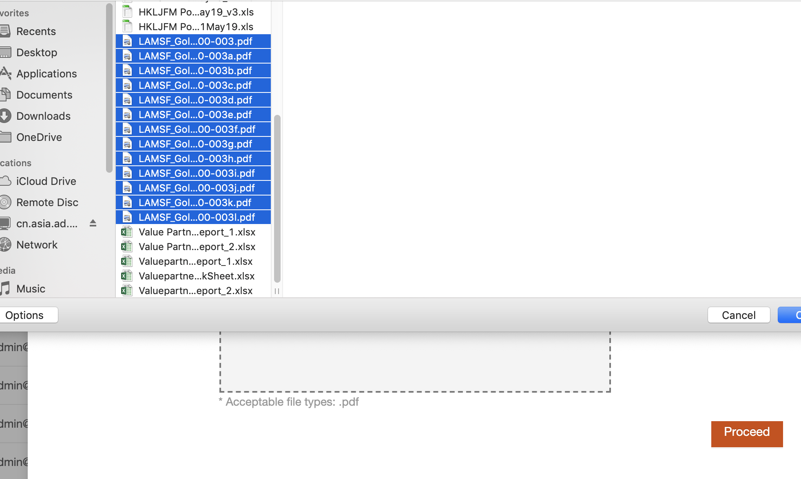
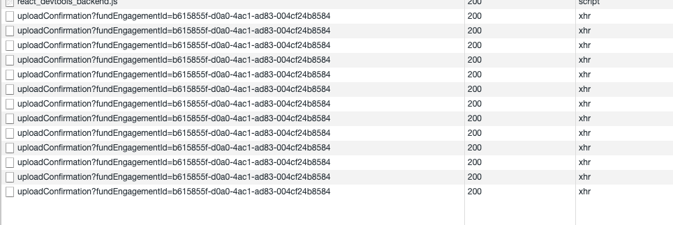
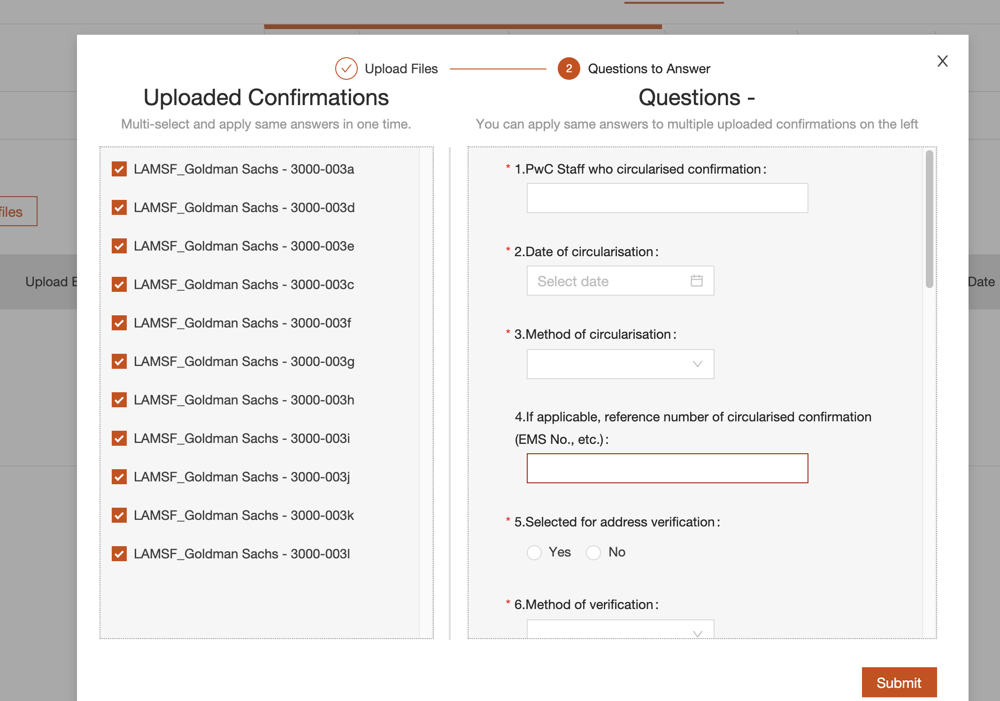
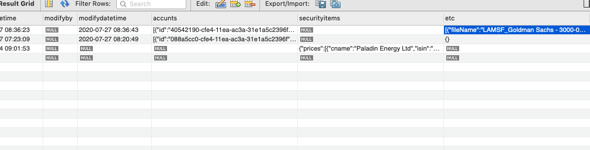

# Lockless design

## Multi-thread update for same field 

In a project, there is need to process multiple files from user:

After all files are uploaded, there are random files are not recorded (13 files uploaded, only 11 files recorded):

The uploaded file is recorded in database field etcs:

## Use named job to remove lock

The recording error is caused by multiple threads update same field in database like below:

@@snip[record file](code/update.scala)

The classical way for fixing this issue is to have a lock on the operation.

Use namedjob to have lockless as below:

Call processor
: @@snip[call processor](code/callProcessor.scala)

Processor
: @@snip[Processor](code/processor.scala)

NamedJob wrap
: @@snip[named job](code/doraserver.scala)

For more information about named job : [Named job](https://wherby.github.io/doradilla/usage/namedjob.html)
