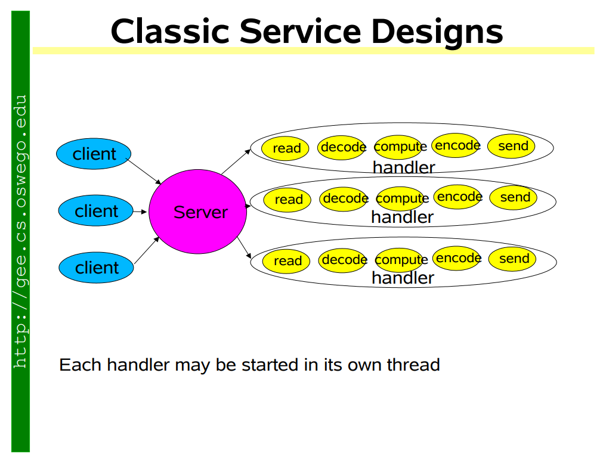

## Scalable IO in Java

The original reference is from [Scalable IO in Java](http://gee.cs.oswego.edu/dl/cpjslides/nio.pdf)  { open=new }

#### Classic way of handle one requst pre thread

Add design multiple implementations of Event Driven design

#### Single threaded version [Nodejs]

#### Thread Pool version

#### Multiple reactor
