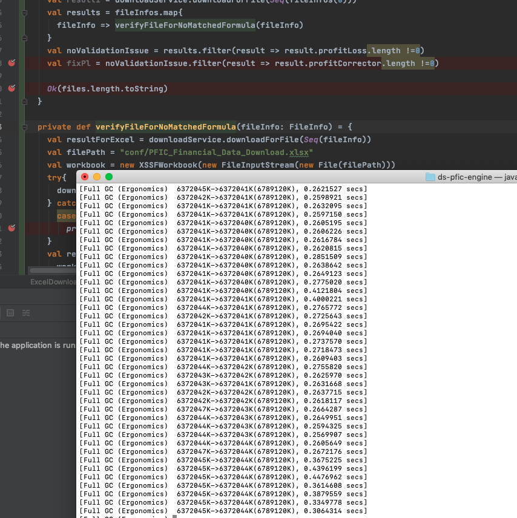

# Out of memory for batch job

## Iusse

When we want to process batch job in scala, there may trigger OOM issue if we process batch job in same thread like below:

The code as below:

Process excel files in folder
: @@snip[process folder](./code/code1.scala)

Actions on excel file
: @@snip[action on excel](./code/verifyFile.scala)

In the code, all excel files in folder "temp" will be processed with "verifyFileForNoMatchedFormula" method which
is memory consuming job. 

How to fix:

Fix for process
: @@snip[With Future](./code/code2.scala) 