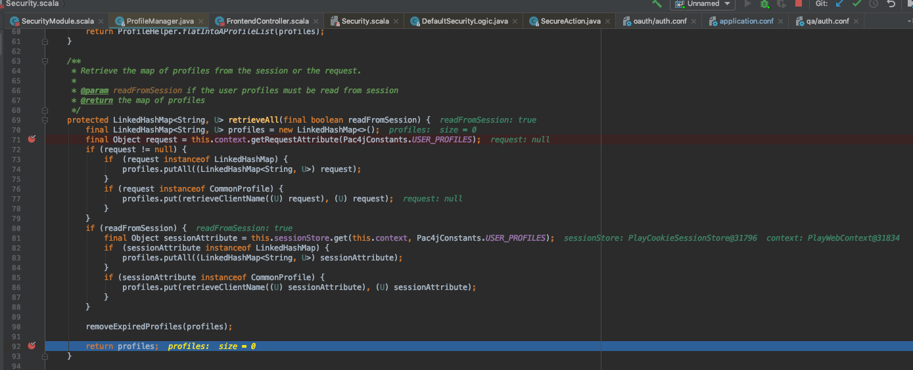
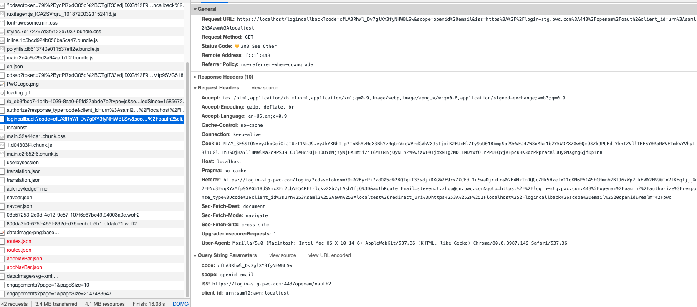
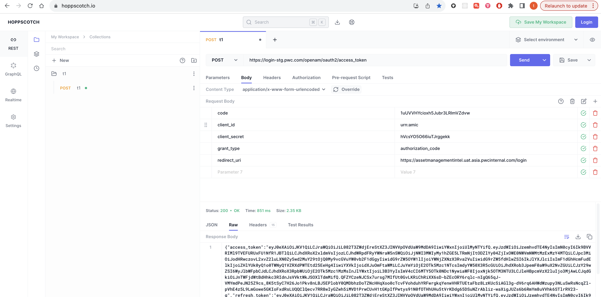

# Oauth2 client for Pac4j


## What's pac4j do?

Pac4j will maintain a "profile" for authenticated user:

### 1. User will specify the client used for application:

@@ snip [Client selection](./code/clientselection.scala)

### 2. Pac4j will first query profile


and there is no profile exist yet:




### 3. Client will start Oauth2 authentication:

#### Get authorize
User will redirect to authorization portal


After user authorized, then the authorization portal will post back with token for user:



#### Get access token

Then use the authorized token to change the access token:


More clear about the body

``` 
 code=qqBjWVysrKBqckPcI-Mm9mdV2JM&redirect_uri=https%3A%2F%2Fassetmanagementintel.uat.asia.pwcinternal.com%2Flogin&grant_type=authorization_code&client_id=urn%3Aamic&client_secret=hVcsYO5O66iuTJrggekk
```




#### Get user information

User the access token to get user information 


### 4. Then the pac4j will use the user information to create a profile for user:


### 5. When profile is stored in session, user profile could be get when user visit restricted resources:


and redirect to the resources:

