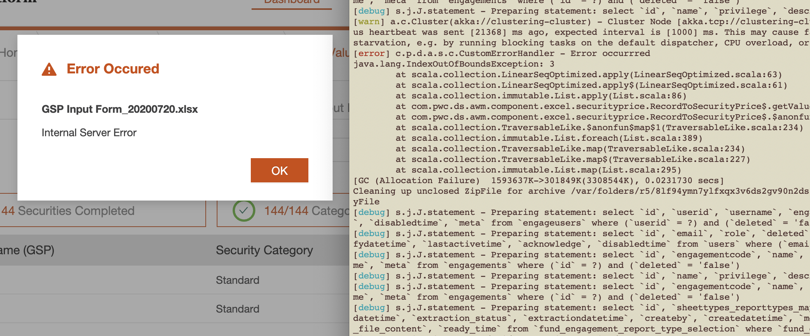
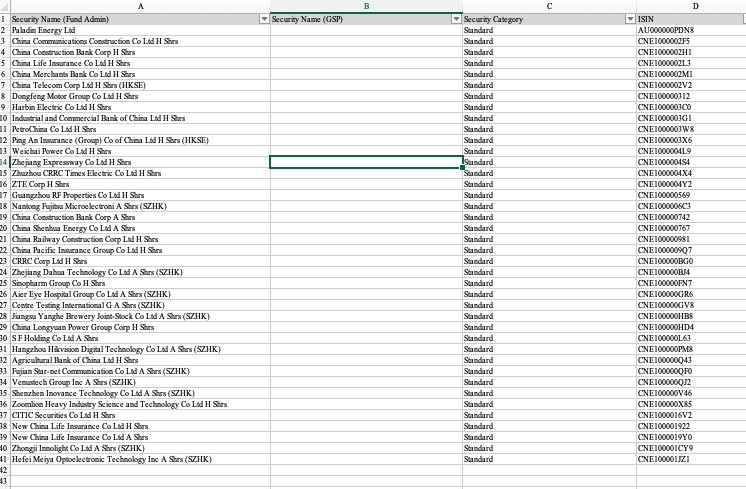
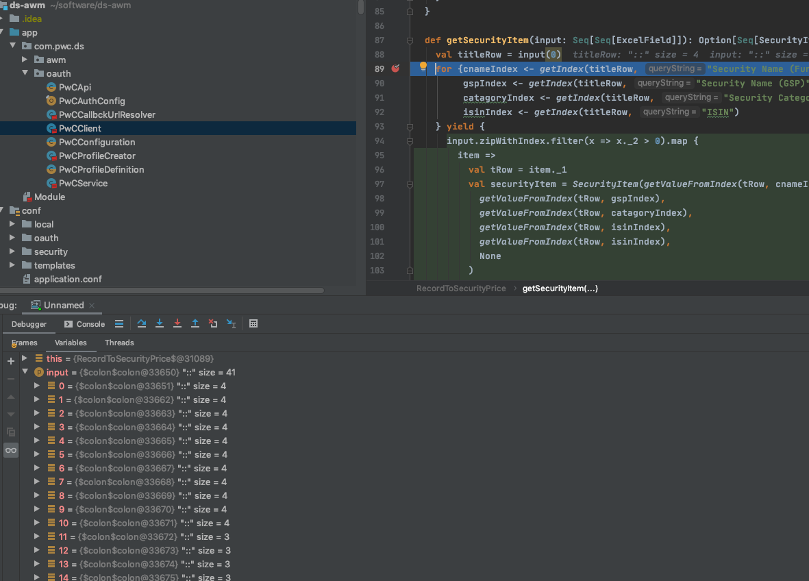
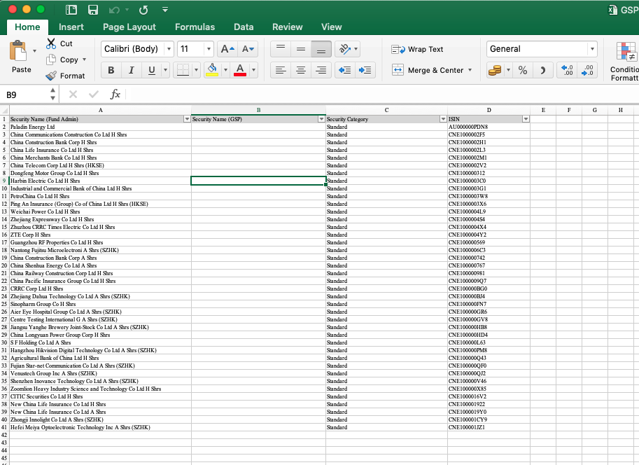
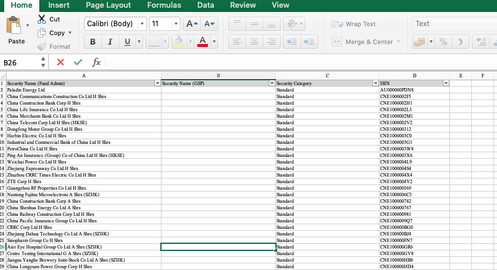
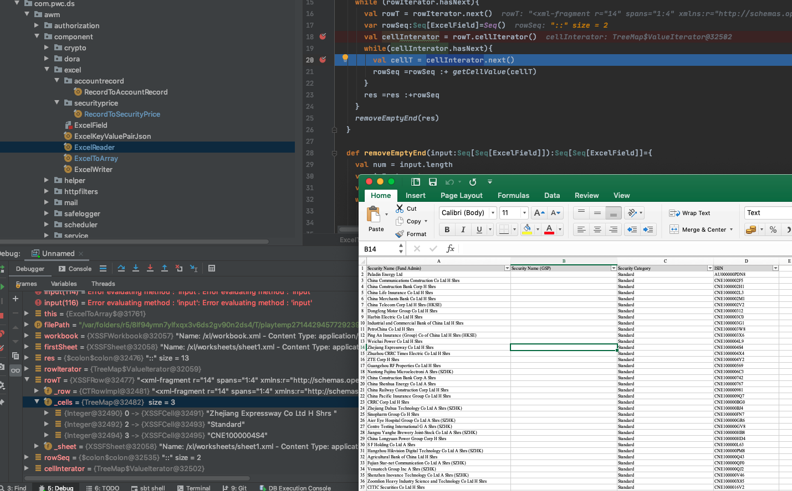

# Excel reader using POI

## Issue

AWM process user's excel input throws exception as below:

It's shows index out of boundary on index 3, but the excel has 4 columns.

In debug mode, shows output of reader, some rows has 4 columns while some rows has 3 columns.

Open the excel, the 4-column line has empty cell which type is "General":

And 3-clumn line has empty cell which type is "Text":

In debugger, when use cellIterator, POI will pass the empty cell which type is "Text" because
POI will remove the empty cell which type is text:

 
## Fix
 
 For POI will not read empty "Text" cell, and iterator method will be not apply if need the 
 formatted result.

Code use iterator
: @@snip[Code use iterator](code/oldVersion.scala)

Code use index
: @@snip[Code use index](code/newVersion.scala)

For use index to get null for inplace cell, need to catch exception for null input.

