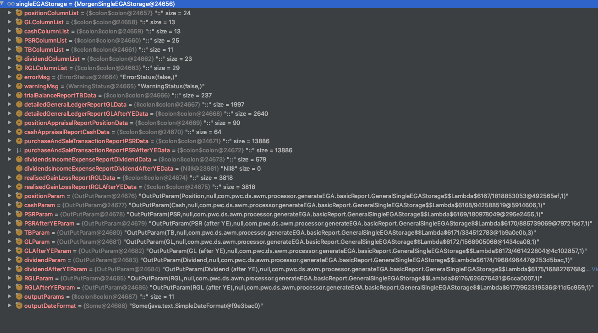

# Refactor code for Excel output

## Presentation-layer for Excel output

We use Apache POI for Excel output in system.

@@snip[Presentation layer](./code/presentation.scala)

For each fund admin, there is a definition of EGA storage:

GeneralEGAStorage
: @@snip[General Ega storage](./code/GeneralSingleEGAStorage.scala)

EGAConstMorgenStanley
: @@snip[EGAConstMorganStanley](./code/EGAConstMorgenStanley.scala)

Even the "GeneralEGAStorage" has the name of general, but it uses the MorganStanly's const.

If another fund admin has different ColumList definition, there will need another **EGAStorage.

How could we define a general EGAStorage:

GenericSingleEGAStorage
: @@snip[Generic EGA Storage](./code/GenericSingleEGAStorage.scala)

MorgenSingleEGAStorage
: @@snip[Morgen Single EGA Storage](code/MorganSingleEGAStorage.scala)

ColConstBase
: @@snip[EGA Col Const Base](./code/EGAColConstBase.scala)

MorganStanleyConst
: @@snip[Morgan Stanley const](./code/MorganStanleyConst.scala)

## Pitfall for refactor code

In GeneralSingleEGAStorage, for the ColumList depends on  EGAColConstBase implementation.

@@snip[Generic EGA Storage](./code/GenericSingleEGAStorage2.scala)

if the **Param is not lazy val,the columnList field will be null, for the initialization order.

For MorganStanleyConst implementation, there is some overwrite for base const variables.So the base variables should 
from object variable. 

@@snip[Morgan Stanley const](./code/MorganStanleyConst.scala)

For the lazy value will only set after evaluation:
Before evaluation 

After evaluation

