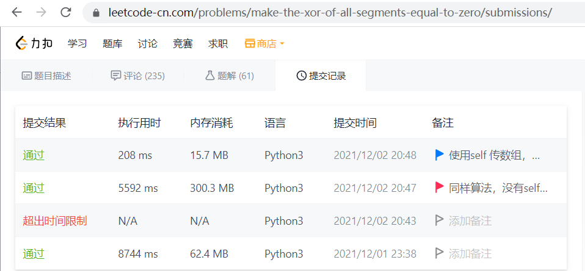

# Speed up python by remove enclosure

## Speed up 20 times

The snap is from [test code](https://leetcode-cn.com/problems/make-the-xor-of-all-segments-equal-to-zero/submissions/)

while the time comsuming code of 5592 ms and 208 ms is as below, the 5592 ms code use cache for speed up and slower 20 time than the code only remove enclosure:

5592 ms code which use cache
: @@snip[code with enclosure](code/q42.py)

208 ms code which not use cache
: @@snip[code without enclosure](code/q44.py)