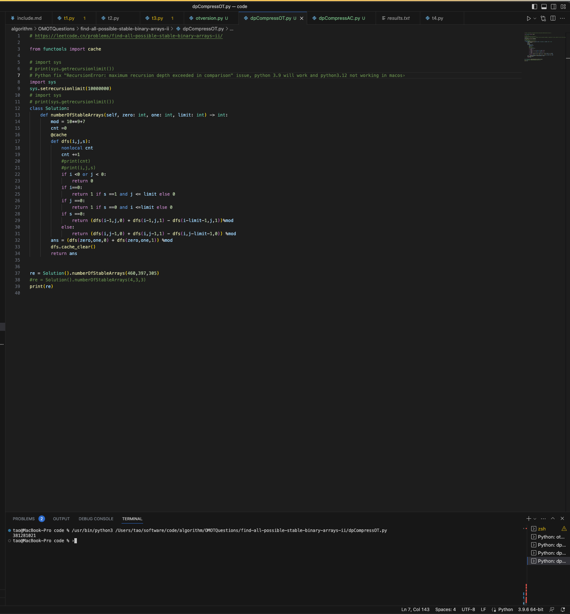
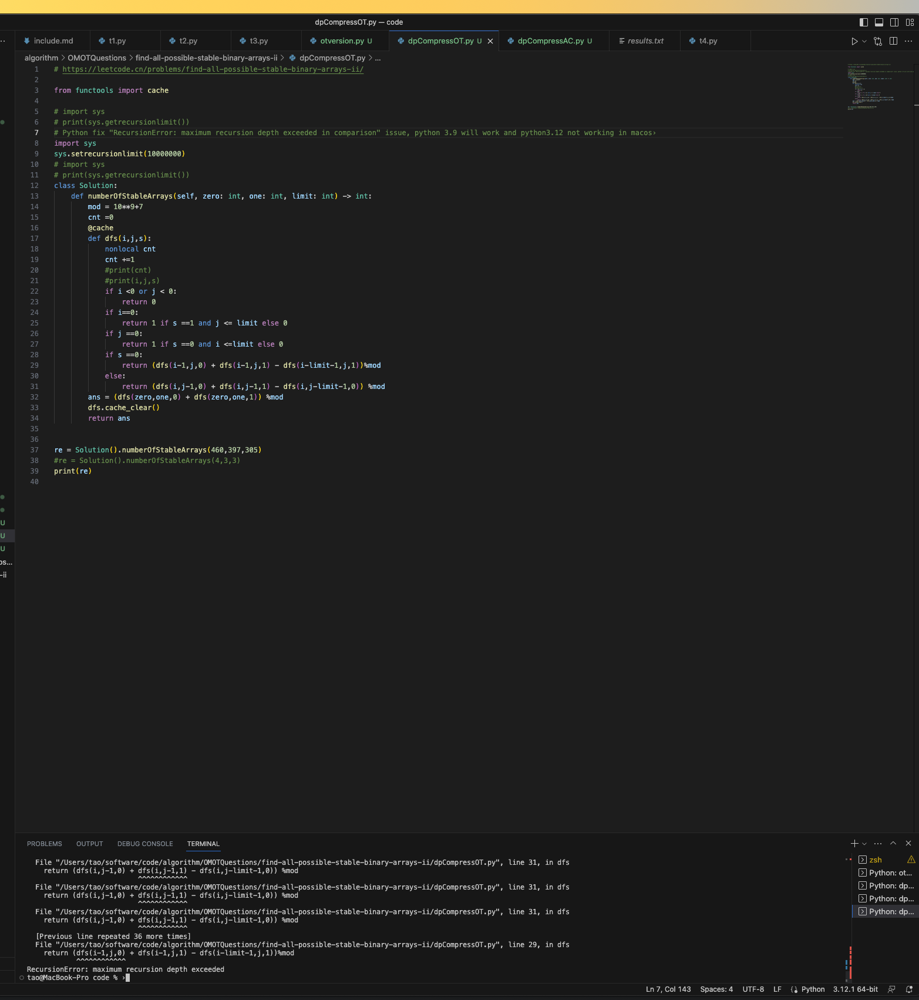

# Python recursion

##  Recursion issue

The error "RecursionError: maximum recursion depth exceeded in comparison" will throw if not set recursion limit in python. Python's default
recursion number is 1000.


```
  File "/Users/tao/software/code/algorithm/OMOTQuestions/find-all-possible-stable-binary-arrays-ii/dpCompressOT.py", line 31, in dfs
    return (dfs(i,j-1,0) + dfs(i,j-1,1) - dfs(i,j-limit-1,0)) %mod 
                           ^^^^^^^^^^^^
  File "/Users/tao/software/code/algorithm/OMOTQuestions/find-all-possible-stable-binary-arrays-ii/dpCompressOT.py", line 31, in dfs
    return (dfs(i,j-1,0) + dfs(i,j-1,1) - dfs(i,j-limit-1,0)) %mod 
                           ^^^^^^^^^^^^
  [Previous line repeated 36 more times]
  File "/Users/tao/software/code/algorithm/OMOTQuestions/find-all-possible-stable-binary-arrays-ii/dpCompressOT.py", line 29, in dfs
    return (dfs(i-1,j,0) + dfs(i-1,j,1) - dfs(i-limit-1,j,1))%mod 
            ^^^^^^^^^^^^
RecursionError: maximum recursion depth exceeded
```


When set the reursion limit, the code will pass in python 3.9 on MacOS M1:

``` python
import sys
sys.setrecursionlimit(10000000)
```



While the setting will not be used in python3.12 on Mac:

