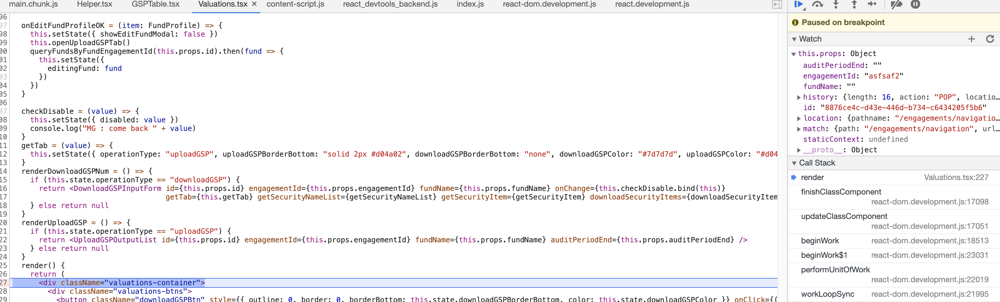

# React web render

## The null element after refresh

In AWM the when click the fist tab and go to second tab, every thing goes well

First Tab:


Second Tab:


When refresh page on second tab, the "Audit Period End" field is missing"


Let's see how the "Audit Period End" field is rendered:

In validation component
: @@snip[parent element](./code/parent.jsx)

In GSP component
: @@snip[gsp element](./code/child.jsx)

And the field is controlled by {this.props.auditPeriodEnd} in validation component, if the page
is refreshed,

first the props value will be:


and the props will be updated by its parent component:


the updated props value is not applied to the GSP component.

## Fix:
Change the code from 

```
    title: <div style={{display: "flex"}}>
      <p>Audit Period End </p>
      <p style={{color: "#e03220", fontWeight: "bold"}}>&nbsp;(Price as of {new Date(Number(this.props.auditPeriodEnd.split("-")[0]), Number(this.props.auditPeriodEnd.split("-")[1])-1, Number(this.props.auditPeriodEnd.split("-")[2])).toString().split(" ")[1] + " "
      ...
    </div>,
```
to
```
    title: ()=> <div style={{display: "flex"}}>
      <p>Audit Period End </p>
      <p style={{color: "#e03220", fontWeight: "bold"}}>&nbsp;(Price as of {new Date(Number(this.props.auditPeriodEnd.split("-")[0]), Number(this.props.auditPeriodEnd.split("-")[1])-1, Number(this.props.auditPeriodEnd.split("-")[2])).toString().split(" ")[1] + " "
      ...
    </div>,
```
